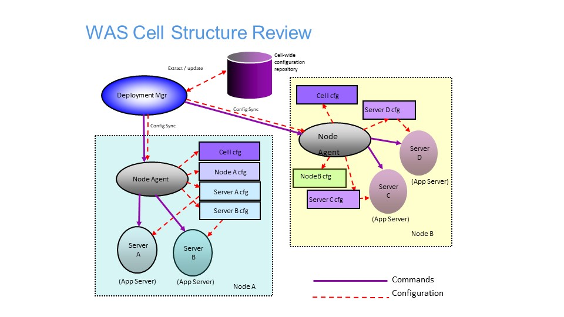

# Why Operations Modernization

## Table of Contents
* [Introduction](#Introduction)
* [WebSphere Constraints](#WAS_Review)
* [Requirements Driving Operations Modernization](#Requirements)
* [Openshift for Operations Modernization](#Openshift)

## Introduction

WebSphere Application Server is one of the most widely adopted application servers in the industry. 
Initially released in 1998, its current lineage may be traced back to V5.0, released in 2002.
V5.0 was a major re-write that enabled it to continue to innovate and remain relevant to its users.
Almost two decades later, as new requirements and new technologies emerged, WebSphere and its users must once make adjustments for operations modernization, to adopt cloud based technologies to meet emerging business requirements.

Our focus will be on IBM Cloudpak for Applications and Openshift. 
IBM Cloudpak for Applications is an offering that includes both WebSphere Application Server and Openshift, enabling you deploy WebSphere Application Server both in your existing environment and to the Openshift.
Openshift is a container based cloud derived from Kubernetes open source, the most popular contrainer orchestrator.
Openshift adds certification, additional security, additional graphical user interface, and qualities of service on top of open source Kubernetes into an enterprise offering.

In this chapter we will:
- Review WebSphere infrastructure and its constraints.
- List requirements driving changes in IT infrastructure towards operations modernization.
- Explain why Cloudpak for Applications and Openshift are the technolog iesto adopt for operations modernization.

## WebSphere Constraints

In this section, we review the constraints of the WebSphere Application Server and WebSphere Liberty environments.

### Traditional WebSphere Application Server

A WebSphere cell is managed through a Deployment Manager, which is in control of one or more WebSphere nodes. 

After installation, the administrator uses either an administrative console or scripting for application or configuration management. 
The changes are stored on the deployment manager repository, then synchronized to the nodes. 
This design works well for traditional monolithic applications when the size of the environment is smaller, or when there are in-frequent changes to the environment.  It does not work as well as the size of the environment increases, or as the frequency of administrative operations increases. Consider:

| item | WAs Cell constraint|
|-----------|-----|
| size of cell       | 300 - 1000 JVMs |
| size of installation    | 2 Gb            |
| deployment unit    | application |
| create a new WAS cell | > 30 minutes |
| add a WAS node | > 30 minutes |
| create cluster | seconds to 5 minutes  |
| add cluster member | seconds to 5 minutes |
| deploy application | seconds to 1 hour |
| start application  | > 30 seconds |
| programming models  | Java/Jakarta EE, Spring |
| configuration migration| months or more |
| application migration| months or more |

Note that the time it takes to perform configuration operations gets progressive longer as the number of JVMs increases in the environment.  It may take seconds to add a cluster member when there are only a few JVMs, but may take up to 5 minutes when there are 1000.
In addition, the time required for application management also depends on the size of the application. There are multiple copies made when deploying the application to the deployment manager repository, or synchronizing the changes to the nodes.

### WebSphere Liberty

WebSphere Liberty and Open Liberty uses much of the same runtime as traditional WebSphere. However, instead of storing configuration in a central repository, configurations are stored with individual Liberty Servers. One way to manage WebSphere Liberty is through the Collective Controller. It serves a similar purpose to the deployment manager. It can scale much higher due to the decentralized design,  but its GUI or scripting interface is not as full function as that offered through the deployment manager.

| item | Liberty Collective  constraint|
|-----------|-----|
| size of collective |  10000 JVMs |
| size of install    |  > 30 Mb            |
| deployment unit    | zip file |
| create a new WAS collective| seconds to minutes |
| add a new node | seconds |
| create cluster | seconds |
| add cluster member | seconds|
| deploy application | seconds  |
| start application  | > 3-5 seconds |
| programming models | Java/Jakarta EE, Spring |
| configuration migration| no migration|
| appliation migration| no migration|

WebSphere Liberty overcame many of the size and speed limitations of traditional WebSphere. However, as we will see in later sections, it still falls behind in terms of the scalability and administration features offered by Openshift.

## Requirements Driving Operations Modernization

The following requirements are the factors driving infrastructure innovation and operations modernization:
- Speed and agility of delivery
- Scale of Infrastructure
- Polyglot programming languages

With respect to speed and agility of delivery: the faster you deliver new features, and the faster you adjust to changing requirements, the better an edge you have over your competitors. 
Instead of a waterfall development process where applications are updated with frequency measured in months or even years, some organizations can now deliver multiple times a day. 
To increase delivery frequency, organizations are adopting:
- agile development process that reacts quickly to changing requirements, even on a daily basis.
- Cloud based IT infrastructure that uses automation to enables extremely fast turn-around when delivering new features.

With respect to scale of of infrastructure: it has grown enormously with increased usage via mobile applications, and increased number of users as rate of technology adoption increases. 
Some organizations are supporting hundreds of millions of users. 
Not only does the underlying infrastructure needs to support a large number of users, it must also support changing usage patterns. For example, paydays and holidays may place much higher demands on the infrastructure.
The switch from large monolithic applications to smaller microservices also places higher demand on infrastructure, as each service is independently developed and tested.

With respect to polyglot: application programmers now have multiple options, and increasingly they will choose the option that best fits their tasks. 
Examples of languages and runtimes include Java/Jakart EE, Spring, reactive, node, Ruby, Swift, and Python. 
An infrastructure capable of managing a polyglot environment provides a consistent management experience, ease of use, and cost savings compared to having to administer multiple environments.

## Cloudpak for Applications and Openshift for Operations Modernization

IBM Cloudpak for applications and Openshift supports a much more scalable environment compared to both traditional WebSphere Application Server and WebSphere Liberty. The time required to perform operations and the scale of the environment is 10 to 100 times better compared to WebSphere. And it is inherently polyglot:
 
| item | Openshift Contraints|
|-----------|-----|
| size of Openshift environment | 100,000 pods |
| deployment unit    | image |
| create cluster | seconds |
| add cluster member | seconds |
| deploy image | seconds |
| start application  | same as underlying runtime |
| programming models  | polyglot| 
| configuration migration | minimal (for alpha or beta configuration) |
| application migration| runtime dependent |

Cloudpak for Applications and Openshift draws from the ongoing improvements made by the Kubernetes open source community, a community that spans than the resources of multiple organizations.
On top of open source, it provides value adds, such as
- certification of the environment
- security
- improved graphical user interface

It also matches the qualities of service similar to those offered by WebSphere, such as:
- auto-scaling
- health management
- application updates