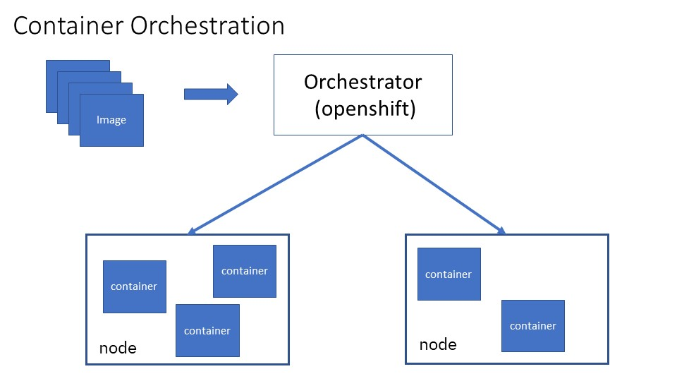

# Moving WebSphere Applications  to Openshift 

## Table of Contents
* [Introduction](#Introduction)
* [WebSphere Constraints](#WAS_Review)
* [Requirements Driving Operations Modernization](#Requirements)
* [Introduction to Openshift](#Cloud)
* [Options For Operations Modernization](#WAS_To_Cloud)
* [WebSphere and Openshift Comparison](#Openshift_Comparison)

## Introduction

WebSphere Application Server is one of the most widely adopted application servers in the industry. 
Initially released in 1998, its current lineage may be traced back to V5.0, released in 2002.
V5.0 was a major re-write that enabled it to continue to innovate and remain relevant to its users.
Almost two decades later, as new requirements and new technologies emerged, WebSphere and its users must once make adjustments for operations modernization, to adopt cloud based technologies to meet emerging business requirements.

Our focus will be on IBM Cloudpak for Applications and Openshift. 
IBM Cloudpak for Applications is an offering that includes both WebSphere Application Server and Openshift, enabling you deploy WebSphere Application Server both in your existing environment and to the Openshift.
Openshift is a container based cloud derived from Kubernetes open source, the most popular contrainer orchestrator.
Openshift adds certification, additional security, additional graphical user interface, and qualities of service on top of open source Kubernetes into an enterprise offering.

In this chapter we will:
- Review WebSphere infrastructure and its constraints.
- List requirements driving changes in IT infrastructure towards operations modernization.
- Explain why openshift is the technology to adopt for operations modernization.
- Present options to run WebSphere applications in Openshift 
- Compare the differences between WebSphere environments and Openshift environments.

## WebSphere Constraints

In this section, we review the constraints of the WebSphere Application Server and WebSphere Liberty environments.

### Traditional WebSphere Application Server

A WebSphere cell is managed through a Deployment Manager, which is in control of one or more WebSphere nodes. 

After installation, the administrator uses either an administrative console or scripting for application or configuration management. 
The changes are stored on the deployment manager repository, then synchronized to the nodes. 
This design works well for traditional monolithic applications when the size of the environment is smaller, or when there are in-frequent changes to the environment.  It does not work as well as the size of the environment increases, or as the frequency of administrative operations increases. Consider:

| item | WAs Cell constraint|
|-----------|-----|
| size of cell       | 300 - 1000 JVMs |
| size of installation    | 2 Gb            |
| deployment unit    | application |
| create a new WAS cell | > 30 minutes |
| add a WAS node | > 30 minutes |
| create cluster | seconds to 5 minutes  |
| add cluster member | seconds to 5 minutes |
| deploy application | seconds to 1 hour |
| start application  | > 30 seconds |
| programming models  | Java/Jakarta EE, Spring |
| configuration migration| months or more |
| application migration| months or more |

Note that the time it takes to perform configuration operations gets progressive longer as the number of JVMs increases in the environment.  It may take seconds to add a cluster member when there are only a few JVMs, but may take up to 5 minutes when there are 1000.
In addition, the time required for application management also depends on the size of the application. There are multiple copies made when deploying the application to the deployment manager repository, or synchronizing the changes to the nodes.

### WebSphere Liberty

WebSphere Liberty and Open Liberty uses much of the same runtime as traditional WebSphere. However, instead of storing configuration in a central repository, configurations are stored with individual Liberty Servers. One way to manage WebSphere Liberty is through the Collective Controller. It serves a similar purpose to the deployment manager. It can scale much higher due to the decentralized design,  but its GUI or scripting interface is not as full function as that offered through the deployment manager.

| item | Liberty Collective  constraint|
|-----------|-----|
| size of collective |  10000 JVMs |
| size of install    |  > 30 Mb            |
| deployment unit    | zip file |
| create a new WAS collective| seconds to minutes |
| add a new node | seconds |
| create cluster | seconds |
| add cluster member | seconds|
| deploy application | seconds  |
| start application  | > 3-5 seconds |
| programming models | Java/Jakarta EE, Spring |
| configuration migration| no migration|
| appliation migration| no migration|

WebSphere Liberty overcame many of the size and speed limitations of traditional WebSphere. However, as we will see in later sections, it still falls behind in terms of the scalability and administration features offered by Openshift.

## Requirements Driving Operations Modernization

The following requirements are the factors driving infrastructure innovation and operations modernization:
- Speed and agility of delivery
- Scale of Infrastructure
- Polyglot programming languages

With respect to speed and agility of delivery: the faster you deliver new features, and the faster you adjust to changing requirements, the better an edge you have over your competitors. 
Instead of a waterfall development process where applications are updated with frequency measured in months or even years, some organizations can now deliver multiple times a day. 
To increase delivery frequency, organizations are adopting:
- agile development process that reacts quickly to changing requirements, even on a daily basis.
- Cloud based IT infrastructure that uses automation to enables extremely fast turn-around when delivering new features.

With respect to scale of of infrastructure: it has grown enormously with increased usage via mobile applications, and increased number of users as rate of technology adoption increases. 
Some organizations are supporting hundreds of millions of users. 
Not only does the underlying infrastructure needs to support a large number of users, it must also support changing usage patterns. For example, paydays and holidays may place much higher demands on the infrastructure.
The switch from large monolithic applications to smaller microservices also places higher demand on infrastructure, as each service is independently developed and tested.

With respect to polyglot: application programmers now have multiple options, and increasingly they will choose the option that best fits their tasks. 
Examples of languages and runtimes include Java/Jakart EE, Spring, reactive, node, Ruby, Swift, and Python. 
An infrastructure capable of managing a polyglot environment provides a consistent management experience, ease of use, and cost savings compared to having to administer multiple environments.

## Openshift for Operations Modernization

This section provides a brief introduction to Openshift, and how it meets the requirements from the previous section.
As a container based cloud, the unit of deployment is an image, not an application. An image built for WebSphere Application Server looks like:

Instead of installing WebSphere Application server multiple times, once for each node, you start with a pre-built WebSphere Application Server image shipped with the product. Or alternatively, you may start with an operating system image and install WebSphere Application Server to create a new image. 
This new image then serves as the basis from which to create additional images containing additional prerequisites, shared libraries, applications, and configurations.

A container is used to run an image. Containers provide isolated environments at the process level. Within this isolated environment, the amount of resources, and visibility to the resources, such as cpu, memory, and disk can all be strictly controlled. In addition, due to the the isolation being at the process level, containers can be created and destroyed much more quickly compared to virtual machines, as quickly as starting and stopping processes.

To run just one or a few containers, a container runtime such as docker or podman may be used. However, to manage many containers across different nodes, you need a container orchestrator such as Openshift. 
Deployment through an container orchestrator looks looks like:

A container orchestrator serves many of the same functions as the WebSphere deployment manager, except that the deployment unit is an image. It:
- Creates running containers from images.
- Allocates the containers across multiple physical nodes.
- Monitors the health of the containers 
- Adjusts number of running containers based on load

Openshift supports a much more scalable environment compared to both traditional WebSphere Application Server and WebSphere Liberty.
In addition,  Openshift also benefits from the improvements made by the Kubernetes open source community.

| item | Openshift Contraints|
|-----------|-----|
| size of Openshift environment | 100,000 pods |
| deployment unit    | image |
| create cluster | seconds |
| add cluster member | seconds |
| deploy image | seconds |
| start application  | same as underlying runtime |
| programming models  | polyglot| 
| configuration migration | minimal (for alpha or beta configuration) |
| application migration| runtime dependent |

Openshift also provides qualities of service similar to those offered by WebSphere, such as:
- auto-scaling
- health management
- application updates

## Options for Operations Modernization

In this section, we will evaluate several options for operations modernization. The options are:
- WebSphere Cell in VM
- WebSphere Liberty in VM
- WebSphere in Openshift

### WebSphere Cell in VM

You may pre-install WebSphere onto a VM, then clone the VM to quickly create WAS cells. 
You may do this on your own, use VM Quickstarter, or use the WebSphere as a Service in IBM public cloud. 
Ultimately, this approach only enables you to quickly create new cells, which is useful if you need to frequently create new environments for development or testing, 
but it does not address the other performance or scalability issues with the cell:

| item | WAs Cell constraint|
|-----------|-----|
| size of cell       | 300 - 1000 JVMs |
| size of installation    | 2 Gb            |
| deployment unit    | application |
| create a new WAS cell | minutes |
| add a WAS node |  minutes |
| create cluster | seconds to 5 minutes  |
| add cluster member | seconds to 5 minutes |
| deploy application | seconds to hour |
| start application  | > 30 seconds |
| programming models  | Java/Jakarta EE, Spring |
| configuration migration | months or more |
| application migration | months or more |

### WebSphere Liberty in VM

You may also pre-install WebSphere Liberty onto a VM, then clone the VM to quickly create Liberty collectives. 
However, since Liberty is already designed for quick installation and fast startup, there are no significant savings using this approach. In addition, the scalability and administration issues still remain.

### WebSphere in Openshift

There are two recommended methods to run applications currently running in WebSphere in Openshift cloud :
- using WebSphere Liberty image:  recommended if the application already runs or can be port to Liberty. 
- using Websphere Base image: recommended if it is difficult to port the application to Liberty.

Note that it is also possible and supported to run applications using Tomcat or JBOSS images. However, running on either Liberty or Base gives you the most runtime compatibility for an application currently running on WebSphere.

With Liberty or WebSphere Base, The scalability of the environment is that of the Kubernetes environment, not of the original cell or collective environment. The JVMs are stand-alone, not part of a collective or a cell. This also means that much of the qualities of service, such as clustering or failover, is provided by Openshift rather than WebSphere.
For Liberty:

| item | Liberty in Openshiftconstraint|
|-----------|-----|
| size of environment|  100,000 pods |
| size of install    |  > 30 Mb            |
| deployment unit    | image |
| create cluster | seconds |
| add cluster member | seconds|
| deploy application | seconds  |
| start application  | > 3-5 seconds |
| programming models | Java/Jakarta EE, Spring |
| configuration migration | no migration |
| application migration | no migration |

For WebSphere Base:

| item | WAs Cell in Openshift|
|-----------|-----|
| size of environment | 100,000 pods |
| size of installation    | 2 Gb            |
| deployment unit    | image |
| create cluster | seconds|
| add cluster member | seconds |
| deploy application | seconds |
| start application  | > 30 seconds |
| programming models  | Java/Jakarta EE, Spring |
| configuration migration | months or more |
| application migration | months or more |

It should be clear that Liberty has many advantages over WebSphere Base when running in Openshift cloud. However, there are also some programming model and qualities of service limitations that makes some applications difficult to port to Openshift or Liberty without code change. The current restrictions are listed in the next section.

## WebSphere Openshift Comparison

We conclude with a detailed comparison between WebSphere Application Server cell, Liberty Collective, and IBM Cloudpak for Applications.

|           |             |WAS Cell      | Liberty Collective |ICPA + Openshift  |
|-----------|-------------|--------------|--------------------|-----------------|
|topology   |             |              |                    |                 |
|           |max env      | 300-1000 JVMs| 10,000 JVMs        | 100,000 pods    |
|           | disk        | 2GB per node | up to 200 MB       |depends on underlying runtime|
|           |firewall     | Y            | Y                  | Y |
|           |load balancer| Y            | Y                  | Y |
|Performance|             |              |                    |
|           |initial heap | > 100 MB     | > 30 MB            | depends on underlying runtime |
|           |server start | > 30s        | 3-5 sec            | depends on underlying runtime |
|migration |     |              |                    |   |
|           |configuration migration | months to years | no migration | minimal migration (of alpha or beta configuration) |
|           |application migration   | months to hears | no migration | depends on underlying runtime |
|high availability|       |              |                    |                               |
|           |auto-scaling | yes          | yes                | yes                           |
|           |routing policy| yes         | yes                | yes                           |
|           | health management | yes     | yes               | yes                           |
|disaster recovery|        |roll you own | roll you rown      |roll your own                  |
|administration|
|           | admin model | scriptin + GUI| scripting + GUI   | declarative|
|           |deployment unit| app         | zip file          | image |
|app config |             | separate      | in zip file       | in image   |
|infra config|            | in infra      | in zip file       |source control + infra |
|libraries  |             | separate      | in zip file       | in imnage |
|app edition |            | yes           | no                | yes (a/b) 
|infra upgrade|           | app + infra migration | no migration | depends on underlying runtime |
| security |   
|          | admin roles  | 6+             | 1-2              | namespace + user defined|
|          | admin audit  | yes            | yes              | yes (?)|
|    |app security domain | yes            | no (seperate by JVM) | depends on underlying runime|
| |certificate management | some           | no               | yes?|
| | secret management     | password hash/encryption | password hash/encryption| underlying runtime + config map + external value |
| | security scans        | no             | no               | yes? |
| problem determination   |                |                  |      |
| | health management     | yes            | yes              | yes  |
| | centralized logging   | no             | no               | yes   |
| | centralized metrics   | no             | no               | yes  |
| devops |                | roll you own   |roll your own     | jenkins, Kabanero |
| qualities of service    |                |                 |      |
| | in-memory session cache| DRS, WXS      | WSX              | Redhat data grid|
| | built-in messaging     | SIBus         | yes (not HA)     | Redhat AMQ|
| | 2-phase transactions  | yes            | yes (not HA)     | yes (not HA)|
| | EJB clustering        | yes            | no(use local EJB)| no( use local EJB) |
| | stateful session failover| yes         | no               | no                 |
| | EJB timer failover    | yes            | no               | no                 |
| | EJB transaction propagation | yes      | no               | depends on underlying runtime |
| | dynamic caching       | yes            | subset           | depends on underlying runtime |
|programming models|      |Java/Jakarta EE| Java/Jakarta EE   | polyglot        |
|           |             | Spring       | Spring             |                 |
|           |restrictions |               | no JAX-RPC |restrictions depends on underlying runtime|