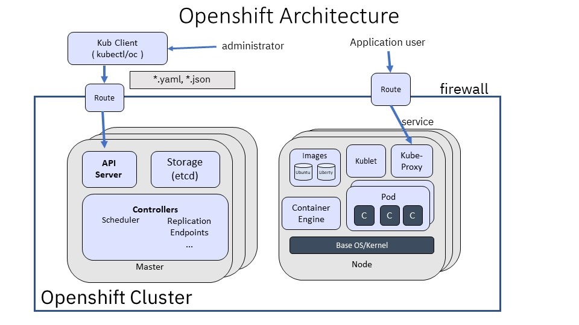
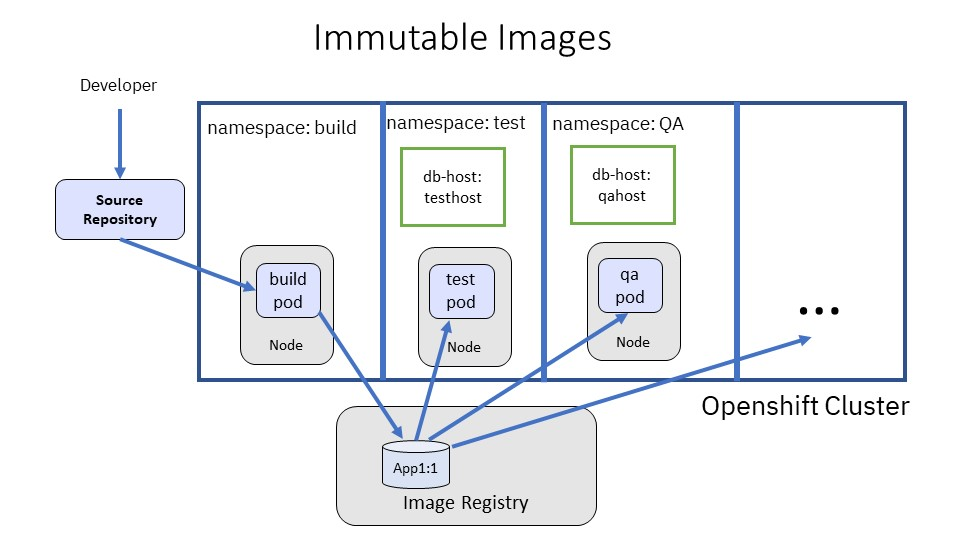
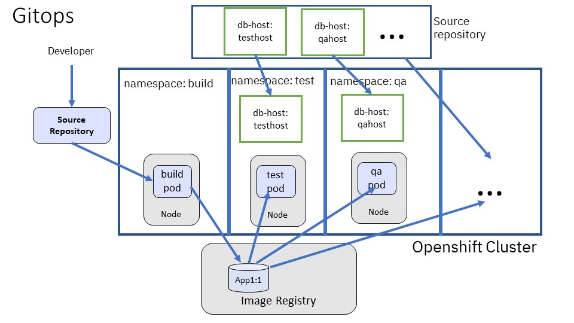

#  Openshift Concepts for WebSphere Administrators


High Level Architecture
Configuration model
Controller model and declarative specification 
Custom Resources and Operators
Internal Networking
Storage
Immutable images
Automation

## Introduction

In this chapter, we introduce the most important concepts and processes in Openshift. The prerequisite is that you already familiar with the following concepts:

- image .
- container.
- container orchestration.

If you are not, please refer to the previous chapter.

## High Level Architecture



At a high level, there is quite a bit of similarity between the organization  of WebSphere and Openshift:

| component | openshift | WebSphere ND | WebSphere Liberty |  comment |
|--------------|-----------|------------|---------|--------|
| domain of management | cluster | cell | collective |
| management node | master | deployment manager | collective controller |  Multiple instance HA on Openshift and Collective |
| management end point | API server | dmgr | collective controller|
| management interface | REST | JMX |  REST+ JMX  |  |
| management model | controller | command |command |    |
| admin enhancement | custom resource | JMX | JMX, REST | |
| configuration repository |  etcd | deployment manager repository| Liberty server.xml |
| Configuration Model   | REST      | WebSphere Common Configuration Model (WCCM)| XML|
| where to run applications | worker node    | node  | node | |
| worker agent | kubelet | node agent | N/A |
| unit of deployment | container image |  application | packaged server | 
| unit of runtime | Pod | JVM server | JVM Server | |
| External Load Balancing | Route or Ingress| http server | http server |
| Internal load balancing | Service | N/A | N/A  |
| firewall | built-in | N/A | N/A |

Beyond the high level, there significant differences that enables Openshift to be more flexible, scalable, and highly available. 
The main differences  for day to day administration are:

- REST based configuration model
- Controller based operations model
- Image based deployment
- Built-in firewall and networking

## Configuration Model

Resources in Openshift are stored in REST format.
Each resource type is identified by a group, version, and kind. 
Each resource instance for a resource type also has a unique name. 
A group that has no name (empty string) is built-in to Openshift. 
Here are examples of some resource types:

| group  | version | kind |  description  |
|--------|---------|------|---------------|
|        | v1      | Namespace| for administration isolation |
|        | v1      | Pod      | for running containers |
|        | v1      | Deployment | to deploy an image |
|        | v1      | ConfigMap  | configuration customization
|        | v1      | Secret | stores secrets for re-use later
|        | v1      | Service| logical endpoint for routing in the cluster
|        | v1      | Route | exposes endpoint access from outside of built-in firewall, Openshift specific
|        | v1      | Ingress | exposes endpoint access from outside of built-in firewall
| openliberty.io| v1beta1 | OpenLibertyApplication | Deploy an Liberty image |


Openshift may be used to manage a very large environment.  
Namespaces are used to allow you to isolate disparate resources  within the environment, e.g. between different teams, or applications.  
Resource instances may be scoped to a namespace, or be cluster wide if they are applicable to the entire cluster.

In openshift, a pod is is the most basic unit of runtime to be managed. It is used to run one or more related containers.
Here is a sample redacted configuration for a Pod with 1 container:

```
apiVersion: v1
kind: Pod
metadata:
  name: demo-app-7c4f775c8b-8xn2n
  namespace: default
spec:
  containers:
  - env:
    - name: WLP_LOGGING_CONSOLE_LOGLEVEL
      value: info
    - name: WLP_LOGGING_CONSOLE_SOURCE
      value: message,trace,accessLog,ffdc
    - name: WLP_LOGGING_CONSOLE_FORMAT
      value: json
    image: openliberty/open-liberty:full-java8-openj9-ubi
    ports:
    - containerPort: 9080
      name: 9080-tcp
      protocol: TCP
  imagePullSecrets:
  - name: demo-app-dockercfg-657tj
status:
  conditions:
  - lastProbeTime: null
    lastTransitionTime: "2020-01-23T16:05:32Z"
    status: "True"
    type: Initialized
  - containerID: cri-o://9d2d4fcdfcea0c4b3a968daf412b6216b76d1e779eb1364313395caf6f41997f
    image: docker.io/openliberty/open-liberty:full-java8-openj9-ubi
    imageID: docker.io/openliberty/open-liberty@sha256:0bb44ef72d851b3fac9adeea36ba35f6f9a327708b02ec8fd70659d3429a0530
    lastState: {}
    name: app
    ready: true
    restartCount: 0
    started: true
    state:
      running:
        startedAt: "2020-01-23T16:06:06Z"
  hostIP: 10.16.28.115
  phase: Running
  podIP: 10.254.4.23
  podIPs:
  - ip: 10.254.4.23
  qosClass: BestEffort
  startTime: "2020-01-23T16:05:32Z"
```

Note that a pod specification:

- is scoped to a namespace.
- defines where to fetch and run the container image. (`image`)
- defines environment variables for the process to be run in the container
- defines which ports to expose
- contains a sub-resource `status` that describes the current status of the pod. The `status` is generated by the controller in Openshift that monitors pods.

## Controller Model and Declarative Specification

The administration model for WebSphere is command based. 
You provide the step by step instructions either via a script or through interaction with the graphical console. 
On the other hand, almost all commands in Openshift is declarative. 
You provide the specification of what you want in REST, stored in either JSON or YAML, and Openshift will do its best to honor that specification. 

A good analogy to explain the controller model is a thermostat, which is an agent to control temperature.
The controller compares the current room temperature with the desired temperature. If the temperatures don't agree, it initiates heating or cooling to bring the temperatures into agreement. Note that:

- The desired temperature and the room temperature may be constantly changing, and the thermostat will react to the changes.
- The thermostat does this on a best effort basis. There is no guarantee for how frequent or how long the room temperature matches the desired temperature.

Similarly there is a controller for every resource type within Openshift. It monitors for changes as follows:

- resource added: performs the operations required to add the resource. For example, in the case of a pod, starts container(s) by finding where a new pod may be created, and fetching image(s) to run new containers within the pod.
- resource modified: Determines the differences between the current state of the resource, and the new desired state, and performs actions needed to bring the resource to the new desired state. For example, if any part of the pod specification is changed, such as image location, or environment variables, the controller determines what changes are required, and carries them out.
- resource deleted: Deletes the underlying resource. In the case of a pod, the hardware resources required to run the container(s) are release.

# Custom Resources and Operators

For WebSphere administrators, custom resources are similar to custom JMX MBeans or custom services.
They are separately installed to add to the capabilities of the default management infrastructure. 
The configuration and management model for custom resources are the same as existing resources. 
Custom resources have been used to add capabilities to install and manage:

- Databases 
- Messaging infrastructure
- Logging and monitoring infrastructure
- Security services
- and much more


In order to enhance Openshift with new custom resources, 
the definitions of custom resources and the controller code that handles the custom resources must first be installed. 
The controllers reside in container images, and must be configured to run on Openshift.

The operator framework for Openshift is designed to manage the life cycle of a custom resource. 
An administrator may:

- use the Openshift console to find both certified and community (non-certified ) operators.
- Install the operator. This effectively installed a new product, such as a new database.
- Create new custom resources that are then managed by the controller shipped with the operator. For example, create new database instance, or perform database backup.


## Internal Networking

Openshift comes installed with a firewall and internal software defined network. 
Applications are not visible outside of an Openshift cluster unless explicitly configured.
You may define a `service` to load balance internal applications. A `service` leverages the internal `kube proxy` to determine how to route from the client to the server. Associated with each `service` is a DNS name. This means you may look up a `service` by its logical name and depend on the `kube proxy` to load balance between the running members.

To expose an application outside of the Kubernetes cluster,use a `route` or `ingress` resource.  The `route` resource is only available in Openshift. It was created before the Kubernetes `ingress` resource became available. The `ingress` resource is part of Kubernetes.  The underlying technology used to implement a route or ingress is environment dependent. For on-premise cloud, your administrator may configure one or more load balancers that bridges the internal and external network. Public clouds will have their own networking infrastructure.

## Storage

Conceptually a pod is indistinguishable from any other pod, and can be quickly created or destroyed at will. When a pod is destroyed, you lose all storage associated with that pod. However, there are cases where you may want to assign permanent storage to the pod. 

- For stateful applications such as databases that require local storage.
- For debugging: you may want to take heap or thread dumps for a malfunctioning pod before it is killed

Your Openshift administrator defines the availability of persistent storage through one or more `Persistent Volume` resources. 
These declare the amount of available storage. 
The underlying technology varies depending on what is available. For example, your administrator for on-premise cloud may be using NFS as the backing storage for `persistent volumes`, while public clouds will have their own storage services.

When deploying an application, you define its persistent storage requirements via a `persistent volume claim`. 
The `persistent volume claim` requests a certain amount of storage with certain permissions.  
If the request can be met, the `persistent volume claim` is bound, and a file system path in the pod is created that maps to persistent storage.

## Immutable Images

Use immutable images to ensure what your run in production is what you have tested, except for environment specific customizations.



The above diagram shows a sample flow propagating an application through various stages:

- The developer develops and unit tests the application in the development environment. The developer environment is not shown in the diagram.
- After the code is committed to source repository, build automation initiates a build which
  - Fetches source code from the source repository
  - Pushes the application image to the image registry.
- The next stage in the flow is to deploy the application in the test stage. 
- If the test succeeds, the application is propagated to the next stage, and so on.

Note that in this scenario, namespaces are used to segregate the different stages. Usually there are multiple applications in the same Openshift cluster, in which case you may want to include the name of the application in the namespace, such as `app1-build`, `app1-test`, and `app1-qa`.

Use `configmaps` or `secrets` to customize your image for the different stages. For our example, we are using a `configmap` to store the location of the database for the different environments. Use `secrets` if you need to store sensitive data, such as passwords and keys. The contents of `configmaps` and `secrets` may be mapped automatically to environment variables or local files for use by the application.

## Automation

As a WebSphere administrator, you likely have been using wsadmin scripts in conjunction with other tools to automate your environment. With Openshift, there is no single tool that everyone uses.  Therefore, in this section, we will only present central automation concepts, and list example tools.

### Infrastructure as Code

With Openshift and declarative specification, you no longer need to write a script. You use .yaml or .json files. 
Like application code, these configuration files may be checked into source repository and versioned. In effect, the source repository is the source of truth of what you should be running. 



Furthermore, you may use additional tools to:

- automatically deploy new images into an environment
- Automatically re-deploy the configuration when a new version is available.
- Ensure that the configuration in environment reflects the configuration in  the source repository. Any manual changes in the environment are automatically rolled back.

Tools that support the above scenario are named `gitops` tools, because they connect `git` the source repository to `ops`, for operations.

Example of tools for `gitops` include:
 
- Weaveworks
- Argo
- Razee

### Continuous Integration and Continuous Delivery

Continuous integration means that your code is (almost) always ready to be committed into the the source repository.
Continuous delivery means that your code is (almost) always ready to be rolled into production. 
You must have sufficient automation in place to make continuous integration and continuous delivery possible.

Examples of tools that may be used to support continuous integration and continuous delivery include:

- Argo
- Spinnaker
- Jenkins 
- Jenkin-X
- Tekton or Red Hat Pipelines

### Developer Environments

Developer environment may be installed locally, such as via Eclipse or VSCode.  Or they may be provisioned remotely, such as via codewind open source, or Red Hat Codeready workspaces. 
Providing IDE environments remotely has several advantages:

- No need to manage the developer desktop environment. The remote IDE is accessible through a browser.
- The same Openshift interface is used to manage the developer environment.
- Certified developer images may be developed once, after which it is very easy to create new environments for developers.
