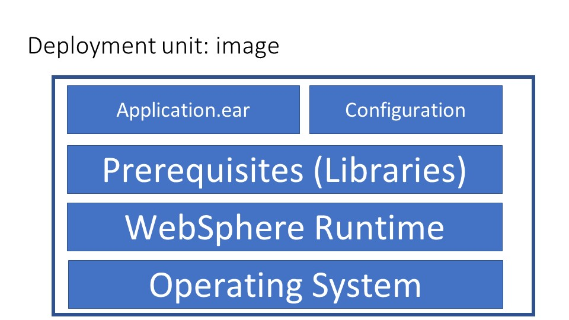
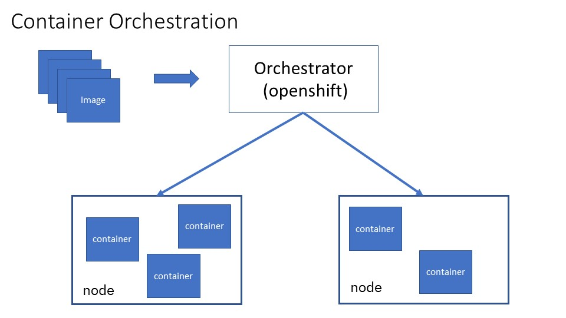

# Moving WebSphere Workload to Cloud

## Table of Contents
* [Introduction](#Introduction)
* [Introduction to Container Based Cloud](#Cloud)
* [WebSphere and Openshift Comparison](#Openshift_Comparison)
* [Options For moving WebSphere Workload](#WAS_To_Cloud)

<a name="Introduction />
## Introduction

In this chapter we will:
- Introduce the reader to the basic concepts of container based cloud. 
- Compare the differences between WebSphere environment and Openshift Environment
- List options to move WebSphere workload to cloud

## Introduction to Container Based Cloud

As a container based cloud, the unit of deployment is an image, not an application. An image contains the complete file system of a machine, starting from the operating system. However, unlike a traditional virtual machine image, it can be started as a process on top of an existing operating system. An image built for WebSphere Application Server looks like:

Image are named and layered. You may start from an existing layer, add one or more layers to build a new layer. 
Instead of installing WebSphere Application server multiple times, once for each node, you start with a pre-built WebSphere Application Server image shipped with the product, then add your own customizations. 
Or alternatively, you may start with an operating system image and install WebSphere Application Server to create a new image. 
This new image then serves as the basis from which to create additional images containing additional prerequisites, shared libraries, applications, and configurations.

A container is used to run an image. Containers provide isolated environments at the process level. Within this isolated environment, the amount of resources, and visibility to the resources, such as cpu, memory, and disk can all be strictly controlled. In addition, due to the the process level isolation, containers can be created and destroyed much more quickly compared to virtual machines, as quickly as starting and stopping processes.

To run just one or a few containers, a container runtime such as docker or podman may be used. However, to manage many containers across different nodes, you need a container orchestrator such as Openshift. 
Deployment through an container orchestrator looks looks like:

A container orchestrator serves many of the same functions as the WebSphere deployment manager, except that the deployment unit is an image. It:
- Creates running containers from images.
- Allocates the containers across multiple physical nodes.
- Monitors the health of the containers 
- Adjusts number of running containers based on load

## WebSphere Openshift Comparison

In this section, we compare in detail WebSphere Application server cell, Liberty Collective, and IBM Cloudpak for Applications.

|           |             |WAS Cell      | Liberty Collective |ICPA + Openshift  |
|-----------|-------------|--------------|--------------------|-----------------|
|topology   |             |              |                    |                 |
|           |max env      | 300-1000 JVMs| 10,000 JVMs        | **100,000 pods**    |
|           | disk        | 2GB per node | up to 200 MB       |depends on underlying runtime|
|           |firewall     | N            | N                  | Y |
|           |load balancer| Y            | Y                  | Y |
|Performance|             |              |                    |
|           |initial heap | > 100 MB     | **> 30 MB**            | depends on underlying runtime |
|           |server start | > 30s        | **3-5 sec**            | depends on underlying runtime |
|migration |     |              |                    |   |
|           |configuration migration | months to years | **no migration** | **minimal migration (of alpha or beta configuration)** |
|           |application migration   | months to hears | **no migration** | depends on underlying runtime |
|high availability|       |              |                    |                               |
|           |auto-scaling | yes          | yes                | yes                           |
|           |routing policy| yes         | yes                | yes                           |
|           | health management | yes     | yes               | yes                           |
|disaster recovery|        |roll you own | roll you rown      |roll your own                  |
|administration|
|           | admin model | scripting + GUI| scripting + GUI   | **declarative**|
|           |deployment unit| app         | zip file          | image |
|app config |             | separate      | in zip file       | in image   |
|infra config|            | in infra      | in zip file       |source control + infra |
|libraries  |             | separate      | in zip file       | in image |
|app edition |            | yes           | no                | yes (a/b) 
|infra upgrade|           | app + infra migration | no migration | depends on underlying runtime |
| security |   
|          | admin roles  | 6+             | 1-2              | namespace + user defined|
|          | admin audit  | yes            | yes              | yes (?)|
|    |app security domain | yes            | no (seperated by JVM) | depends on underlying runtime|
| |certificate management | some           | no               | yes?|
| | secret management     | password hash/encryption | password hash/encryption| underlying runtime + **config map + external value** |
| | security scans        | no             | no               | yes? |
| problem determination   |                |                  |      |
| | health management     | yes            | yes              | yes  |
| | centralized logging   | no             | no               | yes   |
| | centralized metrics   | no             | no               | yes  |
| devops |                | roll you own   |roll your own     | jenkins, Kabanero |
| qualities of service    |                |                 |      |
| | in-memory session cache| DRS, WXS      | WSX              | Redhat data grid|
| | built-in messaging     | SIBus         | yes (not HA)     | Redhat AMQ|
| | 2-phase transactions  | yes            | yes (not HA)     | yes (not HA)|
| | EJB clustering        | yes            | **no(use local EJB)**| **no( use local EJB)** |
| | stateful session failover| yes         | **no**               | **no**                 |
| | EJB timer failover    | yes            | **no**               | **no**                 |
| | EJB transaction propagation | yes      | **no**               | **depends on underlying runtime** |
| | dynamic caching       | yes            | **subset**           | depends on underlying runtime |
|programming models|      |Java/Jakarta EE| Java/Jakarta EE   | **polyglot**        |
|           |             | Spring       | Spring             |                 |
|           |restrictions |               | **no JAX-RPC** |restrictions depends on underlying runtime|

**Note that that some qualities of service are currently not available in Openshift, and have no suitable substitutes. You may need to re-architect your application.**  These include:
- EJB timer failover
- Stateful session bean failover
- 2-phase transaction failover

## Options for Moving WebSphere Workload

In this section, we will evaluate several options for operations modernization. The options are:
- WebSphere Cell in VM
- WebSphere Liberty in VM
- WebSphere in Openshift

### WebSphere Cell in VM

You may pre-install WebSphere onto a VM, then clone the VM to quickly create WAS cells. 
You may do this on your own, use VM Quickstarter, or use the WebSphere as a Service in IBM public cloud. 
Ultimately, this approach only enables you to quickly create new cells, which is useful if you need to frequently create new environments for development or testing, 
but it does not address the other performance or scalability issues with the cell:

| item | WAs Cell constraint|
|-----------|-----|
| size of cell       | 300 - 1000 JVMs |
| size of installation    | 2 Gb            |
| deployment unit    | application |
| create a new WAS cell | minutes |
| add a WAS node |  minutes |
| create cluster | seconds to 5 minutes  |
| add cluster member | seconds to 5 minutes |
| deploy application | seconds to hour |
| start application  | > 30 seconds |
| programming models  | Java/Jakarta EE, Spring |
| configuration migration | months or more |
| application migration | months or more |

### WebSphere Liberty in VM

You may also pre-install WebSphere Liberty onto a VM, then clone the VM to quickly create Liberty collectives. 
However, since Liberty is already designed for quick installation and fast startup, there are no significant savings using this approach. In addition, the scalability and administration issues still remain.

### WebSphere in Openshift

There are two recommended methods to run applications currently running in WebSphere in Openshift cloud:
- using WebSphere Liberty image:  recommended if the application already runs or can be port to Liberty. 
- using Websphere Base image: recommended if it is too difficult to port the application to Liberty.

Note that it is also possible and supported to run applications using Tomcat or JBOSS images. However, running on either Liberty or Base gives you the most runtime compatibility for an application currently running on WebSphere.

With Liberty or WebSphere Base, The scalability of the environment is that of the Kubernetes environment, not of the original cell or collective environment. The JVMs are stand-alone, not part of a collective or a cell. This also means that much of the qualities of service, such as clustering or failover, is provided by Openshift rather than WebSphere.

It should be clear that Liberty has many advantages over WebSphere Base when running in Openshift cloud. 
However, there are also some programming model and qualities of service limitations that makes some applications difficult to port to Openshift or Liberty without code change, as listed in the last section. 