# Introduction to Container Orchestration using Openshift

In this lab, we will introduce you to the basics of container Orchestration using Openshift. The first part of this lab uses the web console.  The second part of this lab uses the command line.

## Using the Web Console

### Login to the web console

Your login id and password should be provided to you by your administrator.

### Administrator vs Developer View

Switch to developer mode, and note you have fewer options. This mode is for developer working with their projects.


Switch back to Administrator mode, which gives you access to more options.


### Dashboard

Click on the dashboard to view summary of events:


Scroll down to view the utilization of cluster resources:


Scroll down some more to view the resources available in the cluster.


Scroll down more to view the cluster inventory, then click through each item in the inventory to find out more:

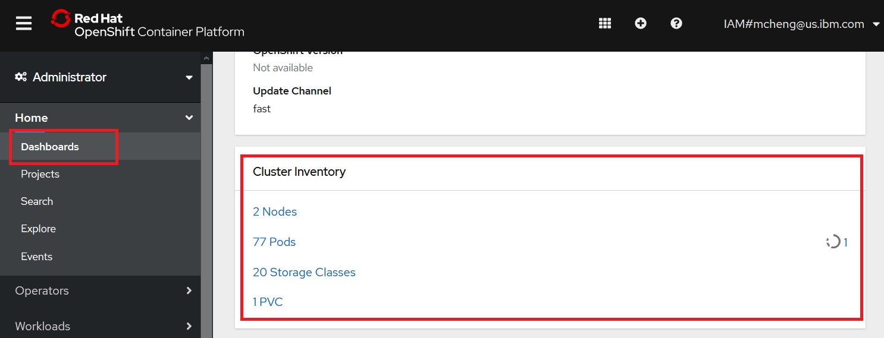

Note that:

- nodes represent physical or virtual hardware that your Openshift cluster is running.
- Pods are used to host and run one or more containers. Each node may run multiple pods. Containers in the same pod share the same network and storage.
- Storage classes represent the different types of storage configured and made available for your Openshift cluster. 
- Persistent Volume Claims (PVCs) represent the usage of storage by the pods. After a pod is removed, data not persistent to persistent storage are gone.

### Projects

Openshift `projects` allow you to group related resources together and to assign them a separate management policies. 
It is common for artifacts related to different applications to be assigned to different `projects`. Resources that belong to the same project are stored in the same Kubernetes `namespace`.

Click on `Projects` followed by *Create Project*:


In the dialog, enter `myproject` as project name, then click Create:

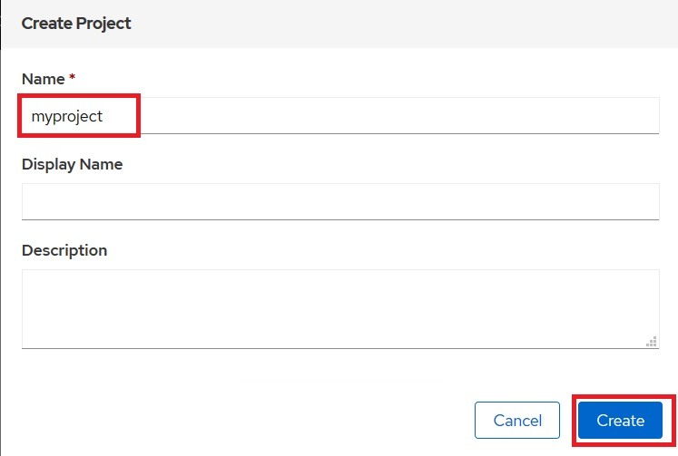


After creation, click on each of the tabs of myproject you just created. Note that:

- the `YAML` tab shows you the YAML representation of your project. Every resource in Openshift is represented as a REST data structure. We'll be working with YAML files a lot more when we interact with Openshift via the command line.
- The `Role Bindings` tab shows you the security configurations that apply to your project. For now, just take notice that there are many different roles already defined when a project is created. Each of these roles is used for a different purpose, and already mapped to different users and groups, or service accounts. 

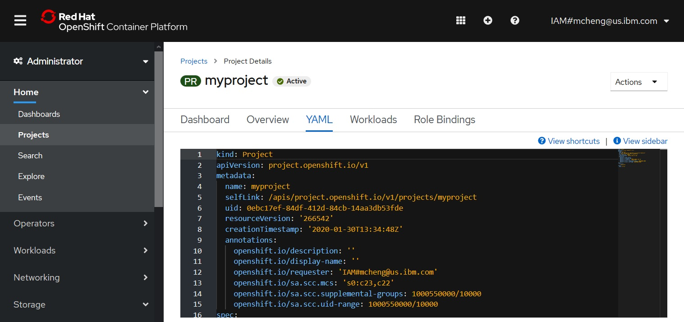

### First Application

The typical artifacts you will need to run an application in Openshift are:

- A container image containing your application, hosted in a container registry
- A `pod` that specifies where to fetch an image and how it should be hosted. For load balancing, other resources such as `deployment` are used to manage a set of `pods`.
- A `service` that exposes the application within the internal network, and enables the application to be load balanced within the Openshift cluster.
- A `route` or `ingress` to make the application accessible outside of the cluster firewall.

#### First deployment 

Click Deployment, followed by Create Deployment:


Note that the console shows you the YAML file for the deployment.  Change the number of replicas to 2, then click Create:


Here is the specification of the deployment in its entirety:

```
apiVersion: apps/v1
kind: Deployment
metadata:
  name: example
  namespace: myproject
spec:
  selector:
    matchLabels:
      app: hello-openshift
  replicas: 2
  template:
    metadata:
      labels:
        app: hello-openshift
    spec:
      containers:
        - name: hello-openshift
          image: openshift/hello-openshift
          ports:
            - containerPort: 8080
```

Let's review this resource:

- Recall that every resource in Openshift has a group, version, and kind. For the `Deployment` resource:
  - The group is `app`
  - The version is `v1`
  - The kind is `Deployment`
- The metadata specifies data that is that is needed for the runtime:
  - The name of this instance is `example`
  - The namespace where the resource is running is `myproject`
- The `spec` section defines the details specific to this kind of resource:
  - The `selector` defines defines details of the `pods` that this `deployment` will manage. The `matchLabels` attribute with value `app: hello-openshift` means this `deployment` instance will manage all pods whose labels contain `app: hello-openshift`.
- The `replicas: 2`  field specifies the number of replicas to run.
- The `template` section describes information about how to run the image and create the `pods`:
  - The `labels` section specifies what labels to create for the pods.
  - The `containers` section specifies where to fetch the container image and which ports to expose.


Wait for both pods to be running:


Click on the YAML tab, and not the additions to the original input YAML file.


Here is a sample :

```
kind: Deployment
apiVersion: apps/v1
metadata:
  name: example
  namespace: myproject
  selfLink: /apis/apps/v1/namespaces/myproject/deployments/example
  uid: 7c6a339b-385c-41bf-b4bf-3b6a120ef137
  resourceVersion: '297294'
  generation: 1
  creationTimestamp: '2020-01-30T15:45:15Z'
  annotations:
    deployment.kubernetes.io/revision: '1'
spec:
  replicas: 2
  selector:
    matchLabels:
      app: hello-openshift
  template:
    metadata:
      creationTimestamp: null
      labels:
        app: hello-openshift
    spec:
      containers:
        - name: hello-openshift
          image: openshift/hello-openshift
          ports:
            - containerPort: 8080
              protocol: TCP
          resources: {}
          terminationMessagePath: /dev/termination-log
          terminationMessagePolicy: File
          imagePullPolicy: Always
      restartPolicy: Always
      terminationGracePeriodSeconds: 30
      dnsPolicy: ClusterFirst
      securityContext: {}
      schedulerName: default-scheduler
  strategy:
    type: RollingUpdate
    rollingUpdate:
      maxUnavailable: 25%
      maxSurge: 25%
  revisionHistoryLimit: 10
  progressDeadlineSeconds: 600
status:
  observedGeneration: 1
  replicas: 2
  updatedReplicas: 2
  readyReplicas: 2
  availableReplicas: 2
  conditions:
    - type: Available
      status: 'True'
      lastUpdateTime: '2020-01-30T15:45:20Z'
      lastTransitionTime: '2020-01-30T15:45:20Z'
      reason: MinimumReplicasAvailable
      message: Deployment has minimum availability.
    - type: Progressing
      status: 'True'
      lastUpdateTime: '2020-01-30T15:45:20Z'
      lastTransitionTime: '2020-01-30T15:45:15Z'
      reason: NewReplicaSetAvailable
      message: ReplicaSet "example-75778c488" has successfully progressed.
```

Note that:

- There are quite a few more `metadta`. `Metadata` may be added by any number of controllers as needed to help with their function.
- The `specification` has more attributes filled in as well. These are default values that were not specified in our original YAML file. But sometimes it is also possible that some values are overridden by admission controllers if they were configured.
- The `status` sub-resource is how Openshift communicates that status of the resource. The `status` is updated regularly as the underlying state of the resource changes.

### First Service

Scroll down to the `Networking` section on the left navigation, click `Service`, then click `Crate Service`:

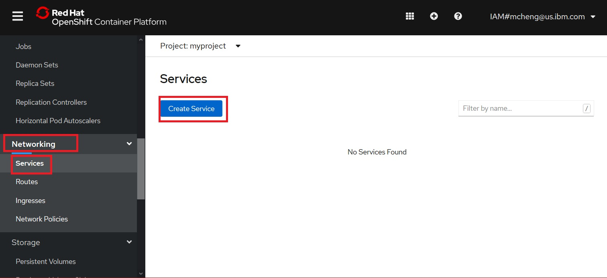


For the YAML parameters:

- For the labels, use `app: hello-openshift`. These were the labels that we used when creating the deployment.
- For the ports, use 8080, the same ports we used previously.

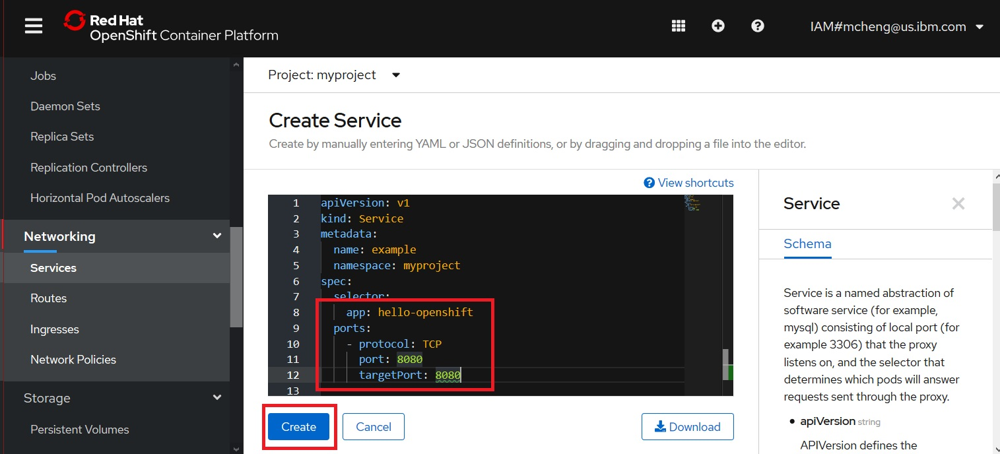


After the service is created, click on the YAML tab:

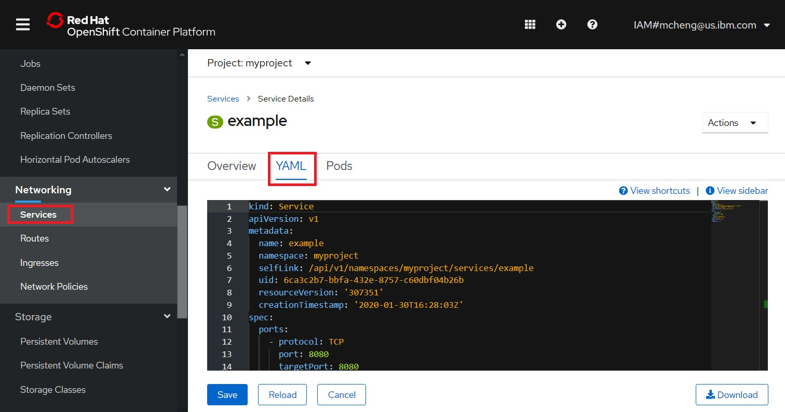

The YAML file looks like:
```
Kind: Service
apiVersion: v1
metadata:
  name: example
  namespace: myproject
  selfLink: /api/v1/namespaces/myproject/services/example
  uid: 6ca3c2b7-bbfa-432e-8757-c60dbf04b26b
  resourceVersion: '307351'
  creationTimestamp: '2020-01-30T16:28:03Z'
spec:
  ports:
    - protocol: TCP
      port: 8080
      targetPort: 8080
  selector:
    app: hello-openshift
  clusterIP: 172.21.239.191
  type: ClusterIP
  sessionAffinity: None
status:
  loadBalancer: {}
```

Note that for this service, there is a cluster wide IP address created, and that it is being load balanced. Also session affinity is not set for this service.

### First Route

Click on `Route` in the left navigation, then click Crate Route:


For the parameters

- Name: example
- Service: example
- Target Port: 8080 --> 8080

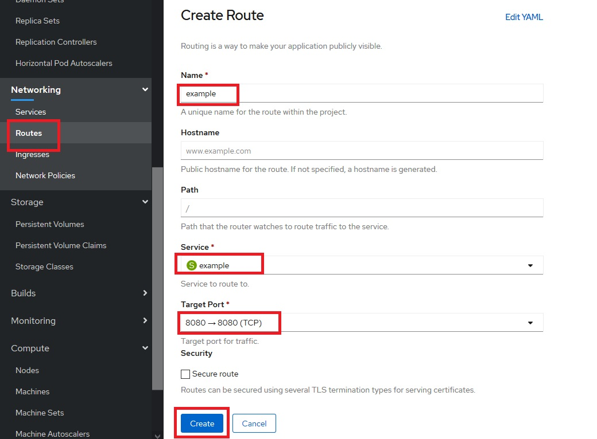

Note that we are ignoring TLS configuration just for the purpose of this lab. 

Try to access the route at the link provided:

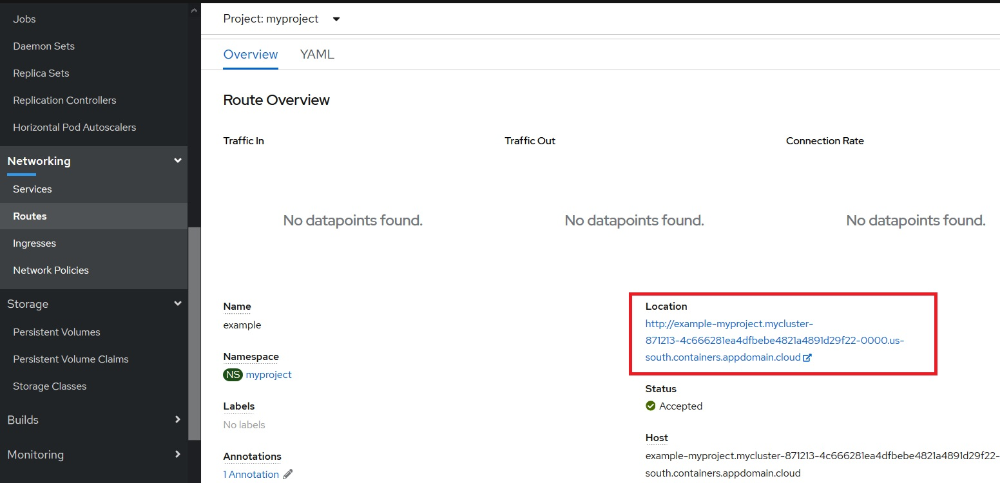

The browser will show: `Hello Openshift!`

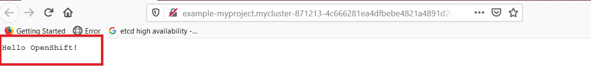

### Changing Replica Instances

Click on `Projectrs` from the left navigation, then click on `myproject`:


Scroll down to see the resources that were created. Recall that we have created one deployment, which then created 2 pods. We also created one service, and one route.

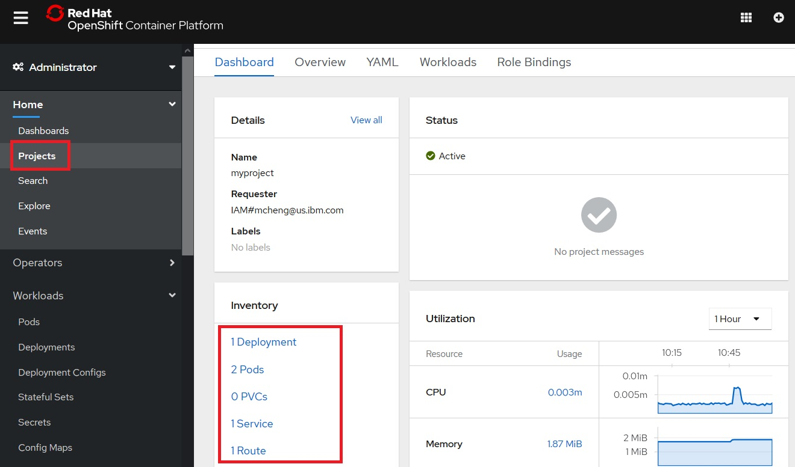

Click on the 2 pods:


Delete one of the pods my clicking on the menu on the right, then selecting `Delete pod`. When prompted, click `Delete`.


This is not the right way to reduce number of instances. You will notice that as soon as one of the pods is being terminated, another one is being created. The reason is that the controller for the `deployment` resource knows that your specification is for 2 instances, and it honors that specification by creating another one.


To change the number of instances, you will need to change the specification of your deployment. Click on Deployments in the left navigation, then click on `example` deployment:

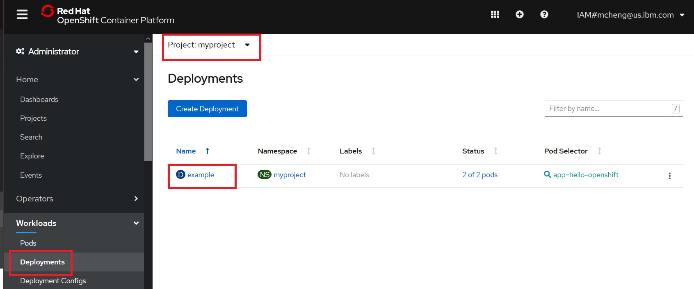


Click on the down arrow to reduce the replica size down to 1:

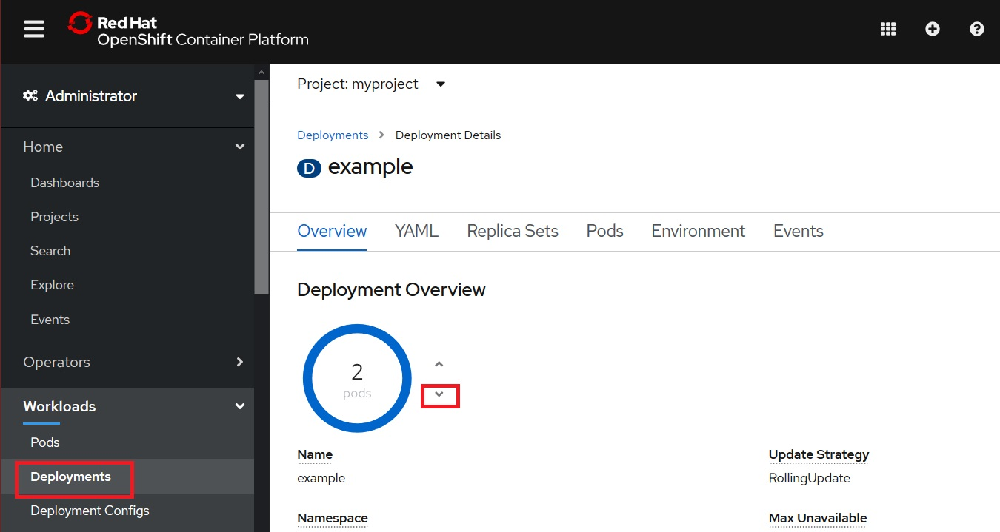

After the operation is completed, click on the YAML tab:


Note that the console had changed the REST specification on your behalf so that the replica count is now 1:


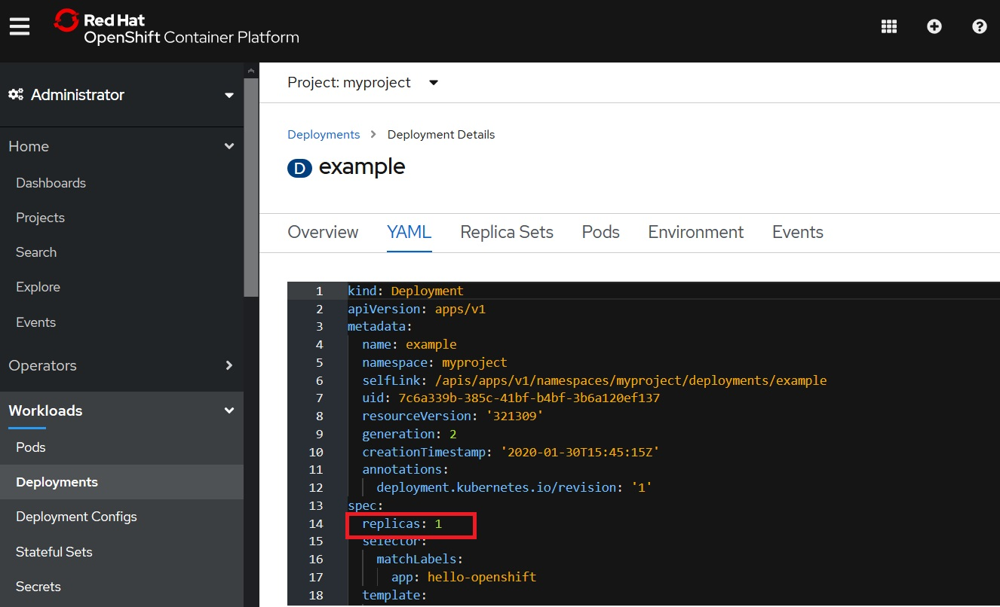


## Using command line
