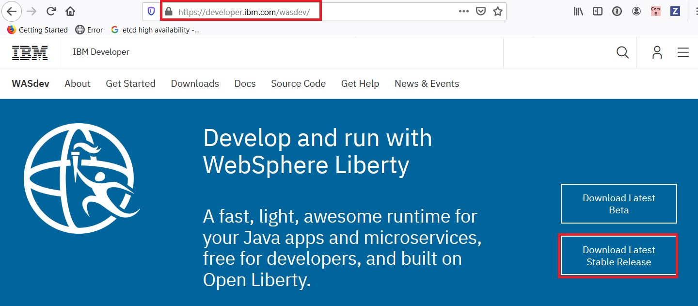
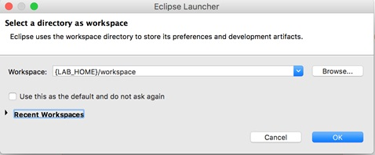
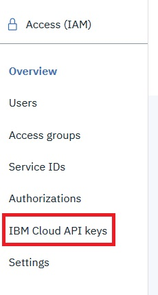
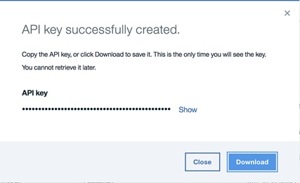

# Setup Liberty

In this lab we will perform the initial set up required for all the labs and explore Liberty.
The instructions assume a Windows environment, but Linux and Mac differences are presented.
Where applicable, substitute with Linux or Mac equivalent, such as path names.

If you are not participating as part of Liberty Virtual POT, you are free to install Liberty and Eclipse at a location of your choosing, after following the installation instructions below.

If you are participating in this lab as part of Liberty Virtual Proof of Technology (Liberty Virtual POT),  you would download a zip file (URL provided during virtual POT) that contains Liberty, Eclipse, WebSphere Developer tools. After following the installation instructions below, you can find Liberty installed in the following locations:

|Location Ref | OS | Absolute Path |
|-------------|----|---------------|
|{LAB_HOME}  | Windows | `C:\WLP_<version>` |
|{LAB_HOME}  | Linux, Mac   | `~/WLP_<version>` or your choice |

## Installing Liberty

If you are installing Liberty not as part of Liberty Virtual POT, proceed to [Installing On Your Own](#SelfInstall).

If you are installing Liberty as part of Liberty Virtual POT, proceed to [Installing as part of VirtualPOT](#InstallVirtualPOT).

<a name="InstallVirtualPOT"></a>
### Installing as part of Virtual POT


#### Unzip the zip files

Unzip the .zip file appropriate from your platform from USB drive to your computer. 

- For Windows, unzip `LibertyPoT_<VERSION>_WIN.zip` to `c:` drive. The final directory is `C:\WLP_<VERSION>`.
- For Linux unzip `LibertyPoT_<VERSION>_LINUX.zip` to a directory of `{LAB_HOME}`, e.g, your home directory.   
The final directory is `{LAB_HOME}/WLP_<VERSION>`
- For Mac, unzip `LibertyPoT_<VERSION>_MAC.zip` to a directory of `{LAB_HOME}`, e.g., your home directory.  
The final directory is `{LAB_HOME}/WLP_<VERSION>`.

#### Install Prerequisites

##### Mac

Download and install the JRE from [Oracle's website](http://www.oracle.com/technetwork/java/javase/downloads/jdk8-downloads-2133151.html)

##### Linux

You may be missing prerequisite packages required to run the supplied Java SDK and Eclipse. 
If you are running on 64-bit Linux, you need to install 32-bit packages as the supplied Java SDK and Eclipse are both 32 bits.  
For Ubuntu or Debian variants of Linux, 
use the following commands to install the missing packages.  
For other Linux variants, search online for equivalent packages.

To run with the supplied Java SDK, use these commands to install the prerequisite packages:

1.	`sudo apt-get install build-essential`
1.	`sudo apt-get install g++-4.8-multilib`

To run with the supplied Eclipse with WDT, use these commands to install the prerequisite packages:

1.	`sudo apt-get install libswt-gtk-3-java`
1.	`sudo apt-get install libgtk2.0-0:i386`
1.	`sudo apt-get install libgtk-3-0:i386`
1.	`sudo apt-get install libxtst6:i386`
1.	`sudo apt-get install gtk2-engines-murrine:i386`
1.	`sudo apt-get install unity-gtk2-module:i386`
1.	`sudo apt-get install libcanberra-gtk-module:i386`
1.	`sudo apt-get install gtk3-engines-unico:i386`
1.	`sudo apt-get install overlay-scrollbar-gtk2:i386`  (Note: this package may not install successfully on latest versions of Ubuntu, but WDT can function without it.)

Execute `env| grep –i java_home`. 
If it returns with a value, then execute `unset JAVA_HOME`. 
This allows you to use the Java that is part of the zip file you installed.

#### Windows

Execute “set JAVA_HOME”.  
If it returns with a value, then execute “set JAVA_HOME=”
This allows you to pick up the Java that is part of your zip install.


<a name="SelfInstall"></a>
### Installing On Your Own

- If you don't already have Eclipse IDE for Enterprise Java Developers, install the latest version from [eclipse.org](http://www.eclipse.org). Click `Download`, followed by `Download packges`.  Locate the packages for Eclipse IDE for Enterprise Java Developers.

- Install `IBM Liberty Developer Tools`. You can find the tool on [Eclipse Market Place](https://marketplace.eclipse.org)

- Point your browser to [wasdev website](https://developer.ibm.com/wasdev), and click on `Download Latest Stable Release`



- Download the zip file for the latest stable release, and unzip to your `{LAB_HOME}` directory. After unzip, your Liberty installation should be under `{LAB_HOME}/wlp`.
- Follow the instructions to install WebSphere Developer Tools (WDT)
- Install full Java EE 7 support: `{LAB_HOME}/wlp/bin/installUtility install --acceptLicense javaee-7.0`
- Install full Java EE 8 support: `{LAB_HOME}/wlp/bin/installUtility install --acceptLicense javaee-8.0`

## Verifying your Liberty Installation

###  Create Test Server

1. Change directory to `{LAB_HOME}/wlp/bin` 
1. Crete server:
   - For Windows: `server create myServer`
   - For Mac or Linux: `./server create myServer`
1. The new server is created in `{LAB_HOME}/wlp/usr/servers/myServer`.  
The server.xml file is the complete server configuration. Open up an editor to view `{LAB_HOME}/wlp/usr/servers/myServer/server.xml`.
1. Start the server instance with this command: 
    - For Windows: `server start myServer`
    - For Mac or Linux: `./server start myServer`

    This runs the server in the background and the output is written to files in the `{LAB_HOME}/wlp/usr/servers/myServer/logs` directory.  Alternatively, to start the server in the foreground (so the console messages are seen in the command window) you can use the command “server run myServer”.

1. Stop the server instance with this command: 
    - For Windows: `server stop myServer`
    - For Mac or Linux: `./server stop myServer`

1. Having verified the install, clean up.  Delete the server by deleting the `{LAB_HOME}/wlp/usr/servers/myServer` directory.

You now have a Liberty runtime environment that is ready to be configured to run applications.  
 

## Test WebSphere Developer Tools (WDT)

You can manage Liberty from the command line, and edit the server configuration files in any editor, but the WebSphere Developer Tools (WDT) provide a great configuration editor, server controls and application publishing, as well as many other time-saving utilities.
We will use WDT in many more labs.

*Note*:  Upon first startup, it may take Eclipse up to a minute to initialize.

1. Start Eclipse with WDT
   - For Virtual POT attendees:
       - For Windows,  `{LAB_HOME}\wdt\eclipse\eclipse.exe`
       - For Linux, `{LAB_HOME}/wdt/eclipse/eclipse`
       - For Mac, `{LAB_HOME}/wdt/eclipse/Eclipse.app/Contents/MacOs/eclipse`
   - For all others: start Eclipse that you have installed.

1. When the Eclipse launcher prompts you to Select a workspace: 
  - Enter `{LAB_HOME}\workspace` 
  - Click OK, substituting `{LAB_HOME}` with the correct value for your platform.   This should create workspace directory for you.
  - Note: Accepting the default workspace location may cause problems with a preexisting workspace.  Please use a clean workspace location.

  

1. Remove the welcome page by clicking on the `X` icon.

  

### Create Liberty Server in WDT

1. At the bottom of the workbench, open the Servers view by clicking the `Servers` tab.
Right-click within the windows of the `Servers` view and select `New > Server`.

    

1. Under the server type list, expand IBM and select the Liberty Server server type.
Use the default eclipse server name as supplied (localhost).  Click Next.  This creates the liberty server object in eclipse.

    

1. Now eclipse needs to associate the `localhost` server with a server configuration in a Liberty runtime (the runtime that you installed).  
The Liberty Runtime Environment page is displayed.
    - In the Path field under the Installation folder section,
    type or browse for the directory where you installed the
    Liberty runtime environment (The value of {LAB_HOME}/wlp)
    - You may also select which JRE to use if you have 
    multiple JRE in your environment.
    - Click Next.

    
1. To create the server configuration in the runtime, 
 either use the current populated server `myServer` or 
 click the New button.  
 Note: if you had previosly deleted `myServer`, your screen will differ, and there will be no new button and defaultServer will be prepopulated.

    
1. Enter `labServer` to the `Liberty Server:` box then click Finish and then Finish again.

    
1. The new server will appear in the Servers view.
You can expand the server to show a quick view of the configuration.  
You can open the server configuration editor by double-clicking on Server Configuration:

    

## For Labs Accessing IBM Cloud: Create a IBM Cloud User ID

For the cloud labs, IBM Cloud is used for the hosting environment.  
If you already have an IBM Cloud account, you may skip this part.  
Your 30-day Cloud trial is free, with no credit card required. 
You get access to 2 GB of runtime and container memory to run apps, 
unlimited IBM services and APIs.

1. To begin, visit `https://cloud.ibm.com`  and select the `Create an IBM Cloud Account` link. 
If you don't see a sign-up link, 
you should already be logged in, 
though you will need to know your login and password for later steps.

    
1. On the sign-up page, enter your email address and the other required information.
Your IBM ID and IBM Cloud information should be sent to your email account shortly.

    
1. Once you receive the email message in your account, follow the steps to verify your address. 
Once verified, you will be able to log in the IBM Cloud with the password you specified in the previous steps.

1. Once created, open your account in the IBM Cloud console. 
Visit [https://cloud.ibm.com](https://cloud.ibm.com) and click LOG IN.  
Enter your email id and then your password as requested.

1. Once logged in, you may need to create a new space and organization. 
If you are required to create these, you will be immediately asked to do so by the IBM Cloud console (otherwise, proceed to the next part).

## Labs Accessing IBM Cloud: Create a IBM Cloud API Key to use for authentication

As a IBM Cloud user, you might want to use an API key when you enable a program or script without distributing your password to the script or worry about dealing with password management. 
A benefit of using an API key can be that a user or organization can create several API Keys for different programs and the API keys can be deleted independently if compromised without interfering with other API keys or even the user.

1. Create a Platform API Key to use to authenticate with IBM Cloud.  
    - Click `Manage > Access (IAM)> Platform API Keys`

        
    - Click `IBM Cloud API Keys`:

        
    - Click `Create`

        
    - Enter the Name and a description; then click `Create`
        - Name: `Liberty-APIKey`
        - Description: `This API Key for use with Liberty POTs`

        
    -	Click `Download`

        
    -	Find the downloaded file named `apiKey.json`.  (This should be in your browsers Download folder)

Now rename the file to `Liberty-APIKey.json`.   
  There is a string in the file that will be used in lieu of a username/password.
- Copy the `Liberty-APIKey.json` to `{LAB_HOME}` just so it is not lost.  Unfortunately, this key is only downloadable in a file once.  If lost, another key will need to be generated.
-	The file contents will look accordingly. 
    The string in bold is your `password` that maps to the `user` or `email address` of apikey
 ```
{
	"name": "Liberty-APIKey",
	"description": "",
	"createdAt": "2017-06-26T16:16+0000",
	"apiKey": "gI2-RsH8DHWGhCwWA-K61PSdWbLawRlgpAiGixmq7ZmD"
}
```

##  Labs Accessing IBM Cloud: Install the Command Line Interface (CLI) tools

You can use the command line interface to deploy and modify applications and service instances.
 Follow the instructions to download the IBM CLOUD CLI interface, `ibmcloud`: <https://cloud.ibm.com/docs/cli/index.html#cli>
 

This completes the lab exercise.