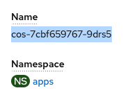
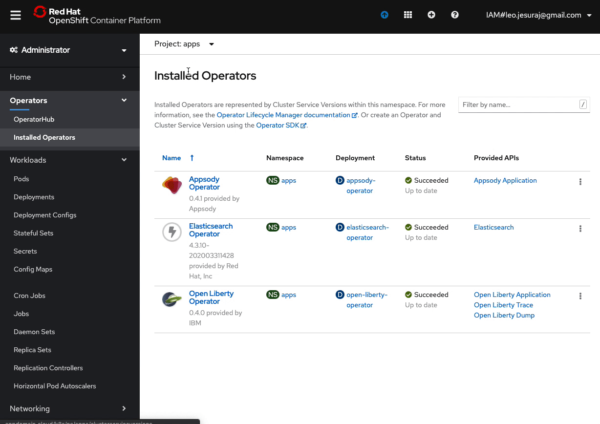
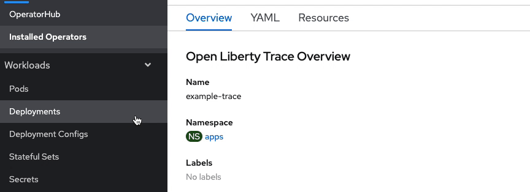

# Application Management

## Table of Contents

- [Introduction](#introduction)
- [IBM Application Navigator](#ibm-application-navigator) (Hands-on)
- [Application Monitoring](#application-monitoring) (Hands-on)
- [Day-2 Operations](#day-2-operations) (Hands-on)
- [Summary](#summary)

## Introduction

In the previous labs, you learned to containerize and deploy modernized applications to OpenShift. In this section, you'll learn about managing your running applications efficiently using various tools available to you as part of IBM Cloud Pak for Applications.

## IBM Application Navigator

IBM Application Navigator provides a single dashboard to manage your applications running on cloud as well as on-prem, so you don't leave legacy applications behind. At a glance, you can see all the resources (Deployment, Service, Route, etc.) that are part of an application and monitor their state. 

1. In OpenShift console, from the left-panel, select **Networking** > **Routes**.

1. From the _Project_ drop-down list, select `kappnav`. 

1. Click on the route URL (listed under the _Location_ column).

1. Click on `Log in with OpenShift`. Click on `Allow selected permissions`.

1. Notice the list of applications you deployed. Click on them to see the resources that are part of the applications.

As you modernize your applications, some workload would still be running on traditional environments. IBM Application Navigator, included as part of IBM Cloud Pak for Applications, supports adding WebSphere Network Deployment (ND) environments. So they can be managed from the same dashboard. Importing an existing WebSphere Application Server ND cell creates a custom resource to represent the cell. Application Navigator automatically discovers enterprise applications that are deployed on the cell and creates custom resources to represent those applications. Application Navigator periodically polls the cell to keep the state of the resources synchronized with the cell. 

Application Navigator also provides links to other dashboards that you already use and are familiar with. You can also define your own custom resources using the extension mechanism provided by Application Navigator.

## Application Monitoring

Building observability into applications externalizes the internal status of a system to enable operations teams to monitor systems more effectively. It is important that applications are written to produce metrics. When the Customer Order Services application was modernized, we used MicroProfile Metrics and it provides a `/metrics` endpoint from where you can access all metrics emitted by the JVM, Open Liberty server and deployed applications. Operations teams can gather the metrics and store them in a database by using tools like Prometheus. The metrics data can then be visualized and analyzed in dashboards, such as Grafana.

### Grafana dashboard

1. Custom resource [GrafanaDashboard](https://github.com/IBM/teaching-your-monolith-to-dance/blob/liberty/deploy/grafana-dashboard-cos.yaml) defines a set of dashboards for monitoring Customer Order Services application and Open Liberty. In web terminal, run the following command to create the dashboard resource:
    ```
    oc apply -f https://raw.githubusercontent.com/IBM/teaching-your-monolith-to-dance/liberty/deploy/grafana-dashboard-cos.yaml
    ```

1. The following steps to access the created dashboard are illustrated in the screen recording at the end of this section: In OpenShift console, from the left-panel, select **Networking** > **Routes**.

1. From the _Project_ drop-down list, select `app-monitoring`. 

1. Click on the route URL (listed under the _Location_ column).

1. Click on `Log in with OpenShift`. Click on `Allow selected permissions`.

1. In Grafana, from the left-panel, hover over the dashboard icon and click on `Manage`.

1. You should see `Liberty-Metrics-Dashboard` on the list. Click on it.

1. Explore the dashboards. The first 2 are for Customer Order Services application. The rest are for Liberty.

1. Click on `Customer Order Services - Shopping Cart`. By default, it'll show the data for the last 15 minutes. Adjust the time-range from the top-right as necessary. 

1. You should see the frequency of requests, number of requests, pod information, min/max request times.

1. Scroll-down to expand the `CPU` section. You'll see information about process CPU time, CPU system load for pods.

1. Scroll-down to expand the `Servlets` section. You'll see request count and response times for application servlet as well as health and metrics endpoints.

1. Explore the other sections.

    

## Day-2 Operations

You may need to gather server traces and/or dumps for analyzing some problems. Open Liberty Operator makes it easy to gather these on a server running inside a container.

A storage must be configured so the generated artifacts can persist, even after the Pod is deleted. This storage can be shared by all instances of the Open Liberty applications. RedHat OpenShift on IBM Cloud utilizes the storage capabilities provided by IBM Cloud. Let's create a request for storage.

### Request storage

1. In OpenShift console, from the left-panel, select **Storage** > **Persistent Volume Claims**.

1. From the _Project_ drop-down list, select `apps`. 

1. Click on `Create Persistent Volume Claim` button.

1. Ensure that `Storage Class` is `ibmc-block-gold`. If not, make the selection from the list.

1. Enter `liberty` for `Persistent Volume Claim Name` field.

1. Request 1 GiB by entering `1` in the text box for `Size`.

1. Click on `Create`.

1. Created Persistent Volume Claim will be displayed. The `Status` field would display `Pending`. Wait for it to change to `Bound`. It may take 1-2 minutes.

1. Once bound, you should see the volume displayed under `Persistent Volume` field.

### Enable serviceability

Enable serviceability option for the Customer Order Services application. In productions systems, it's recommended that you do this step with the initial deployment of the application - not when you encounter an issue and need to gather server traces or dumps. OpenShift cannot attach volumes to running Pods so it'll have to create a new Pod, attach the volume and then take down the old Pod. If the problem is intermittent or hard to reproduce, you may not be able to reproduce it on the new instance of server running in the new Pod. The volume can be shared by all Liberty applications that are in the same namespace and the volumes wouldn't be used unless you perform day-2 operation on a particular application - so that should make it easy to enable serviceability with initial deployment.

1. Specify the name of the storage request (Persistent Volume Claim) you made earlier to `spec.serviceability.volumeClaimName` parameter provided by `OpenLibertyApplication` custom resource. Open Liberty Operator will attach the volume bound to the claim to each instance of the server. In web terminal, run the following command:

    ```
    oc patch olapp cos -n apps --patch '{"spec":{"serviceability":{"volumeClaimName":"liberty"}}}' --type=merge
    ```

    Above command patches the definition of `olapp` (shortname for `OpenLibertyApplication`) instance `cos` in namespace `apps` (indicated by `-n` option). The `--patch` option specifies the content to patch with. In this case, we set the value of `spec.serviceability.volumeClaimName` field to `liberty`, which is the name of the Persistent Volume Claim you created earlier. The `--type=merge` option specifies to merge the previous content with newly specified field and its value.

1. Run the following command to get the status of `cos` application, to verify that the changes were reconciled and there is no error:

    ```
    oc get olapp cos -n apps -o wide
    ```
    The value under `RECONCILED` column should be _True_. 
    
    _Note:_ If it's _False_ then an error occurred. The `REASON` and `MESSAGE` columns will display the cause of the failure. A common mistake is creating the Persistent Volume Claim in another namespace. Ensure that it is created in the `apps` namespace.


1. In OpenShift console, from the left-panel, click on **Workloads** > **Pods**. Wait until there is only 1 pod on the list and its _Readiness_ column changed to _Ready_.

1. Pod's name is needed for requesting server dump and trace in the next sections. Click on the pod and copy the value under `Name` field.

    

### Request server dump

You can request a snapshot of the server status including different types of server dumps, from an instance of Open Liberty server running inside a Pod, using Open Liberty Operator and `OpenLibertyDump` custom resource (CR). 

The following steps to request a server dump are illustrated in the screen recording below:

1. From the left-panel, click on **Operators** > **Installed Operators**.

1. From the `Open Liberty Operator` row, click on `Open Liberty Dump` (displayed under `Provided APIs` column).

1. Click on `Create OpenLibertyDump` button. 

1. Replace `Specify_Pod_Name_Here` with the pod name you copied earlier.

1. The `include` field specifies the type of server dumps to request. Heap and thread dumps are specified by default. Let's use the default values.

1. Click on `Create`.

1. Click on `example-dump` from the list.

1. Scroll-down to the `Conditions` section and you should see `Started` status with `True` value. Wait for the operator to complete the dump operation. You should see status `Completed` with `True` value.

    

### Request server traces

You can also request server traces, from an instance of Open Liberty server running inside a Pod, using `OpenLibertyTrace` custom resource (CR).

The following steps to request a server trace are illustrated in the screen recording below:

1. From the left-panel, click on **Operators** > **Installed Operators**.

1. From the `Open Liberty Operator` row, click on `Open Liberty Trace`.

1. Click on `Create OpenLibertyTrace` button.

1. Replace `Specify_Pod_Name_Here` with the pod name you copied earlier.

1. The `traceSpecification` field specifies the trace string to be used to selectively enable trace on Liberty server. Let's use the default value. 

1. Click on `Create`.

1. Click on `example-trace` from the list.

1. Scroll-down to the `Conditions` section and you should see `Enabled` status with `True` value. 
    - _Note:_ Once the trace has started, it can be stopped by setting the `disable` parameter to true. Deleting the CR will also stop the tracing. Changing the `podName` will first stop the tracing on the old Pod before enabling traces on the new Pod. Maximum trace file size (in MB) and the maximum number of files before rolling over can be specified using `maxFileSize` and `maxFiles` parameters.

    

### Accessing the generated files

The generated trace and dump files should now be in the persistent volume. You used storage from IBM Cloud and we have to go through a number of steps using a different tool to access those files. Since the volume is attached to the Pod, we can instead use Pod's terminal to easily verify that trace and dump files are present.

The following steps to access the files are illustrated in the screen recording below:

1. From the left-panel, click on **Workloads** > **Pods**. Click on the pod and then click on `Terminal` tab. 

1. Enter `ls -R serviceability/apps` to list the files. The shared volume is mounted at `serviceability` folder. The sub-folder `apps` is the namespace of the Pod. You should see a zip file for dumps and trace log files. These are produced by the day-2 operations you performed.

1. Using Open Liberty Operator, you learned to perform day-2 operations on a Liberty server running inside a container, which is deployed to a Pod.

    


## Summary

Congratulations! You've completed **Application Management** lab! 


