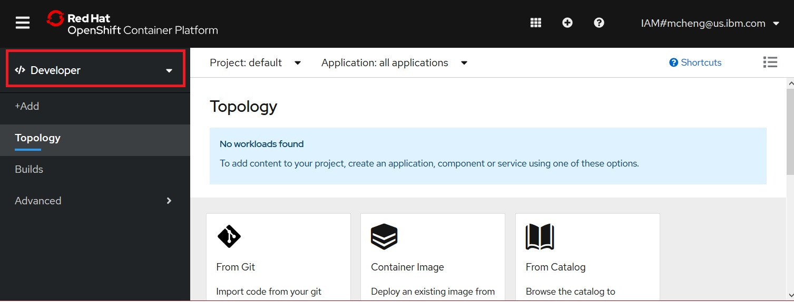
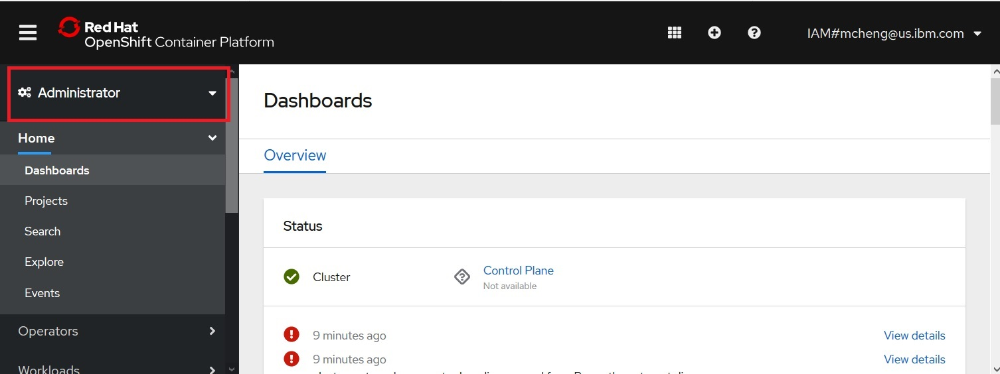
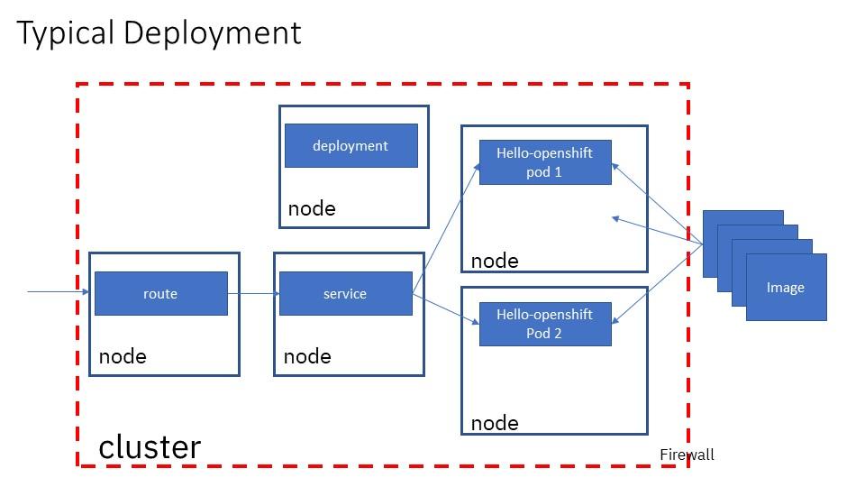
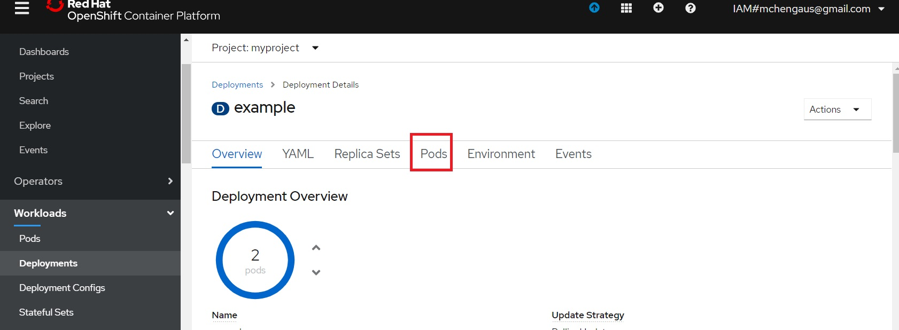
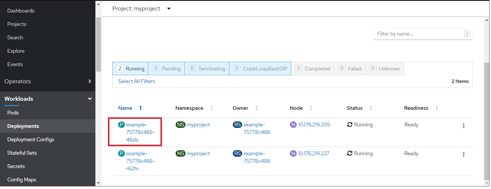
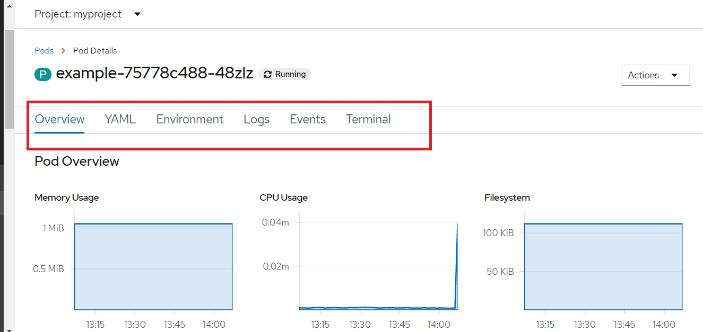
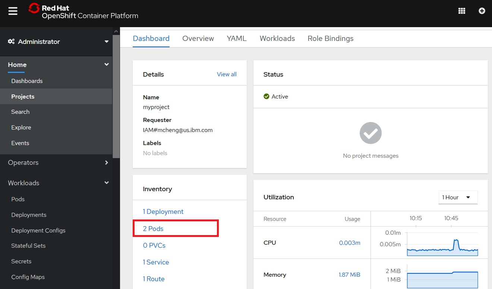
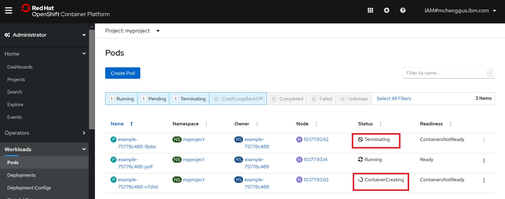
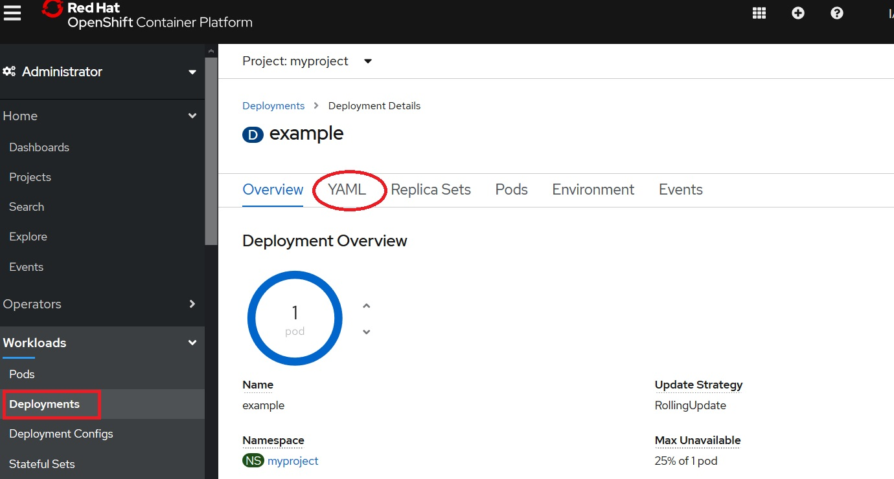
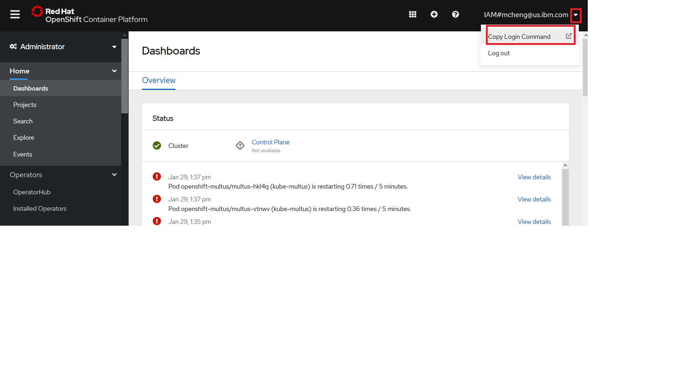

# Introduction to Container Orchestration using Openshift

In this lab, we will introduce you to the basics of container Orchestration using Openshift. We will

- Perform basic navigation using the web console
- Deploy the `hello-openshift` image through the web console.
- Deploy the `hello-openshift` image through the command line.

## Prerequisite

- For background on basic Openshift concepts, read [Openshift Concepts for WebSphere Administrators](https://github.com/IBM/openshift-workshop-was/blob/master/OpenshiftConcepts.md)
- You have the access to OpenShift Web Console. 
- You have cloned the lab into your working directory through the web terminal session. 

## Deploy the hello-openshift image through the web console

### Login to the web console
The instruction to access the web console is at: [Lab Setup](https://github.com/IBM/openshift-workshop-was/tree/master/setup).

### Administrator vs Developer View

1. Switch to Developer view, and note you have fewer and different options. This view is for developer working with their projects.

    


1. Switch back to Administrator view, which gives you access to more options. We will concentrate on administrator view in this lab.




### Dashboard

1. Click on the dashboard to view summary of events:

    


1. Scroll down to view the utilization of cluster resources:

    


1. Scroll down more to view the cluster inventory. Click through each item in the inventory to find out more:

    

    Note that:

    - nodes represent physical or virtual hardware that your Openshift cluster is running.
    - Pods are used to host and run one or more containers. Each node may run multiple pods. Containers in the same pod share the same network and storage.
    - Storage classes represent the different types of storage configured and made available for your Openshift cluster. 
    - Persistent Volume Claims (PVCs) represent the usage of storage by the pods. After a pod is removed, data not persistent to persistent storage are gone.

### Projects

Openshift `projects` allow you to group related resources together and to assign them separate management policies. 
It is common for artifacts related to different applications to be assigned to different `projects`. Resources that belong to the same project are stored in the same Kubernetes `namespace`.

1. Click on `Projects` followed by *Create Project*:

    

1. In the dialog, enter `myproject` as project name, then click Create:

    

1. After creation, click on each of the tabs of myproject you just created. Note that:

   - the `YAML` tab shows you the YAML representation of your project. Every resource in Openshift is represented as a REST data structure. We'll be working with YAML files a lot more when we interact with Openshift via the command line.
   - The `Role Bindings` tab shows you the security configurations that apply to your project. For now, just take notice that there are many different roles already defined when a project is created. Each of these roles is used for a different purpose, and already mapped to different users and groups, or service accounts.

   

### First Application

The typical artifacts you will need to run an application in Openshift are:

- A container image containing your application, hosted in a container registry
- One or more `pods` that specifies where to fetch an image and how it should be hosted. 
- A `deployment` to control the number of instances pods. You don't normally configure a `pod` directly. Instead, you configure a `deployment` to manage a set of `pods`.
- A `service` that exposes the application within the internal network, and enables the application to be load balanced within the Openshift cluster.
- A `route` or `ingress` to make the application accessible outside of the Openshift cluster firewall.

    

#### First deployment 

1. Click Deployment, followed by Create Deployment:

    

1. Note that the console shows you the YAML file for the deployment.  Change the number of replicas to 2, then click **Create**:

    


    Here is the specification of the deployment in its entirety:

    ```
    apiVersion: apps/v1
    kind: Deployment
    metadata:
      name: example
      namespace: myproject
    spec:
      selector:
        matchLabels:
          app: hello-openshift
      replicas: 2
      template:
        metadata:
          labels:
            app: hello-openshift
        spec:
          containers:
            - name: hello-openshift
              image: openshift/hello-openshift
              ports:
                - containerPort: 8080
    ```

1. Let's review this resource:

    - Every resource in Openshift has a group, version, and kind. For the `Deployment` resource:
      - The group is `app`
      - The version is `v1`
      - The kind is `Deployment`
    - The metadata specifies data that is needed for the runtime:
      - The name of this instance is `example`
      - The namespace where the resource is running is `myproject`
      - Though not shown here, any labels associated with the resource. We will see the use of labels later.
    - The `spec` section defines the details specific to this kind of resource:
      - The `selector` defines details of the `pods` that this `deployment` will manage. The `matchLabels` attribute with value `app: hello-openshift` means this `deployment` instance will search for and manage all pods whose labels contain `app: hello-openshift`.
    - The `replicas: 2`  field specifies the number of instances to run.
    - The `template` section describes information about how to run the container image and create the `pods`:
      - The `labels` section specifies what labels to add to the pods being to be created. Note that it matches the labels defined in the `selector`.
      - The `containers` section specifies where to fetch the container image and which ports to expose. For our example, the image to run is `openshift/hello-openshift`.
    
1. Wait for both pods to be running:

    

1. Click on the YAML tab, and note the additions to the original input YAML file.

    

1. Here is a sample :

    ```
    kind: Deployment
    apiVersion: apps/v1
    metadata:
      name: example
      namespace: myproject
      selfLink: /apis/apps/v1/namespaces/myproject/deployments/example
      uid: 7c6a339b-385c-41bf-b4bf-3b6a120ef137
      resourceVersion: '297294'
      generation: 1
      creationTimestamp: '2020-01-30T15:45:15Z'
      annotations:
        deployment.kubernetes.io/revision: '1'
    spec:
      replicas: 2
      selector:
        matchLabels:
          app: hello-openshift
      template:
        metadata:
          creationTimestamp: null
          labels:
            app: hello-openshift
        spec:
          containers:
            - name: hello-openshift
              image: openshift/hello-openshift
              ports:
                - containerPort: 8080
                  protocol: TCP
              resources: {}
              terminationMessagePath: /dev/termination-log
              terminationMessagePolicy: File
              imagePullPolicy: Always
          restartPolicy: Always
          terminationGracePeriodSeconds: 30
          dnsPolicy: ClusterFirst
          securityContext: {}
          schedulerName: default-scheduler
      strategy:
        type: RollingUpdate
        rollingUpdate:
          maxUnavailable: 25%
          maxSurge: 25%
      revisionHistoryLimit: 10
      progressDeadlineSeconds: 600
    status:
      observedGeneration: 1
      replicas: 2
      updatedReplicas: 2
      readyReplicas: 2
      availableReplicas: 2
      conditions:
        - type: Available
          status: 'True'
          lastUpdateTime: '2020-01-30T15:45:20Z'
          lastTransitionTime: '2020-01-30T15:45:20Z'
          reason: MinimumReplicasAvailable
          message: Deployment has minimum availability.
        - type: Progressing
          status: 'True'
          lastUpdateTime: '2020-01-30T15:45:20Z'
          lastTransitionTime: '2020-01-30T15:45:15Z'
          reason: NewReplicaSetAvailable
          message: ReplicaSet "example-75778c488" has successfully progressed.
    ```

1. Note that:

    - There are quite a bit more `metadta`. `Metadata` may be added by any number of controllers as needed to help with their function.
    - The `spec` has more attributes filled in as well. These are default values that were not specified in our original YAML file. But sometimes it is also possible that some values are overridden by background admission controllers.
    - The `status` sub-resource is how Openshift communicates that status of the resource. The `status` is updated regularly as the underlying state of the resource changes.

1. Click on `Pods`. 
Note that the pods resources are managed by the controller for your `deployment`. 
You do not create the pod resources yourself. 
That is the reason that `Pods` tab is under the `deployment` resource you just created.

    

1. Click on one of the pods:

    

1. Explore the various tabs for your pod

    

   - Overview: displays the overall resource usage for your pod. Note that for CPU usage, the unit is m, or milli-core, which is 1/1000th of one core.
   - YAML: examine the YAML that describes your pod. This YAML is created by the deployment controller based on the specification you supplied in your deployment. Note that labels associated with your pod are what you had specified in the deployment.
   - Environment: lists the environment variables defined for your pod. For our `hello-openshift` pod, there is none.
   - Logs: shows the console log for your container. Note that it is the same log as the log from the Introduction to Docker lab, as the same image is being used.
   - Terminal: Opens a remote shell into your container. As with the Introduction to Docker lab, no shell is available within the container for this image. This makes it more secure, but also more difficult to debug.

### First Service

A service enables the pods we just created to be load balanced within the Openshift cluster. 

1. Scroll down to the `Networking` section on the left navigation, click `Service`, then click `Create Service`:

    


1. For the YAML parameters:

    - For labels, use `app: hello-openshift`. This is how the service will find the pods to load balance. Therefore, it matches the labels that we used when creating the deployment for the hello-openshift application.
    - For the ports, changed to 8080, the same ports we used previously.

    


1. After the service is created, click on the YAML tab:

    

    The YAML file looks like:
    ```
    Kind: Service
    apiVersion: v1
    metadata:
      name: example
      namespace: myproject
      selfLink: /api/v1/namespaces/myproject/services/example
      uid: 6ca3c2b7-bbfa-432e-8757-c60dbf04b26b
      resourceVersion: '307351'
      creationTimestamp: '2020-01-30T16:28:03Z'
    spec:
      ports:
        - protocol: TCP
          port: 8080
          targetPort: 8080
      selector:
        app: hello-openshift
      clusterIP: 172.21.239.191
      type: ClusterIP
      sessionAffinity: None
    status:
      loadBalancer: {}
    ```

1. Note that for this service, there is a cluster wide IP address created, and that it is being load balanced. Also session affinity is not set for this service.

### First Route

A route exposes your internal endpoints outside your cluster's built-in firewall. 

1. Click on `Route` in the left navigation, then click Create Route:

    

1. For the parameters

    - Name: example
    - Service: example
    - Target Port: 8080 --> 8080

    

    Note that we are ignoring TLS configuration just for the purpose of this lab.  Security will be addressed in a different lab.

1. Access the route at the link provided:

    

1. If you have configured everything correctly, the browser will show `Hello Openshift!`. Congratulations, you just deployed your first application to Openshift.

    


### Changing Replica Instances

1. Click on `Projectrs` from the left navigation, then click on `myproject`:

    

1. Scroll down to see the resources that were created. Recall that we have created one deployment with 2 pods in the specification. We also created one service, and one route.

    

1. Click on the 2 pods:

   


1. Delete one of the pods by clicking on the menu on the right, then selecting `Delete pod`. When prompted, click `Delete`.

    

    This is not the right way to reduce number of instances. You will notice that as soon as one of the pods is being terminated, another one is being created. The reason is that the controller for the `deployment` resource knows that your specification is for 2 instances, and it honors that specification by creating another one. This also gives you automatic failure recovery should one of the pods crashes on its own.

    

1. To change the number of instances, you will need to change the specification of your deployment. Click on Deployments in the left navigation, then click on `example` deployment:

    


1. Click on the down arrow to reduce the replica size down to 1:

    

1. After the operation is completed, click on the YAML tab:

    

    Note that the console had changed the REST specification on your behalf so that the replica count is now 1:


    


## Deploy the hello-openshift image through the command line

You can use both `oc`, the openshift command line tool, or `kubectl`, the Kubernetes command line tool, to interact with Openshift. 
Resources in Openshift are configured via REST data structure. 
For the command line tools, the REST data structure may be stored either in  a YAML file, or in a JSON file.
The command line tools may be used to:

- List available resources
- Create resources
- Update existing resources
- Delete resources

Recall that Openshift implements a controller model: the REST data structure contains the specification, and controllers performs any operations required to conform to the specification. 
This also makes it easy for you to store and version the REST specification in a source control repository. 
If you make changes, just re-apply the specification via the command line tool.

###  Command Line Terminal

You may run this part of the lab from any terminal where the oc command is installed. 
If your lab environment is provided on the IBM public cloud, you will be using the web terminal. 
Instructions to access the web terminal is at: [Lab Setup](https://github.com/IBM/openshift-workshop-was/tree/master/setup).

After you get into the your command line terminal, clone the lab to your local directory via:

```
git clone https://github.com/IBM/openshift-workshop-was.git
```

Change directory to:  `openshift-workshop-was/labs/Openshift/IntroOpenshift`

### Login

1. From the Openshift console, click on the twisty next to your login name and select `Copy Login Command`.

    

1. In the new window that pops up, click on `Display Token`:

    

1. Copy the instructions to login to your openshift cluster, then paste it into your command line terminal. The instruction looks like:

    ```
    oc login --token=<TOKEN> --server=<SERVER Address>
    ```

1. After login, the project last accessed is displayed, and it may or may not be the `default` project shown below:

    ```
    Logged into "<SERVER address" as "<USER>" using the token provided.

    You have access to 56 projects, the list has been suppressed. You can list all projects with 'oc projects'
    
    Using project "default".
    ```

### Listing resources

Use `oc api-resources` to list all available resource kinds. 
Note that resources in Openshift have a group, version, and kind. 
Some resources are global (not in a namespace), while others are scoped to a namespace.
Many resources also have short names to save typing when using the command line tool. 
For example, you may use cm instead of ConfigMap as a command line parameter when the parameter is for a `KIND`.
Example output:

```
NAME                                  SHORTNAMES       APIGROUP                              NAMESPACED   KIND
bindings                                                                                     true         Binding
componentstatuses                     cs                                                     false        ComponentStatu
s
configmaps                            cm                                                     true         ConfigMap
endpoints                             ep                                                     true         Endpoints
events                                ev                                                     true         Event
limitranges                           limits                                                 true         LimitRange
namespaces                            ns                                                     false        Namespace
nodes                                 no                                                     false        Node
```

### Listing instances of a resource kind

1. List all projects: `oc get projects`

```
NAME          DISPLAY NAME   STATUS
default                      Active
ibm-cert-store               Active
ibm-system                   Active
kube-node-lease              Active
kube-public                  Active
kube-system                  Active
myproject                    Active
...
```


1. List all pods in all namespaces: `oc get pods --all-namespaces`

    ```
    NAMESPACE                                               NAME
      READY   STATUS      RESTARTS   AGE
    ibm-system                                              ibm-cloud-provider-ip-52-116-182-130-67c44c6d5d-bh9x5
      1/1     Running     0          24h
    ibm-system                                              ibm-cloud-provider-ip-52-116-182-130-67c44c6d5d-cs5ln
      1/1     Running     0          24h
    kube-system                                             calico-kube-controllers-549fdb8d79-khkvr
      1/1     Running     0          25h
    ...
    ```


1.  List all pods within a namespace: `oc get pods -n kube-system`

```
NAME                                             READY   STATUS    RESTARTS   AGE
calico-kube-controllers-549fdb8d79-khkvr         1/1     Running   0          25h
calico-node-jc6ln                                1/1     Running   0          24h
calico-node-t7zwg                                1/1     Running   0          24h
...
```


### Projects

1. List all projects: `oc get projects`

    ```
    NAME                                                    DISPLAY NAME   STATUS
    default                                                                Active
    ibm-cert-store                                                         Active
    ibm-system                                                             Active
    kube-node-lease                                                        Active
    ```

1. Get current project: `oc project` (Note: current project may not be `myproject` shown below):

    ```
    Using project "myproject" on server "https://c100-e.us-south.containers.cloud.ibm.com:32541".
    ```

1. Create a new project and make it the current project: `oc new-project  project1`   

    ```
    Now using project "project1" on server "https://c100-e.us-south.containers.cloud.ibm.com:32541".
    ```

1. Switch to the `default` project: `oc project default`


1. Switch back to `project1`: `oc project project1`

1. View the REST specification of the project: `oc get project project1 -o yaml`:

    ```
    apiVersion: project.openshift.io/v1
    kind: Project
    metadata:
      annotations:
        openshift.io/description: ""
        openshift.io/display-name: ""
        openshift.io/requester: IAM#mcheng@us.ibm.com
        openshift.io/sa.scc.mcs: s0:c24,c9
        openshift.io/sa.scc.supplemental-groups: 1000570000/10000
        openshift.io/sa.scc.uid-range: 1000570000/10000
      creationTimestamp: "2020-01-30T20:28:13Z"
      name: project1
      resourceVersion: "364002"
      selfLink: /apis/project.openshift.io/v1/projects/project1
      uid: a817b908-a7fe-4f82-9bfa-e18fa4c12584
    spec:
      finalizers:
      - kubernetes
    status:
      phase: Active
    ```

### Fist Application

#### First Deployment

1. Review the contents of `Deployment.yaml` and note that it is identical to the to the deployment from the last section except for the namespace. This allows us to deploy the same image in a different project. Using the same image customized for different environments is an important concept that will be covered further in future labs.

    ```
    apiVersion: apps/v1
    kind: Deployment
    metadata:
      name: example
      namespace: project1
    spec:
      selector:
        matchLabels:
          app: hello-openshift
      replicas: 2
      template:
        metadata:
          labels:
            app: hello-openshift
        spec:
          containers:
            - name: hello-openshift
              image: openshift/hello-openshift
              ports:
                - containerPort: 8080
    ```


1. Apply the deployment via the command line: `oc apply -f Deployment.yaml`

    ```
    deployment.apps/example created
    ```
    
1. Check the status of deployment: `oc get deployment example -o yaml`. If the status does not show available replica count of 2, wait a few seconds before retrying.

    ```
    apiVersion: extensions/v1beta1
    kind: Deployment
    metadata:
      annotations:
        deployment.kubernetes.io/revision: "1"
        kubectl.kubernetes.io/last-applied-configuration: |
          {"apiVersion":"apps/v1","kind":"Deployment","metadata":{"annotations":{},"name":"example","namespace":"project1"},
    "spec":{"replicas":2,"selector":{"matchLabels":{"app":"hello-openshift"}},"template":{"metadata":{"labels":{"app":"hello
    -openshift"}},"spec":{"containers":[{"image":"openshift/hello-openshift","name":"hello-openshift","ports":[{"containerPo
    rt":8080}]}]}}}}
      creationTimestamp: "2020-01-30T20:37:28Z"
      generation: 1
      name: example
      namespace: project1
      resourceVersion: "366251"
      selfLink: /apis/extensions/v1beta1/namespaces/project1/deployments/example
      uid: f011a93d-2231-4187-b265-f350ee830971
    spec:
      progressDeadlineSeconds: 600
      replicas: 2
      revisionHistoryLimit: 10
      selector:
        matchLabels:
          app: hello-openshift
      strategy:
        rollingUpdate:
          maxSurge: 25%
          maxUnavailable: 25%
        type: RollingUpdate
      template:
        metadata:
          creationTimestamp: null
          labels:
            app: hello-openshift
        spec:
          containers:
          - image: openshift/hello-openshift
            imagePullPolicy: Always
            name: hello-openshift
            ports:
            - containerPort: 8080
              protocol: TCP
            resources: {}
            terminationMessagePath: /dev/termination-log
            terminationMessagePolicy: File
          dnsPolicy: ClusterFirst
          restartPolicy: Always
          schedulerName: default-scheduler
          securityContext: {}
          terminationGracePeriodSeconds: 30
    status:
      availableReplicas: 2
      conditions:
      - lastTransitionTime: "2020-01-30T20:37:31Z"
        lastUpdateTime: "2020-01-30T20:37:31Z"
        message: Deployment has minimum availability.
        reason: MinimumReplicasAvailable
        status: "True"
        type: Available
      - lastTransitionTime: "2020-01-30T20:37:28Z"
        lastUpdateTime: "2020-01-30T20:37:31Z"
        message: ReplicaSet "example-75778c488" has successfully progressed.
        reason: NewReplicaSetAvailable
        status: "True"
        type: Progressing
      observedGeneration: 1
      readyReplicas: 2
      replicas: 2
      updatedReplicas: 2
    ```

1. List the running pods created by the controller for the deployment: `oc get pods`

    ```
    NAME                      READY   STATUS    RESTARTS   AGE
    example-75778c488-7k7q2   1/1     Running   0          3m37s
    example-75778c488-c9jhd   1/1     Running   0          3m37s
    ```

1. List the details for one of the pods: `oc get pods <pod name> -o yaml`

    ```
    apiVersion: v1
    kind: Pod
    metadata:
      annotations:
        cni.projectcalico.org/podIP: 172.30.26.229/32
        openshift.io/scc: restricted
      creationTimestamp: "2020-01-30T20:37:28Z"
      generateName: example-75778c488-
      labels:
        app: hello-openshift
        pod-template-hash: 75778c488
      name: example-75778c488-7k7q2
      namespace: project1
      ownerReferences:
      - apiVersion: apps/v1
        blockOwnerDeletion: true
        controller: true
        kind: ReplicaSet
        name: example-75778c488
        uid: 2b03ef6a-8a1a-4f7e-9502-7249a4dabb98
      resourceVersion: "366248"
      selfLink: /api/v1/namespaces/project1/pods/example-75778c488-7k7q2
      uid: 504c999e-d47d-48f7-afcb-992a5a13fc67
    spec:
      containers:
      - image: openshift/hello-openshift
        imagePullPolicy: Always
        name: hello-openshift
        ports:
        - containerPort: 8080
          protocol: TCP
        resources: {}
        securityContext:
          capabilities:
            drop:
            - KILL
            - MKNOD
            - SETGID
            - SETUID
          runAsUser: 1000570000
        terminationMessagePath: /dev/termination-log
        terminationMessagePolicy: File
        volumeMounts:
        - mountPath: /var/run/secrets/kubernetes.io/serviceaccount
          name: default-token-ngv4p
          readOnly: true
      dnsPolicy: ClusterFirst
      enableServiceLinks: true
      imagePullSecrets:
      - name: default-dockercfg-shjmz
      nodeName: 10.177.93.14
      priority: 0
      restartPolicy: Always
      schedulerName: default-scheduler
      securityContext:
        fsGroup: 1000570000
        seLinuxOptions:
          level: s0:c24,c9
      serviceAccount: default
      serviceAccountName: default
      terminationGracePeriodSeconds: 30
      tolerations:
      - effect: NoExecute
        key: node.kubernetes.io/not-ready
        operator: Exists
        tolerationSeconds: 300
      - effect: NoExecute
        key: node.kubernetes.io/unreachable
        operator: Exists
        tolerationSeconds: 300
      volumes:
      - name: default-token-ngv4p
        secret:
          defaultMode: 420
          secretName: default-token-ngv4p
    status:
      conditions:
      - lastProbeTime: null
        lastTransitionTime: "2020-01-30T20:37:28Z"
        status: "True"
        type: Initialized
      - lastProbeTime: null
        lastTransitionTime: "2020-01-30T20:37:31Z"
        status: "True"
        type: Ready
      - lastProbeTime: null
        lastTransitionTime: "2020-01-30T20:37:31Z"
        status: "True"
        type: ContainersReady
      - lastProbeTime: null
        lastTransitionTime: "2020-01-30T20:37:28Z"
        status: "True"
        type: PodScheduled
      containerStatuses:
      - containerID: cri-o://42828d4a8333d4fa9d3882805680d7693616610ff78a3e07f4794d91b86862b5
        image: docker.io/openshift/hello-openshift:latest
        imageID: docker.io/openshift/hello-openshift@sha256:aaea76ff622d2f8bcb32e538e7b3cd0ef6d291953f3e7c9f556c1ba5baf47e2e
        lastState: {}
        name: hello-openshift
        ready: true
        restartCount: 0
        started: true
        state:
          running:
            startedAt: "2020-01-30T20:37:30Z"
      hostIP: 10.177.93.14
      phase: Running
      podIP: 172.30.26.229
      podIPs:
      - ip: 172.30.26.229
      qosClass: BestEffort
      startTime: "2020-01-30T20:37:28Z"
    ```

1. Show the logs of one of the pods: `oc logs <pod name>`

```
serving on 8888
serving on 8080
```

1. Take a look at `Service.yaml` and note that it's for the `project1` namespace:

    ```
    apiVersion: v1
    kind: Service
    metadata:
      name: example
      namespace: project1
    spec:
      ports:
        - protocol: TCP
          port: 8080
          targetPort: 8080
      selector:
        app: hello-openshift
      type: ClusterIP
    ```

1. Create the service so that it's accessible and load balanced for pods with label `app: hello-openshift` within the `project1` namespace: `oc apply -f Service.yaml`

    ```
    service/example created
    ```

1. Examine Route.yaml:

    ```
    apiVersion: route.openshift.io/v1
    kind: Route
    metadata:
      name: example
      namespace: project1
    spec:
      port:
        targetPort: 8080
      to:
        kind: Service
        name: example
    ```

1. Apply the route to make the service reachable from outside the cluster: `oc apply -f Route.yaml`

    ```
    route.route.openshift.io/example created
    ```

1. Find the URL for the route: `oc get route example`.

    ```
    NAME      HOST/PORT
    PATH   SERVICES   PORT   TERMINATION   WILDCARD
    example   example-project1.mycluster-871213-4c666281ea4dfbebe4821a4891d29f22-0000.us-south.containers.appdomain.cloud
           example    8080                 None
    ```

1. Check that application is accessible by pointing your browser to the URL. For the example above it is: `http://example-project1.mycluster-871213-4c666281ea4dfbebe4821a4891d29f22-0000.us-south.containers.appdomain.cloud`

### Changing Replica Instance

1. List pods: `oc get pods`

    ```
    NAME                      READY   STATUS    RESTARTS   AGE
    example-75778c488-7k7q2   1/1     Running   0          60m
    example-75778c488-c9jhd   1/1     Running   0          60m
    ```

1. Delete one of the pods: `oc delete pod <pod name>`

    ```
    pod "example-75778c488-7k7q2" deleted
    ```

1. List pods again and note that a new instance has been created as expected. The deployment specified 2 instances, so the controller tries to maintain 2 instances: `oc get pods`

    ```
    NAME                      READY   STATUS    RESTARTS   AGE
    example-75778c488-c9jhd   1/1     Running   0          63m
    example-75778c488-rhjrx   1/1     Running   0          28s
    ```

1. To reduce the number of pods, we need to change the specification: `oc edit deployment example`, and under the `spec` section (not under the `status` section, change `replicas: 2` to `replicas: 1`.

    ```
    deployment.extensions/example edited
    ```

    Note: The above edits the copy that is stored in Openshift. You may also edit your local copy of `Deployment.yaml` and re-apply it.

1. List the pods to show only 1 pod is running: `oc get pods`

    ```
    NAME                      READY   STATUS    RESTARTS   AGE
    example-75778c488-c9jhd   1/1     Running   0          65m
    ```


1. Cleanup:
    - `oc delete route example`
    - `oc delete service example`
    - `oc delete deployment example`
    - `oc get pods`.  You may have to do this a few times, to wait for the pods to be deleted.

Congratulations, you have deployed your first application to Openshift via the command line.
