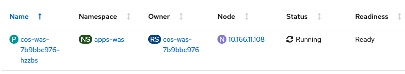
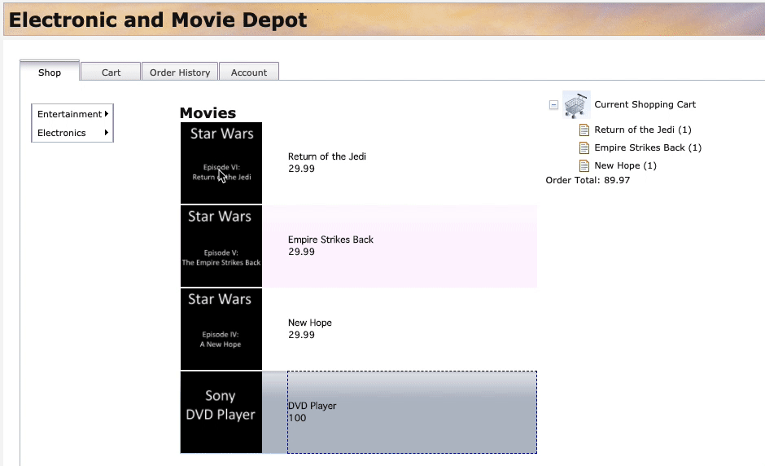

# Operational Modernization

## Table of Contents

- [Introduction](#introduction)
- [Analysis](#analysis) (Reading)
- [Build](#build) (Hands-on)
- [Deploy](#deploy) (Hands-on)
- [Access the Application](#access-the-application) (Hands-on)
- [Summary](#summary)
- [Next](#next)

## Introduction

**Operational modernization** gives an operations team the opportunity to embrace modern operations best practices without putting change requirements on the development team. Modernizing from WebSphere Network Deployment (ND) to the **traditional WebSphere Application Server Base V9 runtime** in a container allows the application to be moved to the cloud without code changes.

The scaling, routing, clustering, high availability and continuous availability functionality that WebSphere ND previously provided will be handled by containers orchestrator Red Hat OpenShift and allows the operations team to run cloud-native and older applications in the same environment with the same standardized logging, monitoring and security frameworks.

While traditional WebSphere isn't a 'built for the cloud' runtime like Liberty, it can still be run in container and will receive the benefits of the consistency and reliability of containers as well as helping to improve DevOps and speed to market.

**This type of modernization shouldn't require any code changes** and can be driven by the operations team. **This path gets the application in to a container with the least amount of effort but doesn't modernize the application or the runtime.**

This repository holds a solution that is the result of an **operational modernization** for an existing WebSphere Java EE application that was moved from WebSphere ND v8.5.5 to the traditional WebSphere Base v9 container and is deployed by the IBM Cloud Pak for Applications to RedHat OpenShift.

In this workshop, we'll use **Customer Order Services** application as an example. In order to modernize, the application will go through **analysis**, **build** and **deploy** phases. Click [here](extras/application.md) and get to know the application, its architecture and components.

## Analysis

IBM Cloud Transformation Advisor helps you to analyze your on-premises workloads for modernization. It determines the complexity of your applications, estimates a development cost to perform the move to the cloud, and recommends the best target environment. It was used to analyze the existing Customer Order Services application running in the WebSphere ND environment. The steps taken were:

1. Used the IBM Cloud Transformation Advisor available as part of IBM Cloud Pak for Applications. Transformation Advisor Local (Beta) can also be used. 

2. Downloaded and executed the **Data Collector** against the existing WebSphere ND runtime.

3. Uploaded the results of the data collection to IBM Cloud Transformation Advisor. A screenshot of the analysis is shown below:

    

4. Analyzed the **Detailed Migration Analysis Report**. In summary, no code changes are required to move this application to the traditional WebSphere Base v9 runtime, and the decision was to proceed with the operational modernization.


## Build

In this section, you'll learn how to build a Docker image for Customer Order Services application running on traditional WebSphere Base v9.

Building this image could take around ~8 minutes (since the image is around 2GB and starting/stopping the WAS server as part of the build process takes few minutes). So, let's kick that process off and then come back to learn what you did. The image will be built by the time you complete this section.

1. You'll need the web terminal (the same one from lab setup). If it's not already open, follow the instructions [here](https://github.com/IBM/openshift-workshop-was/tree/master/setup#access-the-web-terminal) to access the web terminal.

1. You also need to be logged into the OpenShift CLI (command-line interface) using web terminal. Follow the instructions in the [Login section](https://github.com/IBM/openshift-workshop-was/tree/master/labs/Openshift/IntroOpenshift#login) to login to OpenShift CLI.

1. Clone the GitHub repo with the lab artifacts and list the files. Run the following commands on your web terminal:
    ```
    cd / && mkdir was90 && cd was90
    git clone --branch was90 https://github.com/IBM/teaching-your-monolith-to-dance.git
    cd teaching-your-monolith-to-dance
    ls
    ```

1. Run the following command to create a new project in OpenShift. A project allows a community of users to organize and manage their content in isolation from other communities.
    ```
    oc new-project apps-was
    ```

1. Run the following command to start building the image. Make sure to copy the entire command, including the `"."` at the end (which indicates current directory). This command will be explained later in the _Build image_ section. While the image is building (takes ~8 minutes) continue with rest of the lab:
    ```
    docker build --tag image-registry.openshift-image-registry.svc:5000/apps-was/cos-was .
    ```

### Application artifacts

As per container's best practices, you should always build immutable images. Injecting environment specific values at deployment time is necessary most of the times and is the only exception to this rule. 

You should create a new image which adds a single application and the corresponding configuration. You should avoid configuring the image manually (after it started) via Admin Console or wsadmin (unless it is for debugging purposes) because such changes won't be present if you spawn a new container from the image. 

We started with the `wsadmin` script that is used by existing Customer Order Services running on-prem. This script enables application security, creates users and creates JDBC provider for a DB2 database.

Since this is a legacy application, it runs on older frameworks: most notably it uses JPA 2.0 and JAX-RS 1.1. These are not the default in WAS v9 (as they are in WAS v8.5.5), but they are supported. To avoid making application code changes at this time, we modified these settings in the scripts.
For example, older JAX-RS specification is configured by adding:
```
AdminTask.modifyJaxrsProvider(Server, '[ -provider 1.1]')
```

Review the contents of the [wsadmin script](https://github.com/IBM/teaching-your-monolith-to-dance/blob/was90/config/cosConfig.py).

We are going to install the application using a properties file, which is an alternative way to install the application, or apply any configuration. The application could also be installed using the `wsadmin` jython script, but we chose to use the properties file to show the two methods configurations can be applied at build time.

Let's review the contents of the [properties file](https://github.com/IBM/teaching-your-monolith-to-dance/blob/was90/config/app-update.props). The first block specifies Application resource type, followed by the property values, including the location of the ear file:

```
ResourceType=Application
ImplementingResourceType=Application
CreateDeleteCommandProperties=true
ResourceId=Deployment=CustomerOrderServicesApp

Name=CustomerOrderServicesApp
TargetServer=!{serverName}
TargetNode=!{nodeName}
EarFileLocation=/work/apps/CustomerOrderServicesApp.ear
```

Some environment variables are specified towards the end:

```
cellName=DefaultCell01
nodeName=DefaultNode01
serverName=server1
```

### Build instructions

Let's review the contents of the Dockerfile:

```dockerfile
FROM ibmcom/websphere-traditional:9.0.5.0-ubi

COPY --chown=1001:0 resources/db2/ /opt/IBM/db2drivers/

COPY --chown=1001:0 config/PASSWORD /tmp/PASSWORD

COPY --chown=1001:0 config/cosConfig.py /work/config/

COPY --chown=1001:0 config/app-update.props  /work/config/

COPY --chown=1001:0 app/CustomerOrderServicesApp-0.1.0-SNAPSHOT.ear /work/apps/CustomerOrderServicesApp.ear

RUN /work/configure.sh
```

- The base image for our application image is `ibmcom/websphere-traditional`, which is the official image for traditional WAS Base in container. The tag `9.0.5.0-ubi` indicates the version of WAS and that this image is based on Red Hat's Universal Base Image (UBI). We recommend using UBI images.

- For security, traditional WebSphere Base containers run as non-root. This is in fact a requirement for running certified containers in OpenShift. The `COPY` instruction by default copies as root. So, change user and group using `--chown=1001:0` command.

- We need to copy everything that the application needs into the container. So, we copy the db2 drivers which are referenced in the wsadmin jython script. 

- Specify a password for the wsadmin user at `/tmp/PASSWORD`. This is optional. A password will be automatically generated if one is not provided. This password can be used to login to Admin Console (should be for debugging purposes only).

- We copy `cosConfig.py` jython script and the `app-update.props` file into `/work/config/` folder, so they are run during container creation.

- Then we copy application ear to the `EarFileLocation` referenced in `app-update.props`

- Then we run the `/work/configure.sh` which will start the server and run the scripts and apply the properties file configuration.  

Each instruction in the Dockerfile is a layer and each layer is cached. You should always specify the volatile artifacts towards the end.

### Build image

This is the command you ran earlier.

```
docker build --tag image-registry.openshift-image-registry.svc:5000/apps-was/cos-was .
```

It instructs docker to build the image following the instructions in the Dockerfile in current directory (indicated by the `"."` at the end).

A specific name to tag the built image with is also specified. The value `image-registry.openshift-image-registry.svc:5000` in the tag is the default address of the internal image registry provided by OpenShift. Image registry is a content server that can store and serve container images. The registry is accessible within the cluster using the `Service`. Note the format of a Service address: _name_._namespace_._svc_. So in this case, the image registry is named `image-registry` and it's in namespace `openshift-image-registry`.

5000 is the port, which is followed by namespace and name for the image. Later when we push the image to OpenShift's internal image registry, we'll refer to the image by the same values.


Go back to the web terminal to check on the image build.

You should see the following message if image was successfully built. Please wait if it's still building.

```
Successfully tagged image-registry.openshift-image-registry.svc:5000/apps-was/cos-was:latest
```

Validate that image is in the repository by running command:

```
docker images
```

You should get an output similar to this. Notice that the base image, websphere-traditional, is also listed. It was pulled as the first step of building application image.

```
REPOSITORY                                                             TAG                 IMAGE ID            CREATED             SIZE
image-registry.openshift-image-registry.svc:5000/apps-was/cos-was      latest              9394150a5a15        10 minutes ago      2.05GB
ibmcom/websphere-traditional                                           9.0.5.0-ubi         898f9fd79b36        12 minutes ago      1.86GB
```

You built the image and verified that it's available locally.

Let's push the image into OpenShift's internal image registry. First, login to the image registry by running the following command in web terminal. A session token is obtained using the `oc whoami -t` command and used as the password to login.

```
docker login -u openshift -p $(oc whoami -t) image-registry.openshift-image-registry.svc:5000
```

[comment]: <> (Specify how to create a project in OpenShift - is it needed?)

Now, push the image into OpenShift's internal image registry, which will take 1-2 minutes:

```
docker push image-registry.openshift-image-registry.svc:5000/apps-was/cos-was
```

Verify that the image is in image registry. The following command will get the images in the registry. OpenShift stores various images needed for its operations and used by its templates in the registry. Filter through the results to only get the image you pushed. Run the following command:

```
oc get images | grep apps-was/cos-was
```

The application image you just pushed should be listed. The hash of the image is stored alongside (indicated by the SHA-256 value).

```
image-registry.openshift-image-registry.svc:5000/apps-was/cos-was@sha256:fbb7162060754261247ad1948dccee0b24b6048b95cd704bf2997eb6f5abfeae
```

OpenShift uses _ImageStream_ to provide an abstraction for referencing container images from within the cluster. When an image is pushed to registry, an _ImageStream_ is created automatically, if one already doesn't exist. Run the following command to see the _ImageStream_ that's created:

```
oc get imagestreams -n apps-was
```

You can also use the OpenShift console (UI) to see the _ImageStream_. From the panel on left-side, click on **Builds** > **Image Streams**. Then select `apps-was` from the _Project_ drop-down menu. Click on `cos-was` from the list. Scroll down to the bottom to see the image that you pushed. 


## Deploy

The following steps will deploy the modernized Customer Order Services application in a traditional WebSphere Base container to a RedHat OpenShift cluster.

Customer Order Services application uses DB2 as its database. You can connect to an on-prem database that already exists or migrate the database to cloud. Since migrating the database is not the focus of this particular workshop and to save time, the database needed by the application is already configured in the OpenShift cluster you are using.

### Operator

Operators are a method of packaging, deploying, and managing a Kubernetes application. Conceptually, Operators take human operational knowledge and encode it into software that is more easily shared with consumers. Essentially, Operators are pieces of software that ease the operational complexity of running another piece of software. They act like an extension of the software vendor’s engineering team, watching over a Kubernetes environment (such as OpenShift Container Platform) and using its current state to make decisions in real time.

We'll use Appsody Operator, available as part of IBM Cloud Pak for Applications, to deploy the application you containerized. Appsody Operator is capable of deploying any application image with consistent, production-grade Quality of service (QoS).

[comment]: <> (Explain what an operator is and what Appsody Operator does specifically)

We'll use the following `AppsodyApplication` custom resource (CR), to deploy the Customer Order Services application:

```yaml
apiVersion: appsody.dev/v1beta1
kind: AppsodyApplication
metadata:
  name: cos-was
  namespace: apps-was
spec:
  applicationImage: image-registry.openshift-image-registry.svc:5000/apps-was/cos-was
  service:
    port: 9080
  readinessProbe:
    httpGet:
      path: /CustomerOrderServicesWeb/index.html
      port: 9080
    periodSeconds: 10
    failureThreshold: 3
  livenessProbe:
    httpGet:
      path: /CustomerOrderServicesWeb/index.html
      port: 9080
    periodSeconds: 30
    failureThreshold: 6
    initialDelaySeconds: 90
  expose: true
  route:
    termination: edge
    insecureEdgeTerminationPolicy: Redirect
```

  - The `apiVersion` and the `kind` specifies the custom resource to create. `AppsodyApplication` in this case.

  - The metadata specifies a name for the instance of `AppsodyApplication` custom resource (CR) and the namespace to deploy to.

  - The image you pushed to internal registry is specified for `applicationImage` parameter.

  - The port for service is specified as 9080.

  - Readiness probe specifies when the application, running inside the pod, is ready to accept traffic. Traffic will not be sent to it unless it's in `Ready` state.

  - Liveness probe specifies the ongoing health of the running container. The container will be restarted when liveness probe failures exceed the specified threshold. The hope is that the problem will be resolved with restart.

  - For probes, we are using the main page `/CustomerOrderServicesWeb/index.html`, which is not the best indication that the app is fully functional. Since the application was not modified, it's the best option. When we modernize the application later, we'll implement better mechanisms.

  - The settings on probes are:
    - `periodSeconds`: how often (in seconds) to perform the probe
    - `failureThreshold` - When a Pod starts and the probe fails, Kubernetes will try this many times before giving up. Giving up in case of liveness probe means restarting the container. In case of readiness probe the Pod will be marked _unready_.
    - `initialDelaySeconds`: Number of seconds after the container has started before probes is initiated. Allows the application to complete initial setups.

  - The `expose` field is a simple toggle to enable Route (proxy) - to expose your application outside the cluster. 

  - The termination policy specified under `route` configures a secured route.

### Deploy application

1. In OpenShift console, from the panel on left-side, click on **Operators** > **Installed Operators**.

1. From the `Project` drop-down menu, select `apps-was`. 

1. You'll see `Appsody Operator` on the list. From the `Provided APIs` column, click on `Appsody Application`.

1. Click on `Create AppsodyApplication` button.

1. Replace the content of default template with the above `AppsodyApplication` custom resource (CR).

1. Click on `Create` button.

1. Click on `cos-was` from the list. 

1. Navigate down to `Conditions` section and wait for `Reconciled` type to display `True` in _Status_ column. This means Appsody Operator had processed the configurations you specified.

1. Click on the `Resources` tab. The resources that the operator created will be listed: _Deployment_, _Service_ and _Route_. 
    - The operator will continue to watch over these resources. If anything changes unexpectedly in the cluster and as a result these resources are no longer in the desired state you defined in `AppsodyApplication` CR then it'll take necessary actions to reach the desired state.

1. On the row with `Deployment` as `Kind`, click on `cos-was` to get to the _Deployment_.

1. Click on `Pods` tab. 

1. Wait until the `Status` column displays _Running_ and `Readiness` column displays _Ready_ (as shown in the screenshot below). It may take 1-2 minutes. These indicate that the application within the container is running and is ready to handle traffic. 

    _Troubleshoot_: : If you see the Pod with a status of `ImagePullBackOff` or `ErrImagePull` (instead of the expected `Running` status) then an intermittent error has occurred. Try deleting the Pod. Click on the menu option on the right-side of where the pod is listed and click on `Delete Pod`. On the prompt, click on `Delete` to confirm. You will see that the old Pod will be terminating as another Pod is created. If you encounter the same issue with the new Pod, please inform the host to get help.

    

  [comment]: <> (Optional exercise: delete the pod. Another pod should be created, but takes awhile for it to be ready. Shows that traditional WAS is slow, but Liberty as they'll see later is faster)


## Access the application

1. From the left-panel, select **Networking** > **Routes**.

1. Note that the URL, listed under the `Location` column, is in the format _application_name_-_project_name_._your_cluster_url

1. Click on the Route URL. 
    - Note: since there isn't an application served at server context root `/`, it's expected to get a message stating _SRVE0255E: A WebGroup/Virtual Host to handle / has not been defined_. 

1. The username and password to login to the application are `skywalker` and `force` respectively. Add `/CustomerOrderServicesWeb` to the end of the URL in the browser to access the application. 

1. Click on the `Account` tab to see user details. This information is retrieved from the database.

1. From the `Shop` tab, add few items to the cart as illustrated in the screen recording below. Click on an item and then drag and drop the item into the shopping cart. Add at least 5 items to the cart. As the items are added, they'll be shown under _Current Shopping Cart_ (on the right side).

    

## Summary

Congratulations! You've completed the **Operational Modernization** lab. You containerized and deployed a monolith application to cloud!

## Next
Please follow the link to the next lab **Runtime Modernization**:
- [Runtime Modernization](https://github.com/IBM/openshift-workshop-was/tree/master/labs/Openshift/RuntimeModernization).

