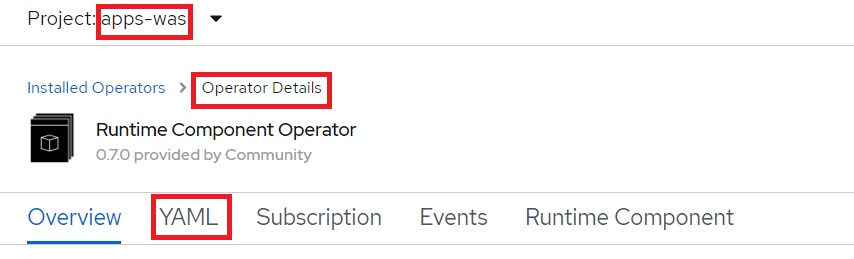

# Operational Modernization

## Table of Contents

- [Introduction](#introduction)
- [Analysis](#analysis) (Reading)
- [Build](#build) (Hands-on)
- [Deploy](#deploy) (Hands-on)
- [Access the Application](#access-the-application) (Hands-on)
- [Alternate Deployment via Runtime Component Operator](#deploy-rco) (Hands-on)
- [Summary](#summary)
- [Next](#next)

<a name="introduction"></a>
## Introduction

**Operational modernization** gives an operations team the opportunity to embrace modern operations best practices without putting change requirements on the development team. 
Modernizing from WebSphere Network Deployment (ND) to the **traditional WebSphere Application Server Base V9 runtime** in a container allows the application to be moved to the cloud without code changes.

The scaling, routing, clustering, high availability and continuous availability functionality that WebSphere ND previously provided will be handled by containers orchestrator Red Hat OpenShift and allows the operations team to run cloud-native and older applications in the same environment with the same standardized logging, monitoring and security frameworks.

While traditional WebSphere isn't a 'built for the cloud' runtime like Liberty, it can still be run in container and will receive the benefits of the consistency and reliability of containers as well as helping to improve DevOps and speed to market.

**This type of modernization shouldn't require any code changes** and can be driven by the operations team. **This path gets the application in to a container with the least amount of effort but doesn't modernize the application or the runtime.**

This repository holds a solution that is the result of an **operational modernization** for an existing WebSphere Java EE application that was moved from WebSphere ND v8.5.5 to the traditional WebSphere Base v9 container and is deployed by the IBM Cloud Pak for Applications to RedHat OpenShift.

In this lab, we'll use **Customer Order Services** application as an example. In order to modernize, the application will go through **analysis**, **build** and **deploy** phases. Click [here](extras/application.md) and get to know the application, its architecture and components.

<a name="analysis"></a>
## Analysis (Background reading only)

IBM Cloud Transformation Advisor was used to analyze the Customer Order Service Application running in the WebSphere ND environment. 
The Transformation Advisor helps you to analyze your on-premises workloads for modernization. 
It determines the complexity of your applications, estimates a development cost to perform the move to the cloud, and recommends the best target environment. 
The stesp taken to analyze the existing Customer Order Services application were:

1. Used the IBM Cloud Transformation Advisor available as part of IBM Cloud Pak for Applications. Transformation Advisor Local (Beta) can also be used. 

2. Downloaded and executed the **Data Collector** against the existing WebSphere ND runtime.

3. Uploaded the results of the data collection to IBM Cloud Transformation Advisor. A screenshot of the analysis is shown below:

    

4. Analyzed the **Detailed Migration Analysis Report**. In summary, no code changes are required to move this application to the traditional WebSphere Base v9 runtime, and the decision was to proceed with the operational modernization.


<a name="build"></a>
## Build

In this section, you'll learn how to build a Docker image for Customer Order Services application running on traditional WebSphere Base v9.

Building this image could take around ~8 minutes (since the image is around 2GB and starting/stopping the WAS server as part of the build process takes few minutes). So, let's kick that process off and before explaining what you did. The image should be built by the time you complete this section.

1. Open the web terminal (the same one from lab setup) for command line interface. If it's not already open, follow the instructions [here](https://github.com/IBM/openshift-workshop-was/tree/master/setup#access-the-web-terminal) to access the web terminal.

1. Follow the instructions in the [Login section](https://github.com/IBM/openshift-workshop-was/tree/master/labs/Openshift/IntroOpenshift#login) to login to OpenShift CLI through issing `oc login` command from the web terminal.

1. If you have not yet cloned the GitHub repo with the lab artifacts, run the following command on your web terminal:
    ```
    git clone https://github.com/IBM/openshift-workshop-was.git
    ```

1. Change directory to where this lab is located:
    ```
    cd openshift-workshop-was/labs/Openshift/OperationalModernization
    ls
    ```

1. Run the following command to create a new project in OpenShift. A project allows a community of users to organize and manage their content in isolation from other communities.
    ```
    oc new-project apps-was
    ```

1. Run the following command to start building the image. Make sure to copy the entire command, including the `"."` at the end (which indicates current directory). This command will be explained later in the _Build image_ section. While the image is building continue with rest of the lab:
    ```
    docker build --tag image-registry.openshift-image-registry.svc:5000/apps-was/cos-was .
    ```

### Managing Build artifacts

As per container's best practices, you should always build immutable images. 
You should create a new image which adds a single application and corresponding configuration. 
You should avoid configuring the image manually (after it is built) via Admin Console or wsadmin (unless it is for debugging purposes) because such changes won't be present if you spawn a new container from the image. 

There are two ways to modify the configuration of the traditional WebSphere image during the build:
- via `wsadmin` scripting
- via `properties file based configuration`.

First review the wsadmin script, based on an existing Customer Order Services script running on-prem. 
The contents of the script is found [here](config/cosConfig.py).
This script enables application security, creates users and JDBC provider for a DB2 database. 
It also enables JPA 2.0 and JAX-RS 1.1, which are not defaults on WebSphere 9.0.

- `AdminTask.modifyJPASpecLevel(Server, '[ -specLevel 2.0]')`
- `AdminTask.modifyJaxrsProvider(Server, '[ -provider 1.1]')`

For `properties file based configuration`, review the properties file found [here](config/app-update.props).
This properties file is used to install the application, which is an alternate way to install applications or apply configurations. 
The application could also have been installed using the wsadmin scripting, but we chose to use the properties file to show the second methods of configurations.


The first block of the properties file specifies Application resource type, followed by the property values, including the location of the ear file:

```
ResourceType=Application
ImplementingResourceType=Application
CreateDeleteCommandProperties=true
ResourceId=Deployment=CustomerOrderServicesApp

Name=CustomerOrderServicesApp
TargetServer=!{serverName}
TargetNode=!{nodeName}
EarFileLocation=/work/apps/CustomerOrderServicesApp.ear
```

The values of the properties file variables are specified towards the end:

```
cellName=DefaultCell01
nodeName=DefaultNode01
serverName=server1
```

### Build instructions

Let's review the contents of the Dockerfile:

```dockerfile
FROM ibmcom/websphere-traditional:9.0.5.0-ubi

COPY --chown=1001:0 resources/db2/ /opt/IBM/db2drivers/

COPY --chown=1001:0 config/PASSWORD /tmp/PASSWORD

COPY --chown=1001:0 config/cosConfig.py /work/config/

COPY --chown=1001:0 config/app-update.props  /work/config/

COPY --chown=1001:0 app/CustomerOrderServicesApp-0.1.0-SNAPSHOT.ear /work/apps/CustomerOrderServicesApp.ear

RUN /work/configure.sh
```

- The base image for our application image is `ibmcom/websphere-traditional`, which is the official image for traditional WAS Base in container. The tag `9.0.5.0-ubi` indicates the version of WAS and that this image is based on Red Hat's Universal Base Image (UBI). We recommend using UBI images.

- We need to copy everything that the application needs into the container. So, we copy the db2 drivers which are referenced in the wsadmin jython script. 

- For security, traditional WebSphere Base containers run as non-root. This is in fact a requirement for running certified containers in OpenShift. The `COPY` instruction by default copies as root. So, change user and group using `--chown=1001:0` command.

- Specify a password for the wsadmin user at `/tmp/PASSWORD`. This is optional. A password will be automatically generated if one is not provided. This password can be used to login to Admin Console (should be for debugging purposes only).

- We copy `cosConfig.py` jython script and the `app-update.props` file into `/work/config/` folder, so they are run automatically during image creation.

- Then we copy application ear to the `EarFileLocation` referenced in `app-update.props`

- Then we run the `/work/configure.sh` which will start the server and run the scripts and apply the properties file configuration to new image.

Each instruction in the Dockerfile is a layer and each layer is cached. You should always specify the volatile artifacts towards the end.

### Build image

This is the command you ran earlier.

```
docker build --tag image-registry.openshift-image-registry.svc:5000/apps-was/cos-was .
```

It instructs docker to build the image following the instructions in the Dockerfile in current directory (indicated by the `"."` at the end).

A specific name to tag the built image is also specified. 
The value `image-registry.openshift-image-registry.svc:5000` in the tag is the default address of the internal image registry provided by OpenShift. 
Image registry is a content server that can store and serve container images. 
The registry is accessible within the cluster via its exposed `Service`. 
The format of a Service address: _name_._namespace_._svc_. 
In this case, the image registry is named `image-registry` and it's in namespace `openshift-image-registry`.
The port is 5000.
Later when we push the image to OpenShift's internal image registry, we'll refer to the image by the same values.


Go back to the web terminal to check on the image build.
You should see the following message if image was successfully built. Please wait if it's still building.

```
Successfully tagged image-registry.openshift-image-registry.svc:5000/apps-was/cos-was:latest
```

Validate that image is in the repository by running command:

```
docker images
```

You should get an output similar to this. Notice that the base image, websphere-traditional, is also listed. It was pulled as the first step of building application image.

```
REPOSITORY                                                             TAG                 IMAGE ID            CREATED             SIZE
image-registry.openshift-image-registry.svc:5000/apps-was/cos-was      latest              9394150a5a15        10 minutes ago      2.05GB
ibmcom/websphere-traditional                                           9.0.5.0-ubi         898f9fd79b36        12 minutes ago      1.86GB
```

Note that `docker images` only lists those images that are cached locally.
The name of the image also contains the host name where the image is hosted. 
If there is no host name, the image is hosted on docker hub.
For example:
- The image `ibmcom/websphere-traditional` has no host name. It is hosted on docker hub.
- The image we just built, `image-registry.openshift-image-registry.svc:5000/apps-was/cos-was`, has host name `image-registry.openshift-image-registry.svc`. It is to be hosted in the Openshift image registry for your lab cluster.

If you change an image, or build a new image, the changes are only available locally. 
You must `push` the image to propagate the changes to the remote registry.

Let's push the image you just built to your OpenShift cluster's built-in image registry. 
First, login to the image registry by running the following command in the web terminal. 
A session token is obtained using the `oc whoami -t` command and used as the password to login.

```
docker login -u openshift -p $(oc whoami -t) image-registry.openshift-image-registry.svc:5000
```

Now, push the image into OpenShift cluster's internal image registry, which will take 1-2 minutes:

```
docker push image-registry.openshift-image-registry.svc:5000/apps-was/cos-was
```

Verify that the image is in the image registry. The following command will get the images in the registry. OpenShift stores various images needed for its operations and used by its templates in the registry. Filter through the results to only get the image you pushed. Run the following command:

```
oc get images | grep apps-was/cos-was
```

The application image you just pushed should be listed. The hash of the image is stored alongside (indicated by the SHA-256 value).

```
image-registry.openshift-image-registry.svc:5000/apps-was/cos-was@sha256:fbb7162060754261247ad1948dccee0b24b6048b95cd704bf2997eb6f5abfeae
```

OpenShift uses _ImageStream_ to provide an abstraction for referencing container images from within the cluster. When an image is pushed to registry, an _ImageStream_ is created automatically, if one already doesn't exist. Run the following command to see the _ImageStream_ that's created:

```
oc get imagestreams -n apps-was
```

You can also use the OpenShift console (UI) to see the _ImageStream_:
- From the panel on left-side, click on **Builds** > **Image Streams**. 
- Then select `apps-was` from the **Project** drop-down menu. 
- Click on `cos-was` from the list. 
- Scroll down to the bottom to see the image that you pushed. 

<a name="deploy"></a>
## Deploy

The following steps will deploy the modernized Customer Order Services application in a traditional WebSphere Base container to a RedHat OpenShift cluster.

Customer Order Services application uses DB2 as its database. 
You can connect to an on-prem database that already exists or migrate the database to cloud. 
Since migrating the database is not the focus of this particular workshop and to save time, the database needed by the application is already configured in the OpenShift cluster you are using.


### Deploy application

Run the following command to deploy the resources (*.yaml files) in the `deploy` directory:

```
oc apply -f deploy

Output:
deployment.apps/cos-was created
route.route.openshift.io/cos-was created
secret/authdata created
service/cos-was created
```

The directory `deploy` contains the following yaml files:

- Deployment.yaml:  the specification for creating a Kubernetes deployment
- Service.yaml: the specification to expose the deployment as a cluster-wide Kubernetes service.
- Route.yaml: the specification to expose the service as a route visible outside of the cluster.
- Secret.yaml: the specification that the `properties based configuration` properties file used to configure database user/password when the container starts.

The concepts of a `route` and a `service` have already been covered in the *Introduction to Openshift* lab, and will not be covered here. The concept of a deployment has been covered as well, but we are making use of a few additional features:

```yaml
apiVersion: apps/v1
kind: Deployment
metadata:
  name: cos-was
  namespace: apps-was
spec:
  selector:
    matchLabels:
      app: cos-was
  replicas: 1
  template:
    metadata:
      labels:
        app: cos-was
    spec:
      containers:
      - name: cos-was
        image: image-registry.openshift-image-registry.svc:5000/apps-was/cos-was
        ports:
          - containerPort: 9080
        livenessProbe:
          httpGet:
            path: /CustomerOrderServicesWeb/index.html
            port: 9080
          periodSeconds: 30
          failureThreshold: 6
          initialDelaySeconds: 90
        readinessProbe:
          httpGet:
            path: /CustomerOrderServicesWeb/index.html
            port: 9080
          periodSeconds: 10
          failureThreshold: 3
        volumeMounts:
        - mountPath: /etc/websphere
          name: authdata
          readOnly: true
      volumes:
      - name: authdata
        secret:
            secretName: authdata
```

Note:

- The liveness probe is used to tell Kubernetes when the application is live. Due to the size of the traditional WAS image, the initialDelaySeconds attribute has been set to 90 seconds to give the container time to start.
- The readiness probe is used to tell Kubernetes whether the application is ready to serve requests. 
- You may store property file based configurationfiles as configmaps and secrets, and bind their contents into the `/etc/websphere` directory. 
When the container starts, the server startup script will apply all the property files found in the `/etc/websphere` directory to reconfigure the server.
For our example, the `volumeMounts` and `volumes` are used to bind the contents of the secret `authdata` into the directory `/etc/websphere` during container startup. 
After it is bound, it will appear as the file `/etc/websphere/authdata.properties`. 
  - For volumeMounts:
    - The mountPath, `/etc/websphere`, specifies the directory where the files are bound.
    - the name, `authdata`, specifies the name of the volume
  - For volumes:
    - the secretName specifies the name of the secret whose contents are to be bound.

The file `Secret.yaml` looks like:

```yaml
apiVersion: v1
kind: Secret
metadata:
  name: authdata
  namespace: apps-was
type: Opaque
stringData:
  authdata.props: |-
    #
    # Configuration properties file for cells/DefaultCell01|security.xml#JAASAuthData_1597094577206#
    # Extracted on Tue Aug 11 15:30:36 UTC 2020
    #

    #
    # Section 1.0 ## Cell=!{cellName}:Security=:JAASAuthData=alias#DBUser
    #

    #
    # SubSection 1.0.0 # JAASAuthData Section
    #
    ResourceType=JAASAuthData
    ImplementingResourceType=GenericType
    ResourceId=Cell=!{cellName}:Security=:JAASAuthData=alias#DBUser
    AttributeInfo=authDataEntries
    #

    #
    #Properties
    #
    password="{xor}Oz1tNjEsK24=" #required
    alias=DBUser #required
    userId=db2inst1 #required
    description=

    #
    # End of Section 1.0# Cell=!{cellName}:Security=:JAASAuthData=alias#DBUser
    #
    #
    #
    EnvironmentVariablesSection
    #
    #
    #Environment Variables
    cellName=DefaultCell01
```

The attribute `authdata.properties` contains the properties file based configure used to update the database userId and password for the JAASAuthData whose alias is DBUser. 
The configuration in Deployment.yaml maps it as the file `/etc/websphere/authdata.properties` during container startup so that the application server startup script can automatically configures the server with these entries. 

Note that changes to the contents of the configmap or secret are not automatically refreshed by the running application server pods. The simplest way to get the changes applied is to delete the pods, forcing the deployment controller to start new pods.  

<a name="access-the-application"></a>
## Access the application

1. Confirm you're at the current project `apps-was`:
   ```
   oc project
   
   Example output:
   Using project "apps-was" on server "https://c114-e.us-south.containers.cloud.ibm.com:30016".
   ```
   - If it's not at the project `apps-was', then swtich:
     ```
     oc project apps-was
     ```
1. Run the following command to verify the pod is running:
   ```
   oc get pod
   ```
   If the status does not show `1/1` READY, wait a while, checking status periodically:
   ```
   NAME                       READY   STATUS    RESTARTS   AGE
   cos-was-6bd4767bf6-xhr92   1/1     Running   0          120m
   ```

1. Run the following command to get the URL of your application (the route URL plus the application contextroot): 
   ```
   echo http://$(oc get route cos-was  --template='{{ .spec.host }}')/CustomerOrderServicesWeb
   
   Example output:
   http://cos-was-apps-was.<your-cluster-name>-c53a941250098acc3d804eba23ee3789-0000.us-south.containers.appdomain.cloud/CustomerOrderServicesWeb
   ```

1. Point your browser to the output URL of the above command. 
   - Login as user `skywalker` and password `force`.  (The file-based user is stored in fileregistry.xml of traditional WebSphere container.)
   - From the Shop tab, click on an item (a movie) and on the next pop-up panel, drag and drop the item into the shopping cart. 
   - Add few items to the cart. As the items are added, they’ll be shown under Current Shopping Cart (on the upper right) with the total cost.
   - Close the browser.

### Review the application workload flow

1. Below is an overview diagram on the deployment you've completed from the above steps: 

   
   
 
1. Navigate from OpenShift Console to view the resources on the deployment:
   - Resources in the project `app-was`:
   
     - `deployment` details:
       - select `cos-was`
     
         
   
       - select `YAML` tab to view the content of yaml
     
         
     
     
     - `pod` details:
       - select `cos-was-`
     
         
     
       - select `Logs` tab to view the WebSphere Application Server log
     
         
     
       - select `Terminal` tab to view the files inside the container
     
         
     
     
         
     
     
     - `secret` details:
       - select `authdata`
     
         
      
       - select Copy icon to view the content
     
         
      
      
     - `service` details:
   
       
      
      
     - `route` details:
   
       

     <a name="db project resource"></a>
   - Resources in the project `db`:
     
     - `deployment` details:   
       - select `cos-db-was`
       
         

       - select `YAML` tab to view the content of yaml
       
         
        
     - `pod details:
       - select  `cos-db-was-`
       
         
       
       - select `Logs` tab to view the database logs
       - select `Terminal tab to view the files in the database container
       
         
        
     - `service` details:
       - select  `cos-db-was`
       
       

       


## Remove your deployment

To remove the deploment, run the command:
```
oc delete -f deploy

Output:
deployment.apps "cos-was" deleted
route.route.openshift.io "cos-was" deleted
secret "authdata" deleted
service "cos-was" deleted
```

<a name="deploy-rco"></a>
## Alternate Deployment Via Runtime Component Operator

Another way to deploy the application is via the Runtime Component Operator. It is a generic operator used to deploy different types of application images. 
The Runtime Component Operator is part of a set of devops tools that also includess application stacks. Together, they will enable the enterprise architect to better control the creation and deployment of application images. For more information, see: https://github.com/application-stacks/runtime-component-operator

### Deploy application

Run the following command which uses the Runtime Component Operator to deploy the same Customer Order Service application image:
```
oc apply -f deploy-rco

Output:
runtimecomponent.app.stacks/cos-was-rco created
secret/authdata-rco created
```


Let's review what we just did. First, list the contents of the deploy-rco directory:

```
ls deploy-rco
```

The output shows there are only two yaml files:
```
RuntimeComponent.yaml  Secret.yaml
```

Review Secret.yaml: 
```
cat deploy-rco/Secret.yaml
```

Note that it is the same as the Secret.yaml in the `deploy` directory, except the name has been changed to authdata-rco.  It servers the same purpose for this new deployment, to override the database user/password.


Review RuntimeComponent.yaml:
```
cat deploy-rco/RuntimeComponent.yaml
```

And the output:
```
apiVersion: app.stacks/v1beta1
kind: RuntimeComponent
metadata:
  name: cos-was-rco
  namespace: apps-was
spec:
  applicationImage: image-registry.openshift-image-registry.svc:5000/apps-was/cos-was
  service:
    port: 9080
  readinessProbe:
    httpGet:
      path: /CustomerOrderServicesWeb/index.html
      port: 9080
    periodSeconds: 10
    failureThreshold: 3
  livenessProbe:
    httpGet:
      path: /CustomerOrderServicesWeb/index.html
      port: 9080
    periodSeconds: 30
    failureThreshold: 6
    initialDelaySeconds: 90
  expose: true
  route:
    termination: edge
    insecureEdgeTerminationPolicy: Redirect
  volumeMounts:
    - mountPath: /etc/websphere
      name: authdata-rco
      readOnly: true
  volumes:
    - name: authdata-rco
      secret:
          secretName: authdata-rco
```

Note that:
- The Kind is `RuntimeComponent`
- The `expose` attribute is set to `true` to expose a route
- The attributes within the yaml file are essentially the same information that you provided for the `Service`, `Route`, and `Deployment` resources in the `deploy` directory.

The controller for the RuntimeComponent custom resource reacts to changes in the above specification, and creates the corresponding `Service`, `Route`, and `Deployment` objects. Issue the following commands to view what the controller has created:

```
oc get Deployment cos-was-rco -o yaml
oc get Service cos-was-rco -o yaml
oc get Route cos-was-rco -o yaml
```

## Access the application

1. Run the following command to verify the pod is running:
   ```
   oc get pod
   ```

   If the status does not show `1/1` READY, wait a while, checking status periodically. Note the prefix name for the pod is `cos-was-rco`.
   ```
   NAME                           READY   STATUS    RESTARTS   AGE
   cos-was-rco-6779784fc8-pz92m   1/1     Running   0          2m59s
   ```

1. Run the following command to get the URL of your application (the route URL plus the application contextroot): 

   ```
   echo http://$(oc get route cos-was-rco  --template='{{ .spec.host }}')/CustomerOrderServicesWeb
   
   Example output:
   http://cos-was-rco-apps-was.<your-cluster-name>-c53a941250098acc3d804eba23ee3789-0000.us-south.containers.appdomain.cloud/CustomerOrderServicesWeb
   ```

1. Point your browser to the output URL of the above command. 
   - Login as user `skywalker` and password `force`.  (The file-based user is stored in fileregistry.xml of traditional WebSphere container.)
   - From the Shop tab, click on an item (a movie) and on the next pop-up panel, drag and drop the item into the shopping cart. 
   - Add few items to the cart. As the items are added, they’ll be shown under Current Shopping Cart (on the upper right) with the total cost.
   - Close the browser.
  

### Review the application workload flow with Runtime Component Operator

1. Below is an overview diagram on the deployment you've completed from the above steps using Runtime Component Operator: 

   
   
   
1. Navigate from OpenShift Console to view the resources on the deployment:
   - Resources in the project `openshift-operators`:
   
     - Operator's `deployment` details
     
       - select `runtime-component-operator`
             
         
         
       - select `YAML` tab to view the content of yaml
       
         
   
     - Operator's `pod` details
     
       - select `runtime-component-operator-`
       
         
         
       - select `Logs` to view the runtime-component-operator container log
       
         
         
       - select `Terminal` to view the files in the container
       
          
               
   
   - Resources in the project `app-was`:
   
     - `Runtime Component` instance details:
       - select `Runtime Component Operator`.  Note: The operator is installed at cluster level and is visible to all existing projects, but Runtime Component instance is created under the project `app-was`.
     
         

       - select `YAML` tab to view the content of yaml
     
         

       - select `Runtime Component` tab and select `cos-was-rco` to view the deails of Runtime Component instance
       
         
     
     - Application `deployment` details:
       - select `cos-was-rco`
       
           
       
       - select `YAML` tab to view the content of yaml
       
         
         
         
     - Application `pod` details:    
       - select `cos-was-rco-`
       
           
       
       - select `Logs` tab to view the WebSphere Application Server log
       
           
         
     - Application `service` details:
       - select `cos-was-rco`
       
          
         
       - select `YAML` to view the content of yaml
         
          
       
     - Application `route` details:
       - select `cos-was-rco`
       
          
         
       - select `YAML` to view the content of yaml
         
            
     
      - Application `secret` details:
        - select `authdata-rco`
        
           
        
   - Resources in the project `db`: See the steps above in **Review the application workload flow**.
         
         
## Cleanup

1. Run the following command to remove the deployment:

   ```
   oc delete -f deploy-rco
   
   Output:
   runtimecomponent.app.stacks "cos-was-rco" deleted
   secret "authdata-rco" deleted
   ```

1. Verify that the corresponding application `Service`, `Route`, and `Deployment` have also been deleted:

   ```
   oc get Deployment 
   oc get Service 
   oc get Route 
   
   Output:
   No resources found in apps-was namespace.
   ```

<a name="summary"></a>
## Summary

Congratulations! You've completed the **Operational Modernization** lab. You containerized and deployed a monolith application to cloud!

<a name="next"></a>
## Next
Please follow the link to the next lab **Runtime Modernization**:
- [Runtime Modernization](../RuntimeModernization)

