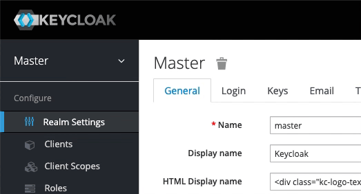
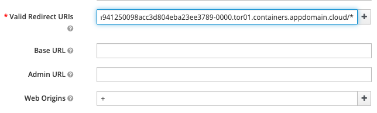

# Runtime Modernization

## Table of Contents

- [Introduction](#introduction)
- [Analysis](#analysis) (Reading only)
- [Build](#build) (Hands-on)
- [Deploy](#deploy) (Hands-on)
- [Access the Application](#access-the-application) (Hands-on)
- [Review Deployment](#review-deployment)
- [Cleanup](#cleanup)
- [Summary](#summary)
- [Next](#next)

## Introduction

**Runtime modernization** moves an application to a 'built for the cloud' runtime with the least amount of effort. **Open Liberty** is a fast, dynamic, and easy-to-use Java application server. Ideal for the cloud, Liberty is open sourced, with fast start-up times (<2 seconds), no server restarts to pick up changes, and a simple XML configuration.

Liberty however doesn't support all of the legacy Java EE and WebSphere proprietary functionality and some code changes maybe required to move an existing application to the new runtime. Effort is also required to move the application configuration from traditional WebSphere to Liberty's XML configuration files.

**This path gets the application on to a cloud-ready runtime container which is easy to use and portable. In addition to the necessary library changes, some aspects of the application was modernized. However, it has not been 'modernized' to a newer architecture such as micro-services**.

This lab demonstrates **runtime modernization**.
It uses the **Customer Order Services** application, which originates from WebSphere ND V8.5.5. 
Click [here](extras/application.md) and get to know the application, its architecture and components.
The application will go through **analysis**, **build** and **deploy** phases. 
It is modernized to run on the Liberty runtime, and
deployed via the IBM Cloud Pak for Applications to RedHat OpenShift.


<a name="analysis"></a>
## Analysis (Background reading only)

IBM Cloud Transformation Advisor was used to analyze the existing Customer Order Services application and the WebSphere ND runtime. The steps taken were:

1. Used the IBM Cloud Transformation Advisor available as part of IBM Cloud Pak for Applications. Transformation Advisor Local (Beta) can also be used.

2. Downloaded and executed the **Data Collector** against the existing WebSphere ND runtime.

3. Uploaded the results of the data collection to IBM Cloud Transformation Advisor. A screenshot of the analysis is shown below:

    

- In the case of the **CustomerOrderServicesApp.ear** application, IBM Cloud Transformation Advisor has determined that the migration to Liberty on Private Cloud is of **Moderate** complexity and that there are two **Severe Issues** that have been detected.

- Drilling down in to **Detailed Migration Analysis Report** that is part of the application analysis, it is apparent that IBM Cloud Transformation Advisor has detected that there are issues with lookups for Enterprise JavaBeans and with accessing the Apache Wink APIs.

  

- **Behaviour change on lookups for Enterprise JavaBeans**: In Liberty, EJB components are not bound to a server root Java Naming and Directory Interface (JNDI) namespace as they are in WebSphere Application Server traditional. The fix for this is to change the three classes that use `ejblocal` to use the correct URL for Liberty

- **The user of system provided Apache Wink APIs requires configuration**: To use system-provided third-party APIs in Liberty applications, you must configure the applications to include the APIs. In WebSphere Application Server traditional, these APIs are available without configuration. This is a configuration only change and can be achieved by using a `classloader` definition in the Liberty server.xml file.

- In summary, some minimal code changes were required to move this application to the Liberty runtime and the decision was taken to proceed with these code changes.

**Homework**: After you complete this workshop, review the step-by-step instructions on how to replicate these steps from the resources included in _Next Steps_ section. Then try Transformation Advisor with one of your applications to migrate it to Liberty.


## Build

In this section, you'll learn how to build a Docker image for Customer Order Services application running on Liberty.

Building this image could take around ~3 minutes (multi-stage build that compiles the code, which takes extra time). 
Let's kick that process off and then come back to learn what you did.

You'll need the web terminal (same as the one from previous lab). If it's not open, follow the instructions [here](https://github.com/IBM/openshift-workshop-was/tree/master/setup#access-the-web-terminal) to access the web terminal.

You also need to be logged into the OpenShift CLI (command-line interface) using web terminal. Follow the instructions in the [Login section](https://github.com/IBM/openshift-workshop-was/tree/master/labs/Openshift/IntroOpenshift#login) to login to OpenShift CLI.

Clone the GitHub repository with the lab artifacts, if you have not already done so. Run the following commands on your web terminal:
```
git clone https://github.com/IBM/opneshift-workshop-was.git
```


Change to the lab's directory:
```
cd openshift-workshop-was
cd labs/Openshift/RuntimeModernization
ls
```

Run the following command to start building the image. Make sure to copy the entire command, including the `"."` at the end. While the image is building(takes ~3 minutes), continue with rest of the lab:

```
docker build --tag image-registry.openshift-image-registry.svc:5000/apps/cos .
```

### Library changes (for reading only)

- Made the simple code changes required for the EJB lookups which were recommended by IBM Cloud Transformation Advisor. The three Java classes that should be modified to look up Enterprise JavaBeans differently are shown in the detailed analysis view of IBM Cloud Transformation Advisor:

  

- Below is an example of the code changes required for one of the three Java classes. The `org.pwte.example.resources.CategoryResource.java` is changed from using `ejblocal` as shown below:

  Before:

    ```java
    ...
    InitialContext().lookup("ejblocal:org.pwte.example.service.ProductSearchService");
    ...
    ```

  After:

  ```java
  ...
  InitialContext().lookup("java:app/CustomerOrderServices/ProductSearchServiceImpl!org.pwte.example.service.ProductSearchService");
  ...
  ```

- Upgraded to Java EE8. Changed from using annotations from _jackson_ to _jsonb_. For example, changed from `@JsonProperty(value="id")` to `@JsonbProperty(value="id")`.


### Modernize with MicroProfile

We used the opportunity to make code changes to modernize some aspects of the application as well. Eclipse MicroProfile is a modular set of technologies designed so that you can write cloud-native microservices. Even though our application is a monolith, we can still take advantage of some of the technologies from MicroProfile.


#### Secure application

We updated the application to use a token-based authentication mechanism to authenticate, authorize, and verify user identities. Added MicroProfile JWT to validate security tokens. The application was updated to use Keycloak, which runs on the cluster and will handle authenticating users. It'll also handle registering & storing user account information.

#### Externalize configuration

The application will have to run on many different environments. So it's important to avoid hardcoding environment specific values in your code. Otherwise, you'll have to update code, recompile and containerize it frequently. 

MicroProfile Config separates the configuration from code. You can inject the external configuration into services in the containers without repackaging them. Applications can use MicroProfile Config as a single API to retrieve configuration information from different sources such as system properties, system environment variables, properties files, XML files, or data sources. Of course, you can do all this by yourself, but it'll be a lot of work and code. Add few MicroProfile Config annotations and you'll make your life easier and code a lot cleaner.

We used MicroProfile Config to [inject information](app/CustomerOrderServicesWeb/src/org/pwte/example/resources/JWTConfigResource.java#L21) about the application's authenticator (Keycloak in this case). For example, added these 3 lines and at runtime the variable will automatically get the value injected by MicroProfile Config:

  ```java
  @Inject
  @ConfigProperty(name = "SSO_URI")
  private String keycloakURI;
  ```

#### Determine application's availability

In the last lab, we used `/CustomerOrderServicesWeb/index.html` for readiness and liveness probes, which is not the best indication that application is ready to handle traffic or is healthy to process requests correctly within a reasonable amount of time. What if the database is down? What if application's security layer is not yet ready/unable to handle authentication? The Pod would still be considered ready and healthy and traffic would still be sent to it. All of those requests will fail or would queue up - leading to bigger problems.

MicroProfile Health provides a common REST endpoint format to determine whether a microservice (or in our case a monolith application) is healthy or not. Health can be determined by the service itself and might be based on the availability of necessary resources (for example, a database) and services. The service itself might be running but considered unhealthy if the things it requires for normal operation are unavailable. All of the checks are performed periodically and the result is served as a simple UP or DOWN at `/health/ready` and `/health/live` which can be used for readiness and liveness probes.

We implemented the following health checks:
- [ReadinessCheck](app/CustomerOrderServicesWeb/src/org/pwte/example/health/ReadinessCheck.java#L17): Keycloak is required to authenticate users. Application should only accept traffic if Keycloak client is up and running.

  ```java
  URL url = new URL(keycloakURI);
  con = (HttpURLConnection) url.openConnection();
  con.setRequestMethod("GET");
  int status = con.getResponseCode();
  if (status != 200) {
    return HealthCheckResponse.named("Readiness").down().build();
  }
  return HealthCheckResponse.named("Readiness").up().build();
  ```

- [LivenessCheck](app/CustomerOrderServicesWeb/src/org/pwte/example/health/LivenessCheck.java#L15): The requests should be processed within a reasonable amount of time. Monitor thread block times to identify potential deadlocks which can cause the application to hang.

    ```java
    ThreadMXBean tBean = ManagementFactory.getThreadMXBean();
    long ids[] = tBean.findMonitorDeadlockedThreads();
    if (ids !=null) {
      ThreadInfo threadInfos[] = tBean.getThreadInfo(ids);
      for (ThreadInfo ti : threadInfos) {
        double seconds = ti.getBlockedTime() / 1000.0;
        if (seconds > 60) {
          return HealthCheckResponse.named("Liveness").down().build();
        }
      }
    }
    return HealthCheckResponse.named("Liveness").up().build();
    ```

#### Adding metrics to application

MicroProfile Metrics is used to gather metrics about the time it takes to add an item to cart, retrieve customer information and to count the number of time these operations are performed.

  ```java
  @GET
  @Produces(MediaType.APPLICATION_JSON)
  @Counted
  @Timed(name = "getCustomer_timed")
  public Response getCustomer()
  {
  ```

### Liberty server configuration

The Liberty runtime configuration files are based on a template provided by IBM Cloud Transformation Advisor.  
For this lab, instead of using a single server.xml, the configurations have been split into multiple configuration files and placed into [config/configDropins/overrides directory](config/configDropins/overrides).

- You may place configuration files into configDropins/overrides directory to override pre-existing configurations.
- You may define separate template configurations that reflect the resources in your environment, and copy them into the configDropsins/overrides directory only for those applications that need them. For example,
  - separate configuration files for each database. (Our sample application only uses one.)
  - separate configuration files for each messaigng provider
  - separate configuration files for different security requirements. 

Have a look at the configuration files and note:

  - The necessary features, including those for MicroProfile, are enabled (e.g. `jdbc-4.2, jaxrs-2.1, mpHealth-2.1`).

  - An HTTP endpoint is configured by:
    ```xml
    <httpEndpoint httpPort="-1" httpsPort="9443" accessLoggingRef="accessLogging" id="defaultHttpEndpoint"/>
    ```
  
  - Access logging is enabled to record all inbound client requests handled by HTTP endpoint. We'll visualize this data later in dashboard to identify and analyze potential problems. 

  - Application with appropriate security role and classloader visibility is specified by `application` element.

  - Database is configured using the `dataSource` element. Note that Liberty variables are used for certain attributes (e.g. `serverName="${DB_HOST}"`). 
  This allows the same image to be instainated in different environments (e.g. production vs testing). Specifically for this lab, the values of `DB_USER` and `DB_PASSWORD` are configured via Kuberntes secrets. 
  When the container starts, thery are injected into the container as environment variables for the Liberty runtime to pick up. How this works is explained later.

  - The configuration to process the MicroProfile JWT token is defined using `mpJWT` element.

  - `quickStartSecurity` provides an easy way to define an internal user registry with just one user. It is used to secure endpoints such as _/metrics_.


### Build instructions

The `Dockerfile` required to build the immutable image containing the application and Liberty runtime was created from the template provided by IBM Cloud Transformation Advisor. 
Here is the final version of the file:

  ```dockerfile
  ## Build stage
  FROM maven:latest AS builder
  COPY app/ /
  RUN cd CustomerOrderServicesProject && mvn clean package

  ## Application image
  FROM openliberty/open-liberty:full-java8-openj9-ubi

  COPY --chown=1001:0 resources/ /opt/ol/wlp/usr/shared/resources/

  COPY --chown=1001:0 config/server.xml /config/

  COPY --chown=1001:0 config/configDropins/overrides/*.xml /config/configDropins/overrides/
  
  COPY --from=builder --chown=1001:0 CustomerOrderServicesApp/target/CustomerOrderServicesApp-0.1.0-SNAPSHOT.ear /config/apps/CustomerOrderServicesApp.ear

  RUN configure.sh
  ```

  - This is a multi-stage Dockerfile, as indicated by the 2 instructions with `FROM`. The first stage builds the application using Maven. It uses the base image from Maven, copies the application source and then builds using Maven commands. The second stage is the actual application image, which uses the _ear_ file produced by the first stage. 

  - The base image for this application image is `openliberty/open-liberty`, which is the official image for Open Liberty. The tag `full-java8-openj9-ubi` indicates the version of Java and that this image is based on Red Hat's Universal Base Image (UBI). We recommend using UBI images. The `full` keyword indicates that this image comes with additional Liberty features. There is also an image with `kernel`, which comes with the bare minimum server. In this case we are using the latest available image. But you can specify a specific Open Liberty release (for example: `20.0.0.3-full-java8-openj9-ubi`).

  - Copy everything that the application needs into the container including the necessary db2 drivers.
  
  - For security, Liberty containers run as non-root. This is in fact a requirement for running certified containers in OpenShift. The `COPY` instruction by default copies as root. So change user and group using `--chown=1001:0` command.

  - Next, copy empty configuration file into `/config/server.xml`.

  - Then copy the actual configuration files into `/config/configDropsins/overrides` directory.

  - Then copy application ear, produced by the first build stage. This is indicated by the `--from=builder`.

  - As last step run `/configure.sh` which will populate shared classes cache to create a fit-for-purpose image.

  Remember that each instruction in the Dockerfile is a layer and each layer is cached. You should always specify the volatile artifacts towards the end.


### Build image

Go back to the web terminal to check the build you started earlier.
You should see the following message if image was built successfully. Please wait if it's still building:

```
Successfully tagged image-registry.openshift-image-registry.svc:5000/apps/cos:latest
```

Validate that image is in the repository by running command:

```
docker images
```

You should see the following images on the output (in addition to the images from previous lab). Notice that the base image, _openliberty/open-liberty_, is also listed. It was pulled as the first step of building application image.

```
REPOSITORY                                                           TAG                     IMAGE ID            CREATED                SIZE
image-registry.openshift-image-registry.svc:5000/apps/cos            latest                  73e50e797849        4 minutes ago          859MB
openliberty/open-liberty                                             full-java8-openj9-ubi   329623a556ff        5 minutes ago          734MB
```

Before we push the image to OpenShift's internal image registry, create a separate project named `apps`.  Choose one of two ays:
- Via command line: 
  ```
  oc new-project apps
  ```
- Via the console: 
  - Click on **Home** > **Projects**. 
  - Click on `Create Project` button.
  - Enter `apps` for the _Name_ field and click on `Create`.
  - Go back to web terminal. 

Switch the current project in the command line to `apps`:
```
oc project apps
```


Login to the image registry again by running the following command in web terminal:

```
docker login -u openshift -p $(oc whoami -t) image-registry.openshift-image-registry.svc:5000
```

Push the image to OpenShift's internal image registry, which could take up to a minute:

```
docker push image-registry.openshift-image-registry.svc:5000/apps/cos
```

Verify that the image is in image registry:

```
oc get images | grep apps/cos
```

The application image you just pushed should be listed:

```
image-registry.openshift-image-registry.svc:5000/apps/cos@sha256:fbb7162060754261247ad1948dccee0b24b6048b95cd704bf2997eb6f5abfeae
```

Verify the imagestream is also created:

```
oc get imagestreams -n apps
```

And the output:
```
NAME   IMAGE REPOSITORY                                            TAGS     UPDATED
cos    image-registry.openshift-image-registry.svc:5000/apps/cos   latest   2 minutes ago
```

You may also check from the console: from the left-panel, click on **Builds** > **Image Streams**. Then select `apps` from the _Project_ drop-down list. Click on `cos` from the list. Scroll down to the bottom to see the image that you pushed.


## Deploy

Let's complete the pre-requisites for the modernized application with Liberty runtime before we deploy it to OpenShift.

Customer Order Services application uses DB2 as its database. To deploy it to Liberty, a separate instance of the database is already configured in the OpenShift cluster you are using. The database is exposed within the cluster using a _Service_ and the application references database using the address of the _Service_.

### Keycloak setup

Keycloak is an OpenID Connect provider that runs on your cluster. 
It handles user registration, and authentication. 
Keycloak is the upstream project for Red Hat Single Sign-On (RH-SSO), which is supported as part of IBM Cloud Pak for Applications.

Let's setup Keycloak to handle user authentication for the Customer Order Services application.

1. In OpenShift console, from the left-panel, click on **Networking** > **Routes**.. Then select `keycloak` from the _Project_ drop-down list.

1. Click on the route URL (under the `Location` column) to launch Keycloak.

1. Click on `Administration Console`. Enter `admin` for both username and password.

1. As illustrated in the screen recording below, from the menu options on the left, hover over `Master` and click on `Add realm`. Enter _Galaxy_ for the `Name` field and click on `Create`.
    - A realm manages a set of users, credentials, roles, and groups. A user belongs to and logs into a realm. Realms are isolated from one another and can only manage and authenticate the users that they control.

      

1. Configure the realm that you created. In the following two steps, ensure that you click on `Save` before clicking on another tab. 
    1. Click on `Login` tab. Turn on `User registration`. Click on `Save`. This provides new users the option to register.

    1. Click on `Tokens` tab. Set `Access Token Lifespan` to _120 minutes_. Click on `Save`. This specifies the maximum time before an access token is expired.

1. From the menu options on the left, select `Clients`.

1. Click on `Create`. Enter _cos_app_ for `Client ID` field. Click on `Save`.

That concludes the Keycloak setup for now. After we deploy the application, we'll come back to add the route URL of the application as a valid redirect URI. Leave the Keycloak tab open for now.

### Deploy

First, enable monitoring by adding the necessary label to the `apps` namespace. 
Choose one of two options:
- For command line:
   ```
   oc label namespace apps app-monitoring=true
   ```
- For console, from the left-panel, click on **Administration** > **Namespaces**. Click on the menu-options for `apps` namespace and click on `Edit Labels`. Copy and paste `app-monitoring=true` into the text box and click `Save`.

    


Next,  substitue keycloak URL to the relevant configuration file. 
Take a look at the contents of deploy/overlay-apps/configmap.yaml, and note the occurrences of `ENTER_YOUR_ROUTER_HOSTNAME_HERE`: 

```
cat deploy/overlay-apps/configmap.yaml
```

Substitute with the actual URL of your keycloak instance:
```
sed -i "s/ENTER_YOUR_ROUTER_HOSTNAME_HERE/$(oc get route keycloak -n keycloak  --template='{{ .spec.host }}')/" deploy/overlay-apps/configmap.yaml
cat deploy/overlay-apps/configmap.yaml
```

We will use the -k, or `kustomize` option of Openshift CLI to deploy the application. We will first complete the deployment, and then explain how it works in a later section. Deploy the yaml files:

```
oc apply -k deploy/overlay-apps
```

### Complete Keycloak setup

1. In OpenShift console, from the left-panel, select **Networking** > **Routes**.

1. Ensure that `apps` is selected from the _Project_ drop-down list. Right-click on the Route URL and copy link address. 

1. Go back to Keycloak console. If you had closed the Keycloak tab then select `keycloak` from the _Project_ drop-down list and click on the route URL. If prompted, enter `admin` for both username and password.

1. From the left-panel, click on `Clients`. Click on _cos_app_ under `Client ID` column.

1. Paste the route URL into `Valid Redirect URIs` field and add `*` at the end of the value. Ensure that the value ends with `/*` (as shown below).

1. Enter `+` into `Web Origins` field. This is necessary to enable Cross-Origin Resource Sharing (CORS).

    

1. Apply the changes by clicking on the `Save` button at the bottom.


### Access the application

1. Ensure the pod is ready:

   ```
   oc get pod
   ```

   If the status does not show 1/1 READY, check periodically. If after 1 minute, the pod is still not ready:
   - Go back and double check your keycloak configuration. This is the most common cause for the pod not being ready.
   - After fixing keycloak configuration, delete the pod so another one gets started:
     ```
     oc delete pod <pod-name>
     ```

1. Run the following command to get the URL of your application:
```
echo http://$(oc get route cos  --template='{{ .spec.host }}')/CustomerOrderServicesWeb
```

1. Point your browser to the above URL. You'll be taken to the login form. Click on `Register` to register as a new user. 

1. Enter the information. Remember your username and password.
Click on `Register`. Once a user registers with a realm, they can be granted access to different applications that are authenticated by the same realm. This is useful for managing user authentication for multiple applications within your enterprise.

1. Now you'll be taken back to the _Customer Order Service_ application.

1. From the `Shop` tab, add few items to the cart. Click on an item and then drag and drop the item into the shopping cart. 

1. As the items are added, it'll be shown under _Current Shopping Cart_ (on the right side).

[comment]: <> (Optional: Delete a pod to see how quickly another one is created and becomes ready - compared to traditional WAS, it's much faster)

## Review Deployment

Let's review the configuration files used for our deployment.

```
ls deploy
```

And the output shows these files:
```
configmap.yaml  
olapp-cos.yaml  
secret-db-creds.yaml  
secret-liberty-creds.yaml
```

### Secrets

Specifying credentials and tokens in plain text is not secure. 
`Secrets` are used to store sensitive information. 
The stored data can be referenced by other resources. 
Special care is taken by OpenShift when handling data from secrets. 
For example, they will not be logged or shown anywhere. 

There are two secrets, one for database credentials and another for Liberty metrics credentials, which is needed to access the `/metrics` endpoint.


The file `secret-db-creds.yaml` contains the credentials for database.  It is injected into the container as environment variable via the `secretRef` specification for the Open Liberty Operator in the section. 

```
cat deploy/secret-db-creds.yaml
```

The file `secret-liberty-creds.yaml` contains the secret to access liberty server.

```
cat deploy/secret-liberty-creds.yaml
```

Note that the first `Secret` provides the credentials in base64 encoded format using the `data` field. The second one provides in plain text using `stringData` field. OpenShift will automatically convert the credentials to base64 format and place the information under `data` field. Click on the `YAML` tab of `liberty-creds` secret. The `data` field should contain the credentials in encoded form.

As anyone can decode the credentials, administrators should ensure that only authenticated users have access to `Secrets` using Role-based access control (RBAC).


### Configmap

Configmaps allows you to store name/value pairs that can be inject into your container when it starts.
For our example, the values of the `configmap.yaml` are injected as environment variables  in the `configMapRef` specification on the _Open Liberty Operator_ in the next section.

```
cat deploy/configmap.yaml
```

### Open Liberty Operator

We could have created our Deployment, Service, and Route resources to deploy the Liberty image. 
However, for this lab we will use the Open Liberty Operator instead. 
Open Liberty Operator provides all functionalities of Runtime Component Operator used when deploying traditional WebSphere images in a previous lab. 
In addition, it also offers Open Liberty specific capabilities, such as day-2 operations (gather trace & dumps) and single sign-on (SSO).

The file `deploy/olapp-cos.yaml` looks like:

```yaml
apiVersion: openliberty.io/v1beta1
kind: OpenLibertyApplication
metadata:
  name: cos
  namespace: apps
spec:
  applicationImage: 'image-registry.openshift-image-registry.svc:5000/apps/cos'
  pullPolicy: Always
  readinessProbe:
    httpGet:
      path: /health/ready
      port: 9443
      scheme: HTTPS
  livenessProbe:
    httpGet:
      path: /health/live
      port: 9443
      scheme: HTTPS
  service:
    annotations:
      service.beta.openshift.io/serving-cert-secret-name: cos-tls
    certificateSecretRef: cos-tls
    port: 9443
  expose: true
  route:
    termination: reencrypt
    insecureEdgeTerminationPolicy: Redirect
  env:
  envFrom:
  - configMapRef:
      name: cos-config
  - secretRef:
      name: db-creds
  monitoring:
    endpoints:
      - basicAuth:
          password:
            key: password
            name: liberty-creds
          username:
            key: username
            name: liberty-creds
        interval: 5s
        scheme: HTTPS
        tlsConfig:
          insecureSkipVerify: true
    labels:
      app-monitoring: 'true'
```

- The `OpenLibertyApplication` is a custom resource supported by the Open Liberty Operator, which is deisgned to help you with Liberty deployment. It allows you to provide Liberty specific configurations (day-2 operations, single sign-on).

- The application image you pushed earlier to internal image registry is specified for `applicationImage` parameter.

- MicroProfile Health endpoints `/health/ready` and `/health/live` are used for readiness and liveness probes.

- Secured service and route are configured with necessary certificates.

- The `configMapRef` surfaces all entries of the  ConfigMap `cos-config`  as environment variables. These contain database host and other settings.

- The `secretRef` surfaces the entries in the Secret `db-creds` as environment variables. These are the database user and password.

- Enabled application monitoring so that Prometheus can scrape the information provided by MicroProfile Metric's `/metrics` endpoint in Liberty. The `/metrics` endpoint is protected, hence the credentials are provided using the _Secret_ `liberty-creds` you created earlier.


## Cleanup

The controller for the Open Liberty Operator creates the necessary Deployment, Service, and Route objects.

```
oc get deployment
oc get service
oc get route
```

To clean up:
```
oc delete -f deploy
```

Double check the correspdoning Deployment, Service, and Route objects are deleted:

```
oc get deployment
oc get service
oc get route
```

## Summary

Congratulations! You've completed **Runtime Modernization** lab! This application has been modified from the initial WebSphere ND v8.5.5 version to run on modern & cloud-native runtime Open Liberty and deployed by IBM Cloud Pak for Applications to RedHat OpenShift.


## Next
Follow the link to the next lab **Application Management**:
- [Application Management](../ApplicationManagement)

