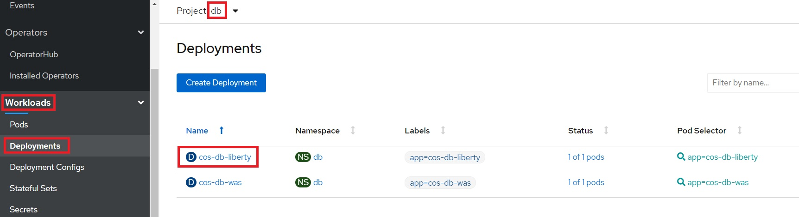
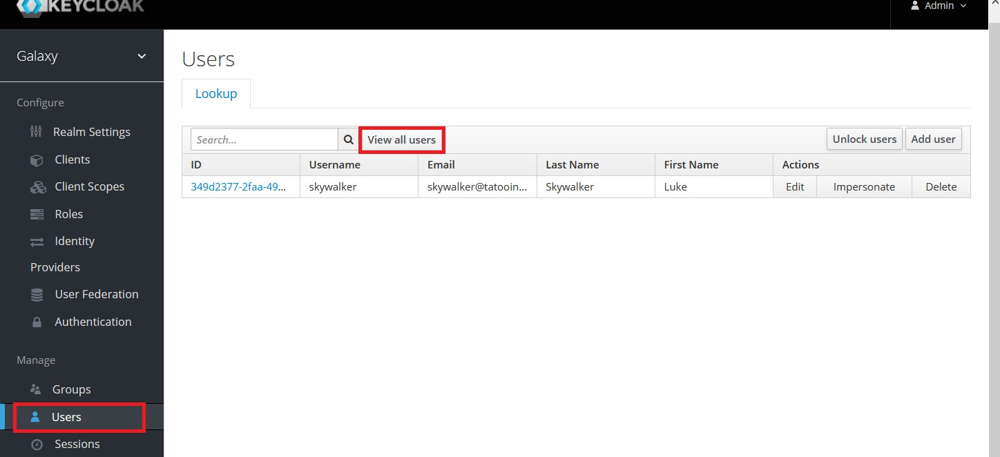

# Runtime Modernization

## Table of Contents

- [Introduction](#introduction)
- [Analysis](#analysis) (Reading only)
- [Build](#build) (Hands-on)
- [Deploy](#deploy) (Hands-on)
- [Access the Application](#access-the-application-hands-on) (Hands-on)
- [Review Deployment](#review-deployment)
- [Review Keycloak setup](#review-keycloak-setup-optional) (Optional)
- [Cleanup](#cleanup-hands-on)
- [Extra Credit](#extra-credit)
- [Summary](#summary)
- [Next](#next)

## Introduction

**Runtime modernization** moves an application to a 'built for the cloud' runtime with the least amount of effort. **Open Liberty** is a fast, dynamic, and easy-to-use Java application server. Ideal for the cloud, Liberty is open sourced, with fast start-up times (<2 seconds), no server restarts to pick up changes, and a simple XML configuration.

Liberty however doesn't support all of the legacy Java EE and WebSphere proprietary functionality and some code changes maybe required to move an existing application to the new runtime. Effort is also required to move the application configuration from traditional WebSphere to Liberty's XML configuration files.

**This path gets the application on to a cloud-ready runtime container which is easy to use and portable. In addition to the necessary library changes, some aspects of the application was modernized. However, it has not been 'modernized' to a newer architecture such as micro-services**.

This lab demonstrates **runtime modernization**.
It uses the **Customer Order Services** application, which originates from WebSphere ND V8.5.5. 
Click [here](extras/application.md) and get to know the application, its architecture and components.
The application will go through **analysis**, **build** and **deploy** phases. 
It is modernized to run on the Liberty runtime, and
deployed via the IBM Cloud Pak for Applications to RedHat OpenShift.


<a name="analysis"></a>
## Analysis (Background reading only)

IBM Cloud Transformation Advisor was used to analyze the existing Customer Order Services application and the WebSphere ND runtime. The steps taken were:

1. Used the IBM Cloud Transformation Advisor available as part of IBM Cloud Pak for Applications. Transformation Advisor Local (Beta) can also be used.

2. Downloaded and executed the **Data Collector** against the existing WebSphere ND runtime.

3. Uploaded the results of the data collection to IBM Cloud Transformation Advisor. A screenshot of the analysis is shown below:

    

- In the case of the **CustomerOrderServicesApp.ear** application, IBM Cloud Transformation Advisor has determined that the migration to Liberty on Private Cloud is of **Moderate** complexity and that there are two **Severe Issues** that have been detected.

- Drilling down in to **Detailed Migration Analysis Report** that is part of the application analysis, it is apparent that IBM Cloud Transformation Advisor has detected that there are issues with lookups for Enterprise JavaBeans and with accessing the Apache Wink APIs.

  

- **Behaviour change on lookups for Enterprise JavaBeans**: In Liberty, EJB components are not bound to a server root Java Naming and Directory Interface (JNDI) namespace as they are in WebSphere Application Server traditional. The fix for this is to change the three classes that use `ejblocal` to use the correct URL for Liberty

- **The user of system provided Apache Wink APIs requires configuration**: To use system-provided third-party APIs in Liberty applications, you must configure the applications to include the APIs. In WebSphere Application Server traditional, these APIs are available without configuration. This is a configuration only change and can be achieved by using a `classloader` definition in the Liberty server.xml file.

- In summary, some minimal code changes were required to move this application to the Liberty runtime and the decision was taken to proceed with these code changes.

**Homework**: After you complete this workshop, review the step-by-step instructions on how to replicate these steps from the resources included in _Next Steps_ section. Then try Transformation Advisor with one of your applications to migrate it to Liberty.


<a name="build"></a>
## Build (Hands-on)

In this section, you'll learn how to build a Docker image for Customer Order Services application running on Liberty.

Building this image could take around ~3 minutes (multi-stage build that compiles the code, which takes extra time). 
Let's kick that process off and then come back to learn what you did.

1. Open the web terminal (the same one from lab setup) for command line interface. If it's not already open, follow the instructions [here](https://github.com/IBM/openshift-workshop-was/tree/master/setup#access-the-web-terminal) to access the web terminal.

1. Follow the instructions in the [Login section](https://github.com/IBM/openshift-workshop-was/tree/master/labs/Openshift/IntroOpenshift#login) to login to OpenShift CLI through issing `oc login` command from the web terminal. Without a successful `oc login`, attempting to run the follow-on `oc` commmands (e.g., `oc new-project ...`),  you will get a permission error.

1. If you have not yet cloned the GitHub repo with the lab artifacts, run the following command on your web terminal:
    ```
    git clone https://github.com/IBM/openshift-workshop-was.git
    ```
    
1. Change directory to where this lab is located:
   ```
   cd openshift-workshop-was
   cd labs/Openshift/RuntimeModernization
   ls
   ```

1. Run the following command to start building the image. Make sure to copy the entire command, including the `"."` at the end (indicated as the location of current directory). While the image is building (which takes ~3 minutes), continue with rest of the lab:
   ```
   docker build --tag image-registry.openshift-image-registry.svc:5000/apps/cos .
   ```

### Library changes (for reading only)

- Made the simple code changes required for the EJB lookups which were recommended by IBM Cloud Transformation Advisor. The three Java classes that should be modified to look up Enterprise JavaBeans differently are shown in the detailed analysis view of IBM Cloud Transformation Advisor:

  

- Below is an example of the code changes required for one of the three Java classes. The `org.pwte.example.resources.CategoryResource.java` is changed from using `ejblocal` as shown below:

  Before:

    ```java
    ...
    InitialContext().lookup("ejblocal:org.pwte.example.service.ProductSearchService");
    ...
    ```

  After:

  ```java
  ...
  InitialContext().lookup("java:app/CustomerOrderServices/ProductSearchServiceImpl!org.pwte.example.service.ProductSearchService");
  ...
  ```

- Upgraded to Java EE8. Changed from using annotations from _jackson_ to _jsonb_. For example, changed from `@JsonProperty(value="id")` to `@JsonbProperty(value="id")`.


### Modernize with MicroProfile

We used the opportunity to make code changes to modernize some aspects of the application as well. Eclipse MicroProfile is a modular set of technologies designed so that you can write cloud-native microservices. Even though our application is a monolith, we can still take advantage of some of the technologies from MicroProfile.


#### Secure application

We updated the application to use a token-based authentication mechanism to authenticate, authorize, and verify user identities. Added MicroProfile JWT to validate security tokens. The application was updated to use Keycloak, which runs on the cluster and will handle authenticating users. It'll also handle registering & storing user account information.

#### Externalize configuration

The application will have to run on many different environments. So it's important to avoid hardcoding environment specific values in your code. Otherwise, you'll have to update code, recompile and containerize it frequently. 

MicroProfile Config separates the configuration from code. You can inject the external configuration into services in the containers without repackaging them. Applications can use MicroProfile Config as a single API to retrieve configuration information from different sources such as system properties, system environment variables, properties files, XML files, or data sources. Of course, you can do all this by yourself, but it'll be a lot of work and code. Add few MicroProfile Config annotations and you'll make your life easier and code a lot cleaner.

We used MicroProfile Config to [inject information](app/CustomerOrderServicesWeb/src/org/pwte/example/resources/JWTConfigResource.java#L21) about the application's authenticator (Keycloak in this case). For example, added these 3 lines and at runtime the variable will automatically get the value injected by MicroProfile Config:

  ```java
  @Inject
  @ConfigProperty(name = "SSO_URI")
  private String keycloakURI;
  ```

#### Determine application's availability

In the last lab, we used `/CustomerOrderServicesWeb/index.html` for readiness and liveness probes, which is not the best indication that application is ready to handle traffic or is healthy to process requests correctly within a reasonable amount of time. What if the database is down? What if application's security layer is not yet ready/unable to handle authentication? The Pod would still be considered ready and healthy and traffic would still be sent to it. All of those requests will fail or would queue up - leading to bigger problems.

MicroProfile Health provides a common REST endpoint format to determine whether a microservice (or in our case a monolith application) is healthy or not. Health can be determined by the service itself and might be based on the availability of necessary resources (for example, a database) and services. The service itself might be running but considered unhealthy if the things it requires for normal operation are unavailable. All of the checks are performed periodically and the result is served as a simple UP or DOWN at `/health/ready` and `/health/live` which can be used for readiness and liveness probes.

We implemented the following health checks:
- [ReadinessCheck](app/CustomerOrderServicesWeb/src/org/pwte/example/health/ReadinessCheck.java#L17): Keycloak is required to authenticate users. Application should only accept traffic if Keycloak client is up and running.

  ```java
  URL url = new URL(keycloakURI);
  con = (HttpURLConnection) url.openConnection();
  con.setRequestMethod("GET");
  int status = con.getResponseCode();
  if (status != 200) {
    return HealthCheckResponse.named("Readiness").down().build();
  }
  return HealthCheckResponse.named("Readiness").up().build();
  ```

- [LivenessCheck](app/CustomerOrderServicesWeb/src/org/pwte/example/health/LivenessCheck.java#L15): The requests should be processed within a reasonable amount of time. Monitor thread block times to identify potential deadlocks which can cause the application to hang.

    ```java
    ThreadMXBean tBean = ManagementFactory.getThreadMXBean();
    long ids[] = tBean.findMonitorDeadlockedThreads();
    if (ids !=null) {
      ThreadInfo threadInfos[] = tBean.getThreadInfo(ids);
      for (ThreadInfo ti : threadInfos) {
        double seconds = ti.getBlockedTime() / 1000.0;
        if (seconds > 60) {
          return HealthCheckResponse.named("Liveness").down().build();
        }
      }
    }
    return HealthCheckResponse.named("Liveness").up().build();
    ```

#### Adding metrics to application

MicroProfile Metrics is used to gather metrics about the time it takes to add an item to cart, retrieve customer information and to count the number of time these operations are performed.

  ```java
  @GET
  @Produces(MediaType.APPLICATION_JSON)
  @Counted
  @Timed(name = "getCustomer_timed")
  public Response getCustomer()
  {
  ```

### Liberty server configuration

The Liberty runtime configuration files are based on a template provided by IBM Cloud Transformation Advisor.  
For this lab, instead of using a single server.xml, the configurations have been split into multiple configuration files and placed into [config/configDropins/overrides](config/configDropins/overrides) directory.

- You may place configuration files into configDropins/overrides directory to override pre-existing configurations.
- You may define separate template configurations that reflect the resources in your environment, and copy them into the configDropsins/overrides directory only for those applications that need them. For example,
  - separate configuration files for each database. (Our sample application only uses one.)
  - separate configuration files for each messaigng provider
  - separate configuration files for different security requirements. 

Have a look at the configuration files and note:

  - The necessary features, including those for MicroProfile, are enabled (e.g. `jdbc-4.2, jaxrs-2.1, mpHealth-2.1`).

  - An HTTP endpoint is configured by:
    ```xml
    <httpEndpoint httpPort="-1" httpsPort="9443" accessLoggingRef="accessLogging" id="defaultHttpEndpoint"/>
    ```
  
  - Access logging is enabled to record all inbound client requests handled by HTTP endpoint. We'll visualize this data later in dashboard to identify and analyze potential problems. 

  - Application with appropriate security role and classloader visibility is specified by `application` element.

  - Database is configured using the `dataSource` element. Note that Liberty variables are used for certain attributes (e.g. `serverName="${DB_HOST}"`). 
  This allows the same image to be instainated in different environments (e.g. production vs testing). Specifically for this lab, the values of `DB_USER` and `DB_PASSWORD` are configured via Kuberntes secrets. 
  When the container starts, thery are injected into the container as environment variables for the Liberty runtime to pick up. How this works is explained later.

  - The configuration to process the MicroProfile JWT token is defined using `mpJWT` element.

  - `quickStartSecurity` provides an easy way to define an internal user registry with just one user. It is used to secure endpoints such as _/metrics_.


### Build instructions

The `Dockerfile` required to build the immutable image containing the application and Liberty runtime was created from the template provided by IBM Cloud Transformation Advisor. 
Here is the final version of the file:

  ```dockerfile
  ## Build stage
  FROM maven:latest AS builder
  COPY app/ /
  RUN cd CustomerOrderServicesProject && mvn clean package

  ## Application image
  FROM openliberty/open-liberty:full-java8-openj9-ubi

  COPY --chown=1001:0 resources/ /opt/ol/wlp/usr/shared/resources/

  COPY --chown=1001:0 config/server.xml /config/

  COPY --chown=1001:0 config/configDropins/overrides/*.xml /config/configDropins/overrides/
  
  COPY --from=builder --chown=1001:0 CustomerOrderServicesApp/target/CustomerOrderServicesApp-0.1.0-SNAPSHOT.ear /config/apps/CustomerOrderServicesApp.ear

  RUN configure.sh
  ```

  - This is a multi-stage Dockerfile, as indicated by the 2 instructions with `FROM`. The first stage builds the application using Maven. It uses the base image from Maven, copies the application source and then builds using Maven commands. The second stage is the actual application image, which uses the _ear_ file produced by the first stage. 

  - The base image for this application image is `openliberty/open-liberty`, which is the official image for Open Liberty. The tag `full-java8-openj9-ubi` indicates the version of Java and that this image is based on Red Hat's Universal Base Image (UBI). We recommend using UBI images. The `full` keyword indicates that this image comes with additional Liberty features. There is also an image with `kernel`, which comes with the bare minimum server. In this case we are using the latest available image. But you can specify a specific Open Liberty release (for example: `20.0.0.3-full-java8-openj9-ubi`).

  - Copy everything that the application needs into the container including the necessary db2 drivers.
  
  - For security, Liberty containers run as non-root. This is in fact a requirement for running certified containers in OpenShift. The `COPY` instruction by default copies as root. So change user and group using `--chown=1001:0` command.

  - Next, copy empty configuration file into `/config/server.xml`.

  - Then copy the actual configuration files into `/config/configDropsins/overrides` directory.

  - Then copy application ear, produced by the first build stage. This is indicated by the `--from=builder`.

  - As last step run `/configure.sh` which will populate shared classes cache to create a fit-for-purpose image.

  Remember that each instruction in the Dockerfile is a layer and each layer is cached. You should always specify the volatile artifacts towards the end.


### Build image (Hands-on)

1. Go back to the web terminal to check the build you started earlier.
   You should see the following message if image was built successfully. Please wait if it's still building:

   ```
   Successfully tagged image-registry.openshift-image-registry.svc:5000/apps/cos:latest
   ```

1. Validate that image is in the repository via the command line:

   ```
   docker images
   ```

   - You should see the following images on the output. Notice that the base image, _openliberty/open-liberty_, is also listed. It was pulled as the first step of building application image.

     Example output:
     ```
     REPOSITORY                                                  TAG                     IMAGE ID            CREATED             SIZE
     image-registry.openshift-image-registry.svc:5000/apps/cos   latest                  4758119add3f        2 minutes ago       883MB
     <none>                                                      <none>                  5bcb83fad548        5 minutes ago       792MB
     openliberty/open-liberty                                    full-java8-openj9-ubi   e6b5411076fe        5 days ago          794MB
     maven                                                       latest                  1337d55397f7        4 weeks ago         631MB
     ```

1. Before we push the image to OpenShift's internal image registry, create a separate project named `apps`.  
   Reminder: Ensure you have run `oc login` command as directed in the [Build](#build) section before using OpenShift CLI.
   
   Choose one of two ways to create the project:
   
   - Via the command line: 
     ```
     oc new-project apps
     ```   
     
     Example output:
     ```
     Now using project "apps" on server "https://c115-e.us-south.containers.cloud.ibm.com:32661".
     . . .
     ```
     
   - Via the console, from the left-panel: 
     - Click on **Home** > **Projects**. 
     - Click on `Create Project` button.
     - Enter `apps` for the _Name_ field and click on `Create`.
     - Go back to web terminal. 
     - Switch the current project in the command line to `apps` 
       ```
       oc project apps
       ```

1. Enable monitoring by adding the necessary label to the `apps` namespace. 

   Choose one of two options to label the namespace:
   
   - Via the command line:
     ```
     oc label namespace apps app-monitoring=true
     ```
     
     Example output:
     ```
     namespace/apps labeled
     ```
     
   - Via the console, from the left-panel, 
     - Click on **Administration** > **Namespaces** 
     - Click on the menu-options for `apps` namespace 
     - Click on `Edit Labels`
     - Copy and paste `app-monitoring=true` into the text box 
     - Click `Save`

       


1. Login to the image registry via the command line:
   - Note: From below command, a session token is obtained from the value of another command `oc whoami -t` and used as the password to login.

     ```
     docker login -u openshift -p $(oc whoami -t) image-registry.openshift-image-registry.svc:5000
     ```
     
     Example output:
     ```
     WARNING! Using --password via the CLI is insecure. Use --password-stdin.
     WARNING! Your password will be stored unencrypted in /root/.docker/config.json.
     Configure a credential helper to remove this warning. See
     https://docs.docker.com/engine/reference/commandline/login/#credentials-store

     Login Succeeded
     ```

1. Push the image to OpenShift's internal image registry via the command line, which could take up to a minute:

   ```
   docker push image-registry.openshift-image-registry.svc:5000/apps/cos
   ```

   Example output:
   ```
   The push refers to repository [image-registry.openshift-image-registry.svc:5000/apps/cos]
   9247390b40be: Pushed 
   9a21ca46f8e3: Pushed 
   b3cee8ba43fe: Pushed 
   1dd2f7265f58: Pushed 
   33b2a4ee94ff: Pushed 
   2b2a8abdd0c4: Pushed 
   91ffc437f551: Pushed 
   4f04e7098d96: Pushed 
   248016390e0a: Pushed 
   0fa7eb58a57c: Pushed 
   b5489882eed9: Pushed 
   2fb5caadbbb0: Pushed 
   d06182ac791b: Pushed 
   b39b0291530b: Pushed 
   a04c77af4b60: Pushed 
   479c44e860ff: Pushed 
   fc905c23b8a3: Pushed 
   161ec220381b: Pushed 
   b7b591e3443f: Pushed 
   ccf04fbd6e19: Pushed 
   latest: digest: sha256:56d926b7ef64ed163ff026b7b5608ae97df4630235c1d0443a32a4fc8eb35a6c size: 4513
   ```
   
1. Verify that the image is in image registry via the command line:

   ```
   oc get images | grep apps/cos
   ```

   - The application image you just pushed should be listed.

     Example output:
     ```
     sha256:56d926b7ef64ed163ff026b7b5608ae97df4630235c1d0443a32a4fc8eb35a6c   image-registry.openshift-image-registry.svc:5000/apps/cos@sha256:56d926b7ef64ed163ff026b7b5608ae97df4630235c1d0443a32a4fc8eb35a6c
     ```

1. Verify the image stream is created via the command line:

   ```
   oc get imagestreams
   ```

   Example output:
   ```
   NAME   IMAGE REPOSITORY                                            TAGS     UPDATED
   cos    image-registry.openshift-image-registry.svc:5000/apps/cos   latest   2 minutes ago
   ```

1. You may also check the image stream via the console: 
   - From the left-panel, click on **Builds** > **Image Streams**. 
   - Then select `apps` from the _Project_ drop-down list. 
   - Click on `cos` from the list. 
   - Scroll down to the bottom to see the image that you pushed.
   
     


<a name="deploy"></a>
## Deploy (Hands-on)

Customer Order Services application uses DB2 as its database. To deploy it to Liberty, a separate instance of the database is already pre-configured in the OpenShift cluster you are using. The database is exposed within the cluster using a _Service_ and the application references database using the address of the _Service_.

The OpenID Connector Provider Keycloak has already been pre-deployed in the cluster, and a realm named `Galaxy` is created. This is the security realm to be used for our application.  

1. Configure the application by substiting the keycloak URL to the relevant configuration file.
   - First, take a look at the contents of `deploy/overlay-apps/configmap.yaml` (at the current directory of `/openshift-workshop-was/labs/Openshift/RuntimeModernization`), and note the occurrences of `ENTER_YOUR_ROUTER_HOSTNAME_HERE`: 

     ```
     cat deploy/overlay-apps/configmap.yaml
     ```

     Output of yaml:
     ```yaml
     apiVersion: v1
     kind: ConfigMap
     metadata:
       name: cos-config
     data:
       SEC_TLS_TRUSTDEFAULTCERTS: "true"
       SSO_REALM : "Galaxy"
       SSO_CLIENT_ID : "cos_app"
       SSO_URI : "https://ENTER_YOUR_ROUTER_HOSTNAME_HERE/auth/"
       JWT_ISSUER : "https://ENTER_YOUR_ROUTER_HOSTNAME_HERE/auth/realms/Galaxy"
       JWT_JWKS_URI : "https://ENTER_YOUR_ROUTER_HOSTNAME_HERE/auth/realms/Galaxy/protocol/openid-connect/certs"
       DB_HOST : "cos-db-liberty.db.svc"
     ```
     
   - Run the following comment `sed` to substitute `ENTER_YOUR_ROUTER_HOSTNAME_HERE` with the actual hostname of your keycloak instance and then the command `cat` to display the yaml:
   
     ```
     sed -i "s/ENTER_YOUR_ROUTER_HOSTNAME_HERE/$(oc get route keycloak -n keycloak  --template='{{ .spec.host }}')/" deploy/overlay-apps/configmap.yaml
     cat deploy/overlay-apps/configmap.yaml
     ```
     
     Example output of updated yaml:
     ```yaml
     apiVersion: v1
     kind: ConfigMap
     metadata:
       name: cos-config
     data:
       SEC_TLS_TRUSTDEFAULTCERTS: "true"
       SSO_REALM : "Galaxy"
       SSO_CLIENT_ID : "cos_app"
       SSO_URI : "https://keycloak-keycloak.test1-1-c53a941250098acc3d804eba23ee3789-0000.us-south.containers.appdomain.cloud/auth/"
       JWT_ISSUER : "https://keycloak-keycloak.test1-1-c53a941250098acc3d804eba23ee3789-0000.us-south.containers.appdomain.cloud/auth/realms/Galaxy"
       JWT_JWKS_URI : "https://keycloak-keycloak.test1-1-c53a941250098acc3d804eba23ee3789-0000.us-south.containers.appdomain.cloud/auth/realms/Galaxy/protocol/openid-connect/certs"
       DB_HOST : "cos-db-liberty.db.svc"
     ```

1. Deploy the application using the `-k`, or `kustomize` option of Openshift CLI now and we will explain how the deployment works in a later section. 
   - Preview what will be deployed:

     ```
     oc kustomize deploy/overlay-apps
     ```

     Example output of yaml:
     ```yaml
     apiVersion: v1
     data:
       DB_HOST: cos-db-liberty.db.svc
       JWT_ISSUER: https://keycloak-keycloak.test1-1-c53a941250098acc3d804eba23ee3789-0000.us-south.containers.appdomain.cloud/auth/realms/Galaxy
       JWT_JWKS_URI: https://keycloak-keycloak.test1-1-c53a941250098acc3d804eba23ee3789-0000.us-south.containers.appdomain.cloud/auth/realms/Galaxy/protocol/openid-connect/certs
       SEC_TLS_TRUSTDEFAULTCERTS: "true"
       SSO_CLIENT_ID: cos_app
       SSO_REALM: Galaxy
       SSO_URI: https://keycloak-keycloak.test1-1-c53a941250098acc3d804eba23ee3789-0000.us-south.containers.appdomain.cloud/auth/
     kind: ConfigMap
     metadata:
       name: cos-config
       namespace: apps
     ---
     apiVersion: v1
     data:
       DB_PASSWORD: ZGIyaW5zdDE=
       DB_USER: ZGIyaW5zdDE=
     kind: Secret
     metadata:
       name: db-creds
       namespace: apps
     type: Opaque
     ---
     apiVersion: v1
     kind: Secret
     metadata:
       name: liberty-creds
       namespace: apps
     stringData:
       password: admin
       username: admin
     type: Opaque
     ---
     apiVersion: openliberty.io/v1beta1
     kind: OpenLibertyApplication
     metadata:
       name: cos
       namespace: apps
     spec:
       applicationImage: image-registry.openshift-image-registry.svc:5000/apps/cos
       envFrom:
       - configMapRef:
           name: cos-config
       - secretRef:
           name: db-creds
       expose: true
       livenessProbe:
         httpGet:
           path: /health/live
           port: 9443
           scheme: HTTPS
       monitoring:
         endpoints:
         - basicAuth:
             password:
               key: password
               name: liberty-creds
             username:
               key: username
               name: liberty-creds
           interval: 5s
           scheme: HTTPS
           tlsConfig:
             insecureSkipVerify: true
         labels:
           app-monitoring: "true"
       pullPolicy: Always
       readinessProbe:
         httpGet:
           path: /health/ready
           port: 9443
           scheme: HTTPS
       route:
         insecureEdgeTerminationPolicy: Redirect
         termination: reencrypt
       service:
         annotations:
           service.beta.openshift.io/serving-cert-secret-name: cos-tls
         certificateSecretRef: cos-tls
         port: 9443
     ```
    
   - Run the following command to deploy the yaml files:

     ```
     oc apply -k deploy/overlay-apps
     ```

     Output of deploy command:
     ```
     configmap/cos-config created
     secret/db-creds created
     secret/liberty-creds created
     openlibertyapplication.openliberty.io/cos created
     ```
     
1. Verify that the route is created for your application:
    ```
    oc get route cos
    ```

    Example output:
    ```
    NAME   HOST/PORT                                                                                            PATH   SERVICES   PORT       TERMINATION          WILDCARD
    cos    cos-apps.mchengupdate2-1-c53a941250098acc3d804eba23ee3789-0000.us-south.containers.appdomain.cloud          cos        9443-tcp   reencrypt/Redirect   None
    ```

1. Create keycloak client configuration with the route for this application. 
   - First, view the exsiting configuration, and note the occurrence of `ENTER_YOUR_APPLICATION_HOST_NAME_HERE`:

     ```
     cat keycloak/client.yaml
     ```
 
     Output of yaml:
     ```yaml
     apiVersion: keycloak.org/v1alpha1
     kind: KeycloakClient
     metadata:
       name: cos-app
       namespace: keycloak
       labels:
         app: sso
     spec:
       realmSelector:
         matchLabels:
           app: sso
       client:
         clientId: cos_app
         # clientAuthenticatorType: client-secret
         enabled: true
         consentRequired: false
         publicClient: true
         standardFlowEnabled: true
         implicitFlowEnabled: false
         directAccessGrantsEnabled: true
         redirectUris:
           - https://ENTER_YOUR_APPLICATION_HOSTNAME_HERE/*
         webOrigins:
           - "+"
         protocol: openid-connect
     ```
     
   - Run the following command `sed` to update `keycloak/client.yaml` to substitute `ENTER_YOUR_APPLICATION_HOSTNAME_HERE` with the actual hostname of application route URL and then the command `cat` to display the yaml:

     ```
     sed -i "s/ENTER_YOUR_APPLICATION_HOSTNAME_HERE/$(oc get route cos -n apps --template='{{ .spec.host }}')/" keycloak/client.yaml
     cat keycloak/client.yaml
     ```

     Example of updated yaml:
     ```yaml
     apiVersion: keycloak.org/v1alpha1
     kind: KeycloakClient
     metadata:
       name: cos-app
       namespace: keycloak
       labels:
         app: sso
     spec:
       realmSelector:
         matchLabels:
           app: sso
       client:
         clientId: cos_app
         # clientAuthenticatorType: client-secret
         enabled: true
         consentRequired: false
         publicClient: true
         standardFlowEnabled: true
         implicitFlowEnabled: false
         directAccessGrantsEnabled: true
         redirectUris:
           - https://cos-apps.test1-1-c53a941250098acc3d804eba23ee3789-0000.us-south.containers.appdomain.cloud/*
         webOrigins:
           - "+"
         protocol: openid-connect
     ```
     
   - After verifying the correct substitution, run the following command to apply the changes: 

     ```
     oc apply -f keycloak/client.yaml
     ```
     
     Output of apply command:
     ```
     keycloakclient.keycloak.org/cos-app created
     ```

1. Verify your pod from the project `apps` is ready:
   - First confirm you're at the current project `apps`:
     ```
     oc project
     ```
     
   - If it's not at the project `apps`, then swtich:
     ```
     oc project apps
     ```
     
   - and then run the following command to view the pod status:
   
   ```
   oc get pod 
   ```

   Example output of pod status:
   ```
   NAME                   READY   STATUS    RESTARTS   AGE
   cos-596b4f849f-2fg4h   1/1     Running   0          18m
   ```


### Access the application (Hands-on)

1. Run the following command to get the URL of your application:
   ```
   echo http://$(oc get route cos  --template='{{ .spec.host }}')/CustomerOrderServicesWeb
   ```

   Example output:
   ```
   http://cos-apps.test1-1-c53a941250098acc3d804eba23ee3789-0000.us-south.containers.appdomain.cloud/CustomerOrderServicesWeb
   ```
   
1. Point a browser to your URL (returned from the above command). 
   - You'll be taken to the login form. 

     


   - Login with user `skywalker` and password `force`. (The user is pre-created/registered in OpenID Connector Provider Keycloak.)
   - After login, the application page titled _Electronic and Movie Depot_ will be displayed.
   - From the `Shop` tab, click on an item (a movie) and on the next pop-up panel, drag and drop the item into the shopping cart. 
   - Add few items to the cart. 
   - As the items are added, they’ll be shown under _Current Shopping Cart_ (on the upper right) with _Order Total_.
   - Close the browser.


### Review the application workload flow with Open Liberty Operator (Hands-on)

1. Below is an overview diagram on the deployment you've completed from the above steps: 
   - Note: DB2 and Keycloak in the middle of the diagram are pre-installed through the respective projects `db` and `keycloak`, and have been up and running before your hands-on.  

   
   
   
1. Navigate from OpenShift Console to view the resources on the deployment:
   - Resources in the project `openshift-operators`:
   
     - Operator's `deployment` details
       - select `open-liberty-operator`
             
         
         
       - select `YAML` tab to view the content of yaml
       
         

     - Operator's `pod` details
       - select `open-liberty-operator-`
       
         
         
       - select `Logs` to view the open-liberty-operator container log
       
         
         
       - select `Terminal` to view the files in the container
       
            
     
    - Resources in the project `apps`:
    
      - `Open Liberty Application` instance details:
        - select `Open Liberty Operator`.  Note: The operator is installed at cluster level and is visible to all existing projects, but Open Liberty Application instance is created under the project `apps`.
    
          
          
        - select `Open Liberty Application` tab and select `cos` to view the deails of Open Liberty Application instance
     
          
        
        - select `YAML` tab to view the content of yaml
        
          
          
        - select `Resources` tab to view the resources of Open Liberty Application instance
         
          

      - Application `deployment` details:
        - select `cos`
        
          

        - select `YAML` tab to view the content of yaml.  Note the deployment is created through the controller of OpenLibertyApplication custom resource.
       
          
         
      - Application `pod` details:    
        - select `cos-`
       
            
       
        - select `Logs` tab to view the liberty access log
        
                
         
        - Note: by default, the Open Liberty Application instance is configured with liberty access log:
        
          
          
          
       - Application `service` details:
       
         - select `cos`
       
            
         
         - select `YAML` to view the content of yaml.  Note the service is created through the controller of OpenLibertyApplication custom resource.
         
              
         
       - Application `route` details:
         - select `cos`
       
            
         
         - select `YAML` to view the content of yaml.  Note the route is created through the controller of OpenLibertyApplication custom resource.
         
              
       
       - Application `secret` details:
         - first, re-visit the yaml of Open Liberty Application instance to view the secrets are configured:
         
            
         
            
           
            
           
         - select the respective secret and view the details 
        
            
          
           
           
           
    - Resources in the project `db`:
     
      - db `deployment` details:   
        - select `cos-db-liberty`
       
          

        - select `YAML` tab to view the content of yaml
       
          
        
      - db `pod` details:
        - select  `cos-db-liberty-`
       
          
       
        - select `Logs` tab to view the database logs
        - select `Terminal` tab to view the files in the database container
       
          
        
      - db `service` details:
        - select  `cos-db-liberty`
       
          

          


    - Resources in the project `keycloak`:
     
      - Keycloak Operator `deployment` details:   
        - select `keycloak-operator`
       
          
          
        - select `YAML` tab to view the content of yaml
        
          
          
       - Keycloak Operator's pod details:
         - select `keycloak-operator-`
         
           
           
         - select `Logs` to view the keycloak-operator container log  
         
           
       
        - Keycloak Operator's all instances details:
          - select `Keycloak Operator`
          
            

          - select the respective tabs: `Keycloak`, `KeycloakRealm`, `KeycloakClient` to view the respective instance details, where
            - `Keycloak` instance deploys the primary keycloak software component including database postgresql to store persistent data
            - `KeycloakReam` instance contains the security realm management and credential data
            - `KeycloakClient` instance contains the redirect URI information
       
            
        
            
          
            
          
            
          
          - OR select `All Instances` to view the same insance details
        
            
      
          - Keycloak application `deployment` details (for dababase postgresql portion):
            - select `keycloak-postgresql`

              

            - select `YAML` tab to view the content of yaml. Note the deployment is created through the controller of Keycloak custom resource.

              
            
          - Keycloak application `statefulset` details (for keycloak component portion):
            - Note: 
              - `StatefulSet` resource is equivalent to a special deployment used to manage stateful applications. 
              - Each replica of the pod will have its own state and unique network identifier, and will be using its own stable persistent storage volume.
              - The pod is created with a unique naming convention, for example, `<statefulsetname-0>` as 1st pod, `<statefulesetname-1>` as 2nd pod, etc.  
              - See `keycloak-0` as an example in below pod details section.
              - For comparion, the resource of `Deployment` deploys a stateless application and is the easiest and most used resource for deploying an application. If using a PVC (PersistenceVolumeClaim), all replicas will be using the same Volume and none of it will have its own state.

            - select `keycloak`
            
              
              
            - select `YAML` tab to view the content of yaml. Note the statefulset is created through the controller of Keycloak custom resource.

              
             
          - Keycloak application `pod` details
            - select `keycloak-postgresql-`
             
               
              
            - select `Logs` to view the keycloak-postgresql container log  
           
              
         
            - select `keycloak-0`
             
               
              
            - select `Logs` to view the keycloak-0 container log  
             
                
              
          - Keycloak application `service` details   
            - select `keycloak`
            
               
             
            - select `YAML` tab to view the content of yaml. Note the service is created through the controller of Keycloak custom resource.
            
               
            
          - Keycloak application `route` details
            - Note: The `keycloak` route is used to access the keycloak realm management console with administrator user login.  See the step **Review Keycloak setup (optional)** below for more details. 
            
            - select `keycloak`
            
               
             
            - select `YAML` tab to view the content of yaml. Note the route is created through the controller of Keycloak custom resource.
            
                 
              
              
              
              

[comment]: <> (Optional: Delete a pod to see how quickly another one is created and becomes ready - compared to traditional WAS, it's much faster)

## Review Deployment

1. Let's review the configuration files used for our deployment. 
   - Our configuration files are structured for the -k, or `kustomize` option of Openshift CLI.
   - Kustomize is a separate tool that has been integrated into Openshift CLI.
   - It allows you to customize yaml without using variables.
   - You can define a base directory, and one one more override directories to customize the base directory

1. Change directory to /openshift-workshop-was/labs/Openshift/RuntimeModernization (if it's already changed) and list the files:

   ```
   ls deploy 
   ```

   And the output shows that we have one base directory, and one override directory:
   
   ```
   base  overlay-apps
   ```

1. Take a look at what's in the `base` directory:
   ```
   ls deploy/base
   ```

   And the output:
   
   ```
   kustomization.yaml  olapp-cos.yaml
   ```

   - Each directory used for kustomization contains one `kustomization.yaml`

     ```
     cat deploy/base/kustomization.yaml
     ```

     Output of yaml:
     - This is a simple kustomization directory that lists just the yaml files to be deployed.
       ```
       resources:
       - olapp-cos.yaml
       ```

   - The file `olapp-cos.yaml` contains the custom resource definition to deploy the application and will be covered in detail later.
   - It is placed in the base directory since it is common for all stages of the application, for example, dev, test, prod.

1. Take a look at the files in the `overlay-apps` directory. 

   ```
   ls deploy/overlay-apps
   ```

   And the output:
   
   ```
   configmap.yaml  kustomization.yaml  secret-db-creds.yaml  secret-liberty-creds.yaml
   ```
   
   - Take a look at the `kustomization.yaml` in the overlay-apps directory:
     ```
     cat deploy/overlay-apps/kustomization.yaml
     ```

     And the output:

     ```
     namespace: apps
     resources:
     - configmap.yaml
     - secret-db-creds.yaml
     - secret-liberty-creds.yaml
     bases:
     - ./../base
     ```

    Note that:
    - The namespace is defined. This means that all resource that originate from this directory will be applied to the `apps` namespace.
    - Resources from the base directory will also be included.
    - You may define additional overlay directories for different environments, each with a different namespace. For example, overlay-test, overlay-prod.
    - The configurations in this directory contain the overrides specific to this environment. 
    - It is possible to override configurations in the base directory. But that is beyond the scope of this lab.
    - These configuration files are meant to be stored in source control so that you can version and re-apply them as needed. 
      - This is the basic concept of `git-ops`. Full coverage of gitops is beyond the scope of this lab.
    - For a real environment, DO NOT store the secret yamls into source control. It is a security expsoure.  See extra credit section on how to secure your secrets.

   - To preview the resources that will be applied for a specific override directory, use the `kustomize` option of the Openshift command line. For example,

     ```
     oc kustomize deploy/overlay-apps
     ```
     The output is the same as displayed in [Deploy](#deploy) (Hands-on) section.
     
     
### Secrets

Specifying credentials and tokens in plain text is not secure. 
`Secrets` are used to store sensitive information. 
The stored data can be referenced by other resources. 
Special care is taken by OpenShift when handling data from secrets. 
For example, they will not be logged or shown anywhere. 

There are two secrets, one for database credentials and another for Liberty metrics credentials, which is needed to access the `/metrics` endpoint.


The file `secret-db-creds.yaml` contains the credentials for database.  It is injected into the container as environment variable via the `secretRef` specification for the Open Liberty Operator in the section. 

```
cat deploy/overlay-apps/secret-db-creds.yaml
```

The file `secret-liberty-creds.yaml` contains the secret to access liberty server.

```
cat deploy/overlay-apps/secret-liberty-creds.yaml
```

Note that the first `Secret` provides the credentials in base64 encoded format using the `data` field. The second one provides in plain text using `stringData` field. OpenShift will automatically convert the credentials to base64 format and place the information under `data` field. Click on the `YAML` tab of `liberty-creds` secret. The `data` field should contain the credentials in encoded form.

As anyone can decode the credentials, administrators should ensure that only authenticated users have access to `Secrets` using Role-based access control (RBAC).


### Configmap

Configmaps allows you to store name/value pairs that can be inject into your container when it starts.
For our example, the values of the `configmap.yaml` are injected as environment variables  in the `configMapRef` specification on the _Open Liberty Operator_ in the next section.

```
cat deploy/overlay-apps/configmap.yaml
```

### Open Liberty Operator

We could have created Deployment, Service, and Route resources to deploy the Liberty image. 
However, for this lab we will use the Open Liberty Operator instead. 
Open Liberty Operator provides all functionalities of Runtime Component Operator used when deploying traditional WebSphere images in a previous lab. 
In addition, it also offers Open Liberty specific capabilities, such as day-2 operations (gather trace & dumps) and single sign-on (SSO).

The file `deploy/base/olapp-cos.yaml` looks like:

```yaml
apiVersion: openliberty.io/v1beta1
kind: OpenLibertyApplication
metadata:
  name: cos
  namespace: apps
spec:
  applicationImage: 'image-registry.openshift-image-registry.svc:5000/apps/cos'
  pullPolicy: Always
  readinessProbe:
    httpGet:
      path: /health/ready
      port: 9443
      scheme: HTTPS
  livenessProbe:
    httpGet:
      path: /health/live
      port: 9443
      scheme: HTTPS
  service:
    annotations:
      service.beta.openshift.io/serving-cert-secret-name: cos-tls
    certificateSecretRef: cos-tls
    port: 9443
  expose: true
  route:
    termination: reencrypt
    insecureEdgeTerminationPolicy: Redirect
  env:
  envFrom:
  - configMapRef:
      name: cos-config
  - secretRef:
      name: db-creds
  monitoring:
    endpoints:
      - basicAuth:
          password:
            key: password
            name: liberty-creds
          username:
            key: username
            name: liberty-creds
        interval: 5s
        scheme: HTTPS
        tlsConfig:
          insecureSkipVerify: true
    labels:
      app-monitoring: 'true'
```

- The `OpenLibertyApplication` is a custom resource supported by the Open Liberty Operator, which is deisgned to help you with Liberty deployment. It allows you to provide Liberty specific configurations (day-2 operations, single sign-on).

- The application image you pushed earlier to internal image registry is specified for `applicationImage` parameter.

- MicroProfile Health endpoints `/health/ready` and `/health/live` are used for readiness and liveness probes.

- Secured service and route are configured with necessary certificates.

- The `configMapRef` surfaces all entries of the  ConfigMap `cos-config`  as environment variables. These contain database host and other settings.

- The `secretRef` surfaces the entries in the Secret `db-creds` as environment variables. These are the database user and password.

- Enabled application monitoring so that Prometheus can scrape the information provided by MicroProfile Metric's `/metrics` endpoint in Liberty. The `/metrics` endpoint is protected, hence the credentials are provided using the _Secret_ `liberty-creds` you created earlier.


## Review Keycloak setup (optional)

Keycloak is an OpenID Connect provider that runs on your cluster. 
It handles user registration, and authentication. 
Keycloak is the upstream project for Red Hat Single Sign-On (RH-SSO), which is supported as part of IBM Cloud Pak for Applications.

Get the keycloak admin user name and password that you'll use to login to the keycloak console:
```
echo $(echo $(oc get secret credential-keycloak -n keycloak --template='{{ .data.ADMIN_USERNAME}}') | base64 -d )
echo $(echo $(oc get secret credential-keycloak -n keycloak --template='{{ .data.ADMIN_PASSWORD}}') | base64 -d )
```

1. In OpenShift console, from the left-panel, click on **Networking** > **Routes**. Then select `keycloak` from the _Project_ drop-down list.

   

1. Click on the route URL (under the `Location` column) to launch Keycloak.

   

1. Click on `Administration Console`. Enter the user name and password you obtained previously.

   

1. The next page shows that a realm named `Galaxy` is already created for you.

   

1. Click on `Users` and `View All Users`, and note that the user `skywalker` is already created for you.

   

1. Click on `Clients` followed by `cos_app`

   

1. The custom resource `keycloak/clients.yaml` is used to create the `cos_app` client. Double check the contents of the file with what's on the page.

   

## Cleanup (Hands-on)

1. The controller for the Open Liberty Operator creates the necessary Deployment, Service, and Route objects for Customer Order Services application. To list these resources, run the commands:

   - Reminder: Run `oc project` to confirm you're at the `apps` project before running the following commands.
   
   ```
   oc get deployment
   oc get service
   oc get route
   ```
   
   Example output:
   ```
   # oc get deployment
   NAME   READY   UP-TO-DATE   AVAILABLE   AGE
   cos    1/1     1            1           2d18h

   # oc get service
   NAME   TYPE        CLUSTER-IP     EXTERNAL-IP   PORT(S)    AGE
   cos    ClusterIP   172.21.202.9   <none>        9443/TCP   2d18h

   # oc get route
   NAME   HOST/PORT                                                                                        PATH   SERVICES   PORT       TERMINATION          WILDCARD
   cos    cos-apps.test1-1-c53a941250098acc3d804eba23ee3789-0000.us-south.containers.appdomain.cloud          cos        9443-tcp   reencrypt/Redirect   None
   ```

1. To remove these resources, run the command (Reminder: change directory to `openshift-workshop-was/labs/Openshift/RuntimeModernization` if it's not already at the current path.)
   
   - Note: The pre-installed resources such as Open Liberty Operator, DB2, Keycloak, are not removed.
   
   ```
   oc delete -k deploy/overlay-apps
   ```

   Output:
   ```
   configmap "cos-config" deleted
   secret "db-creds" deleted
   secret "liberty-creds" deleted
   openlibertyapplication.openliberty.io "cos" deleted
   ```
   
   Double check the corresponding Deployment, Service, and Route objects are deleted:

   ```
   oc get deployment
   oc get service
   oc get route
   ```
   
   Output from each `get` command above:
   ```
   No resources found in apps namespace.
   ```

## Extra Credit

- Read about how to protect your secrets: https://www.openshift.com/blog/gitops-secret-management

## Summary

Congratulations! You've completed **Runtime Modernization** lab! This application has been modified from the initial WebSphere ND v8.5.5 version to run on modern & cloud-native runtime Open Liberty and deployed by IBM Cloud Pak for Applications to RedHat OpenShift.


## Next
Follow the link to the next lab **Application Management**:
- [Application Management](../ApplicationManagement)

