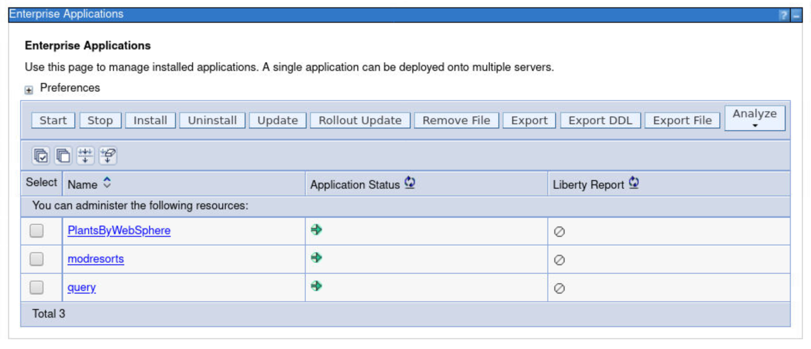
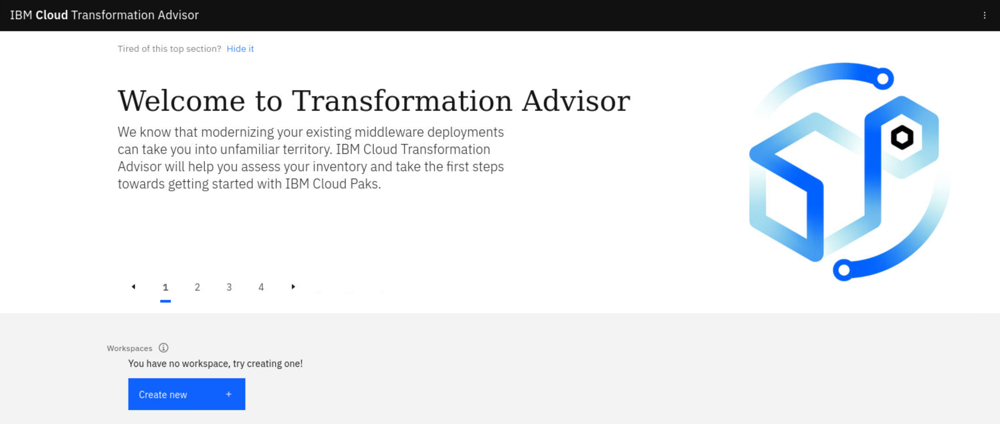
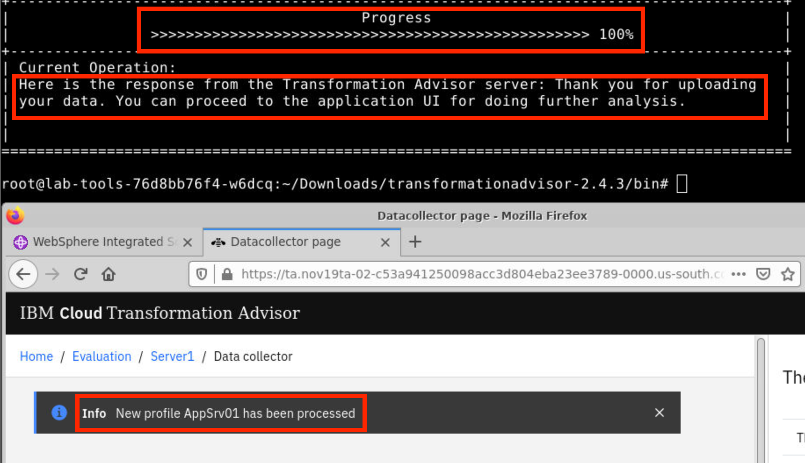
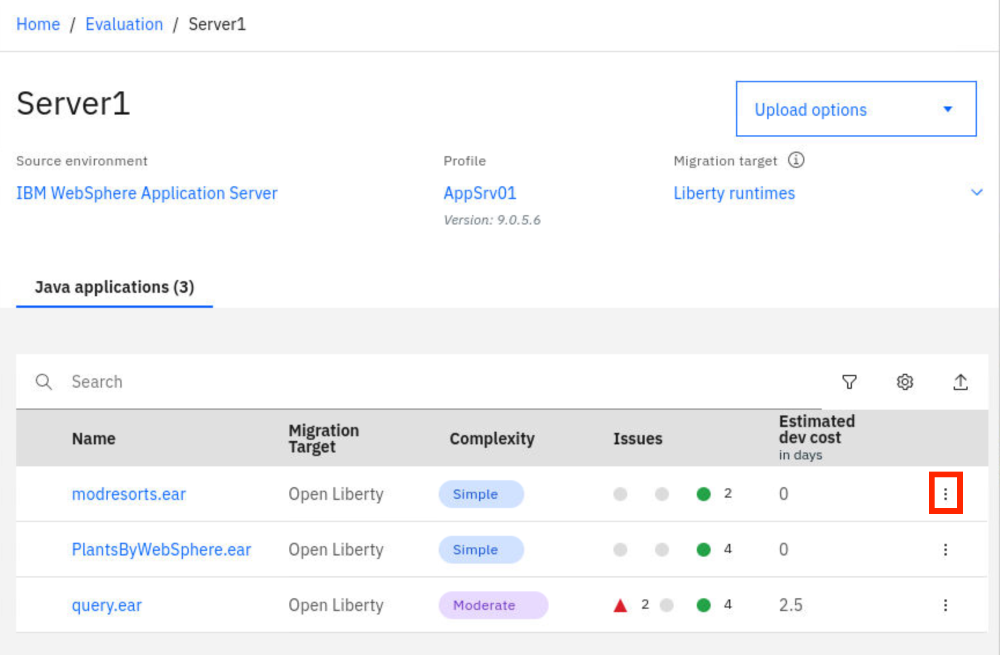
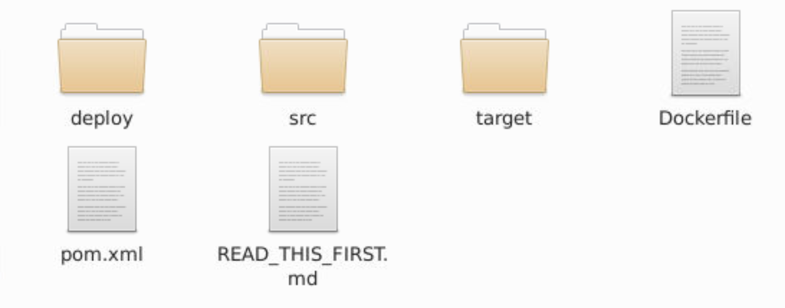
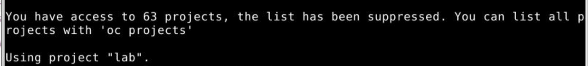
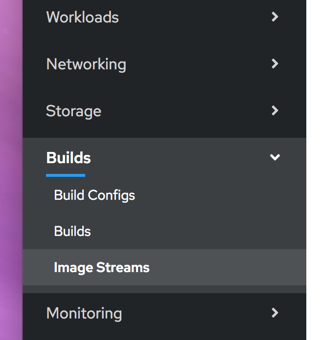
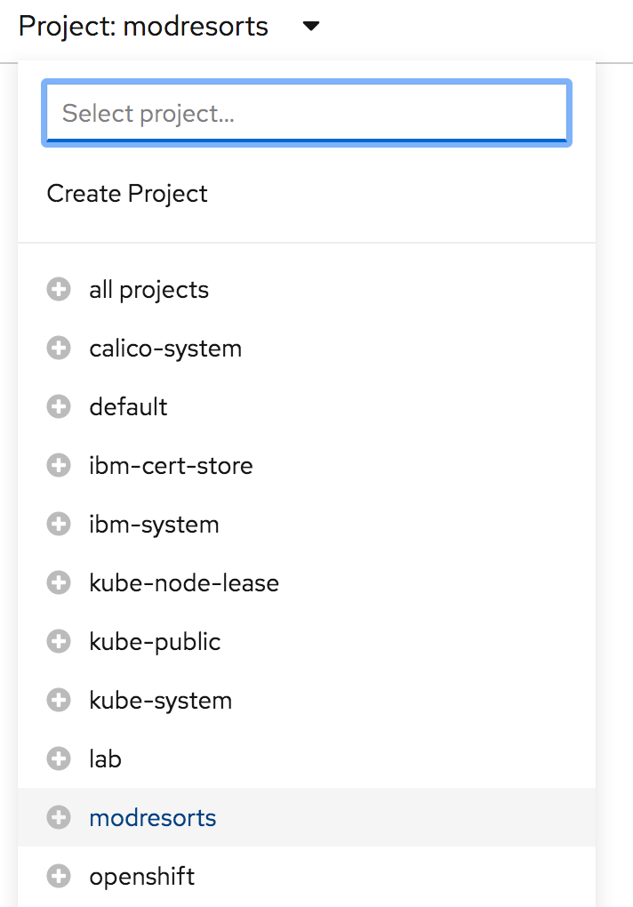

# Transformation Advisor

## Table of Contents

- [Introduction](#introduction)
- [What You'll Do](#tasks)
- [Log In](#login) (Hands-on)
- [Inspect Your Environment](#inspect) (Hands-on)
- [Upload Data](#collector) (Hands-on)
- [View Recommendations](#review) (Reading only)
- [Create Migration Bundle](#bundle) (Hands-on)
- [Containerize Application](#containerize) (Hands-on)
- [Deploy to OpenShift](#deploy) (Hands-on)
- [Summary](#summary)
- [Common Issues](#issues) (Check if you have a problem)

<a name="introduction"></a>
## Introduction

IBM Cloud Transformation Advisor (Transformation Advisor, or TA) is one of the tools included in the Cloud Pak for Applications (CP4Apps), a developer tool helps you quickly evaluate on-premises Java EE applications and to prepare the apps for a rapid cloud deployment. The tool identifies the Java EE programming models in the application, help determine its complexity by listing a high-level inventory of the content and structure of the application, highlight Java EE programming models and WebSphere API differences between the WebSphere profile type and show any Java EE specification implementation differences that could affect the app. You can use this tool in your move in the cloud journey to quickly analyze on-premise WebSphere apps without accessing source code and to prepare the apps for a rapid cloud deployment.

This lab showcases Transformation Advisor as a tool to help you analyze your existing applications and begin the re-platform process for applications you select. Re-platform uses Lift, Modify and Shift approach to move an existing application the cloud. In this lab, you learn how to package a selected candidate Java application to Liberty container without any application code change and to deploy it to an IBM Red Hat OpenShift Kubernetes Service (ROKS) cluster in IBM Cloud using the Transformation Advisor Migration Bundle tool.

<a name="tasks"></a>
## What You'll Do

### Business Scenario

As shown in the image below, your company has a web application called Mod Resorts, a WebSphere application showing the weather in various locations. Your company wants to move this application from on-premises to the cloud.


You will analyze this application and assess the difficulty of re-platforming it to the cloud. Based on the analysis you will discover that you can move this application from the traditional WebSphere Server environment to a lightweight Liberty server environment without any code change. Then you will use the Transformation Advisor migration plan to create the migration bundle, to containerize the application on Liberty, and to deploy the Docker container to an OpenShift Kubernetes cluster environment.

### Objective

The objectives of this lab are to:

- learn how to collect Java application and configuration data using the Transformation Advisor Data Collector tool.
- learn how to use the Transformation Advisor to evaluate the move to cloud efforts and to identify the good candidate for migration.
- learn how Transformation Advisor can accelerate application migration to cloud process, minimize errors and risks and reduce time to market
- learn how to deploy the application to an OpenShift cluster environment using the migration bundle created by Transformation Advisor

### Prerequisites

The following prerequisites must be completed prior to beginning this lab:

- Familiarity with basic Linux commands
- Have internet access
- Have an IBM Cloud account

### What is Already Completed

A Red Hat OpenShift cluster has been created for you. Transformation Advisor and a Linux-based lab environment have been deployed to the cluster. In the lab environment, WebSphere Application Server has already been set up with the applications you will evaluate.

### Lab Tasks

During this lab, you complete the following tasks:

- Review the on-premises WebSphere application
- Access Transformation Advisor and download the data collector
- Scan and upload your application data into Transformation Advisor
- Review the migration advice generated for your application
- Create Migration Bundle
- Update the Migration Bundle
- Test the Migration Bundle Locally (Optional)
- Containerize Liberty Application
- Deploy the Application to OpenShift

<a name="login"></a>
## Log In
### Access the lab environment and get started

Open the IBM Cloud dashboard. Ensure the account name displayed in the top right is 2044184 - CP4AWorkshops. Find your cluster in the resource list and click it, then click the link for **OpenShift web console** in the top right. You should now be in the OpenShift console.

In the left-hand navigation bar, choose **Networking** and then **Routes**. Make sure the **Project** field is set to "lab" and find the **Location** for "vnc-route". Click this link to enter the lab environment. Click **Connect** and enter the password given to you by the lab instructor. You should now see a desktop environment.


> Note: Be sure to keep both the OpenShift console page and the lab environment page open. You will interact with both throughout this lab.

### Working with the lab environment

This lab uses the web-based noVNC software to display a desktop running in the OpenShift cluster. Take a moment to familiarize yourself with the environment. 

On the Desktop, you will find shortcuts to the Firefox web browser and the Terminal Emulator, as well as the filesystem root and home directories. You will also find the `apps` directory which contains a copy of the app you will use for this lab. 

Clipboard contents are not synchronized between your local workstation and the lab environment. To pass text to the lab clipboard, use the clipboard tool. On the left side of the lab window you will see a small tab with an arrow on it. Clicking this reveals the tool palette. 

The second button from the top is the clipboard window. This window contains a textbox that reflects the current contents of the lab clipboard and can be edited or replaced. Whenever you want to send text to the lab environment, reveal this window and paste the text from your local clipboard into the text box. You can then paste that text into any text box in the lab environment using the context menu or CTRL-V.


> Note: Since the destination desktop environment is Linux, use CTRL-V to paste, even on macOS. In the terminal, right click and choose paste from the menu, as CTRL-V will be generate a control character instead of pasting.

Once you have familiarized yourself with the lab environment desktop, proceed to the rest of the lab.

<a name="inspect"></a>
## Inspect Your Current Environment

In this task, you take a look at Mod Resorts application deployed to the local WebSphere Application Server (WAS) environment. You are going to move this application to the cloud using Open Liberty Operator later.

### Start WebSphere Application Server

In the workstation VM, you have a local WebSphere Application Server V9 which hosts the Mod Resorts application.

To start the WAS server:

1. Open a terminal window by clicking **Applications**>**Terminal** or using the shortcut on the desktop.

    

1. In the terminal window, issue the command below to start the WAS server.

    ```shell
    /opt/IBM/WebSphere/AppServer/profiles/AppSrv01/bin/startServer.sh server1
    ```

    Within a few minutes the WAS server is ready.

1. Access the WAS Admin Console to view the application deployed by clicking **Firefox Web Browser** on the desktop to open a browser window.

    

1. From the web browser window enter the following URL to view the console:

    ```
    http://localhost:9060/ibm/console
    ```

1. In the WAS Admin Console login page, click **Login**.

1. On the WAS Console page, click **Applications** -> **Application Types** -> **WebSphere enterprise applications** to view the apps deployed.

    

    In the Enterprise Applications list, you can see all applications deployed. The Mod Resorts application is in the list, currently it is running.

    

### View the Mod Resorts application

1. From the web browser window, click new Tab to open a new browser window. Type the Mod Resorts application URL: `http://localhost:9080/resorts/` and press **Enter**.

    The Mod Resorts application home page is displayed.

    

1. Click **WHERE TO?** dropdown menu to see the city list.

    

1. Click **PARIS, FRANCE** from the list, it shows the weather of the city.

    

Now you have reviewed the application, next you use Transformation Advisor to analyze this application to see if it is good candidate to be moved to the cloud.

<a name="collector"></a>
## Upload Data Using the Data Collector

Transformation Advisor provides an automated data collector which will scan your application environment and upload its findings to the TA user interface.

### Access Transformation Advisor

Transformation Advisor is installed on ROKS in IBM Cloud. In this lab, you use the following steps to access it.

1. From the OpenShift web console you opened earlier, navigate to **Networking**>**Routes** if you have not already and choose "ta" from the **Project** drop-down. Look for the route ending in "ui-route" and right click the **Location** URL to copy the link to the clipboard. You are going to send this URL to the clipboard in the lab environment.

   

1. In the tab with your lab environment, locate the arrow on the left side of the screen and click it. This will reveal the noVNC toolbar. Click the second button from the top to reveal the Clipboard palette. Paste the URL you copied earlier into the textbox. Then, in the lab environment, paste the URL into the address bar using CTRL-V (even on macOS). You can use this technique to send any data you need to into the lab environment.

   

1. The Transformation Advisor home page is displayed.
   

### Upload Application Data into Transformation Advisor

Transformation Advisor can evaluate any Java based applications and help to package the good candidate application to move to cloud. You will use the data collector provided by TA to scan your applications and upload the results back to TA itself.

1. On the Transformation Advisor page, first create a new workspace by clicking **Add a new workspace**, entering the workspace name as **Evaluation** and then clicking **Next**.

   

   > Note: A workspace is a designated area that houses the migration recommendations provided by Transformation Advisor against your application server environment. You can name and organize these however you want, whether it’s by business application, location or teams.

1. Enter the collection name as **Server1** and click **Let’s go**.

   

   > Note: Each workspace can be divided into collections for more focused assessment and planning. Like workspaces, collections can be named and organized in whatever way you want.

1. Once the Workspace and Collection are created, you get the data collection options page. You can either download the Data Collector utility and run it against your application server, or upload an existing data file. In this lab, you are going to use the data collector option. Click **Data Collector** to go to the download page.

   

1. The default platform for the data collector is Linux, which you are using for this lab. Click **Download for Linux** and choose **Save File** for the resulting archive.

   

1. Open a terminal and navigate to `/headless/Downloads` and extract the data collector using the following command, replacing the file name as needed:

   ```shell
   cd /headless/Downloads
   tar xvf transformationadvisor-Linux_Evaluation_Server1.tgz
   ```

1. Change to the bin directory of the data collector and run it, specifying the path to WebSphere with `-w` and the name of the profile to scan with `-p`:

   ```shell
   cd transformationadvisor-2.3.0/bin
   ./transformationadvisor -w /opt/IBM/WebSphere/AppServer -p AppSrv01
   ```

1. Type "1" and press "enter" to agree to the license terms, and the data collector will scan your profile, generate reports, and upload the results to TA. 

   

1. When the progress bar reaches 100%, and the status displayed says **Thank you for uploading your data**, return to the TA web page. You should see a banner on the page stating **New profile AppSrv01 has been processed**.

   

1. Click **Server1** in the top breadcrumb bar to return to the collection page.

   

<a name="review"></a>
## Review Transformation Advisor Recommendations

Transformation Advisor provides migration recommendations for all applications deployed to the WAS server based on the specified source and target environments.

On the **Recommendations** page, the identified migration source environment is shown in the **Source environment** section, and the target environment is shown in the **Preferred migration on Cloud Pak for Applications** section. The data collector tool detects that the source environment is your **WebSphere Application Server AppSrv01** profile. The target environment is **Compatible Liberty Runtime**, which is the default target environment.

The Recommendations page also shows the summary analysis results for all the applications in the AppSrv01 environment to be moved to a Compatible Liberty Runtime environment. For each application, you can see these results:

- Name
- Complexity level
- Dependencies
- Issues
- Estimated development cost in days

For example, if you want to move the **modresorts.ear** application to Liberty on OpenShift, the complexity level is Simple which indicates that the application code does not need to be changed before it can be moved to cloud. The application has no dependency, has one minor level issue and the estimated development effort is 0 day with no code change.

You can view details for a scanned application by clicking its name. On the application details page, you can see any dependencies detected, the complexity rules which contributed to the overall complexity assessment, and links to additional Technology, Inventory, and Analysis reports.

<a name="bundle"></a>
## Create Migration Bundle

Transformation Advisor has the ability to use the imported application analysis data to generate a migration bundle for the specified application and target environment to accelerate the migration process while minimizing the errors and risks. You use it to create our migration package for moving the Mod Resorts application to Liberty container on OpenShift cluster environment.

1. Click the action icon in **modresorts.ear** application row.

   

1. Select the **View migration plan** action.

   

1. Transformation Advisor is now starting to prepare the migration bundle package for the application. It quickly prepares a migration bundle package with several required key files created from the application data collected from the WAS server, including server.xml, pom.xml, OpenShift Operator resource files and Dockerfile. However, it needs a few more application specific dependencies like the application runtime binary file and other library files, like database driver file the application is using. For the Mod Resorts application, it only needs the application runtime binary file. Select **Binary** option, **Don’t use Accelerator for Teams** option, and **Manual upload** option, then click **Drag or add file** in Application binary row.

   

1. Navigate to **/headless/Desktop/apps** directory, select **modresorts.war** file and click Open to add the file to the bundle.

   

   Once the file is added, your application migration bundle is completed and ready for use.

   If you are sure that no more changes are needed for the migration bundle, you can push it to your GitHub repository and use your delivery pipeline to deploy it to cloud.

   In this lab, you are going to make a few changes and deploy the bundle manually.

### Inspect and Update the Migration Bundle

1. Click **Download** to download it to the local machine and choose **Save file**. The download button is located in the bottom-right corner of the web page; you may need to scroll or resize your browser window in order to see it.

   

   Your migration bundle is downloaded to **/headless/Downloads** directory.

1. After the migration bundle (modresorts_migrationBundle.zip) is downloaded, click **Applications**>**File Manager**.

   

1. Navigate to the **/headless/Downloads** directory.

   

   

1. Right click the migration bundle zip file and select **Open With Archive Manager**.

   

1. Click **Extract** in the top-left corner of the Archive Manager window.

   

1. In the next page, select **Downloads** directory, click the **New Folder** icon to create a new folder named **modresorts** and click **Create**.

   

1. Click **Extract** in the bottom-right corner of the dialog to unzip the bundle in the **/headless/Downloads/modresorts** directory

   

1. Choose **Show the files** or navigate to the **modresorts** directory. When you do so, you see the all files in the migration bundle package.

   

   There are five key files you needed to build your Open Liberty server container image:

   - src/main/liberty/config/server.xml - contains the Liberty server configuration for the application you are migrating. It configures application dependencies such as database connections and messaging.
   - Dockerfile - this multi-stage file first downloads the application binary and dependencies (if specified), and then builds a docker image which includes your application configured in Liberty.
   - pom.xml – the file contains information about the project and configuration details used by Maven to build the project. In the case of a binary project generated by Transformation Advisor, it may contain coordinates for application binaries and dependencies.
   - target/application runtime – the ear or war file of your application.
   - Operator resources - deploy and manage your migrated application in Cloud Pak for Applications running on OpenShift Container Platform.

1. Navigate to the **operator/deploy** directory and open the **operator.yaml** file in the file editor by double-clicking it. Locate the line which specifies the operator image, around line 20:

   ```yaml
   image: openliberty/operator:0.3.0
   ```

   Update the version of the image so it reads `openliberty/operator:0.7.0` to allow the application-cr.yaml to specify the image stream tag for the image you will create. This will enable you to specify the image to use without having to keep track of the registry URL at deployment time. 
   
   Save and close this file.

   

1. In the same **deploy** directory, open the **role.yaml** file. Scroll to the end and add the following lines to the bottom of the file:

   ```yaml
     - apiGroups:
         - image.openshift.io
       resources:
         - imagestreams
       verbs:
         - '*'
   ```

   Make sure that the indentation of the new lines is the same as the lines above:

   

   These lines allow the operator to access image streams in the cluster. It will use this permission to deploy the image you create for your application from the internal image registry.

   Save and close this file.

1. Navigate up to the **operator** directory, then into the **application** directory and open the **application-cr.yaml** file. Update the value of **applicationImage:** around line 9 to be `modresorts/modresorts`.

   Change it from:

   ```yaml
   applicationImage: image-registry.openshift-image-registry.svc:5000/modresorts/modresorts
   ```

   to

   ```yaml
   applicationImage: modresorts/modresorts
   ```

   The file will look like this:

   

   This is the image stream tag which will be generated when your image is pushed into the image registry.

   Save and close this file.

<a name="containerize"></a>
## Containerize Your Liberty Application

In this task, you containerize the application. You first create a Liberty Docker image that has the Mod Resorts application installed and configured, and then you test the image to confirm that it is operating correctly.

1. From the terminal window issue the command below to stop the WebSphere server and to free the ports it is using (skip this step if you did not start WebSphere or have stopped it already):

   ```shell
   /opt/IBM/WebSphere/AppServer/profiles/AppSrv01/bin/stopServer.sh server1
   ```

1. Go to where your migration artifacts are located and build your image from the docker file.

   ```shell
   cd /headless/Downloads/modresorts
   docker build . --no-cache -t modresorts:latest
   ```

   The base Liberty image is pulled down and used to create the image that includes your migrated application. You should receive the message **Successfully tagged modresorts:latest** when the build completes (approximately 2-3 minutes.)

1. Once the Docker image is built, create a container instance from the image and confirm that it is working correctly:

   ```shell
   docker run -p 9080:9080 modresorts:latest
   ```

1. If everything looks good, the container has been started and mapped to the port 9080. You can access it from your browser with this link: **localhost:9080/resorts/**.

1. After testing, press **Ctrl-C** to stop the container.

<a name="deploy"></a>
## Deploy Your Application to OpenShift

In this step you deploy the docker image you have created to Red Hat OpenShift and create an instance of it. Before you begin, you need push the image to the OpenShift image registry.

1. From your local web browser, return to the tab/window with the OpenShift web console.

1. In the OpenShift Web Console page, click the **Action** icon next to your username and select **Copy Login** Command to get the OpenShift console login command.

   

1. In the next page, click **Display Token** link.

   

1. Copy the OpenShift login command to the clipboard.

   

1. Return to the lab window/tab and use the clipboard palette to send the login command to the lab environment.

1. In the lab environment, go back to the Terminal window, right-click to paste the OpenShift login command into the terminal window and press Enter to log in to the OpenShift cluster.

    
   
1. Create a new project (namespace) as **modresorts**.

   ```shell
   oc new-project modresorts
   ```

   

   You see the message to confirm that the modresorts project is created.

1. Get OpenShift internal image registry URL and cluster URL with commands:

   ```shell
   export INTERNAL_REG_HOST='image-registry.openshift-image-registry.svc:5000'
   ```

   > Note: You are using the cluster-internal name for the registry because the lab environment is also inside the cluster. In most cases, you will use the URL for the image-registry's default route to push images from outside the cluster.

1. Log in to the OpenShift container image registry with the command:

   ```shell
   docker login -u $(oc whoami) -p $(oc whoami -t) $INTERNAL_REG_HOST
   ```

1. Execute the following command to push your container image to OpenShift image repository.

   ```shell
   docker tag modresorts:latest $INTERNAL_REG_HOST/`oc project -q`/modresorts
   docker push $INTERNAL_REG_HOST/`oc project -q`/modresorts
   ```

   When it is done, your application container image is pushed to the OpenShift cluster image registry. 

   > Note: If you created the OpenShift project with a name other than `modresorts`, you'll need to update the `applicationImage` field of **modresorts/application/application-cr.yaml** to read `<project>/modresorts`, substituting the name you chose for your project for `<project>`. Images in the internal image registry can only be deployed in the project they are tagged for.

1. Verify the pushed container image in OpenShift cluster.

   1. From the OpenShift Web Console Home page, click **Builds**>**Images Streams**.

      

   1. Change project (namespace) from **default** to **modresorts**.

      

   1. You can see the image you just pushed is listed. Click its link to view its details.

      

      In the Image Stream Details Page Overview section, you see the image repository you used to push the image. Note that in most cases, you will push images using the default route of the image registry. If so, the image will have two tags--one referencing the external route and another referencing the internal service name, which you used in the lab environment.

      Because you are specifying the image stream tag instead of the tag of the image itself, you only need to make note of the project/namespace the image stream is in, and the name of the image stream. These are equivalent to the last two terms of the image tag. Ensure this matches what you edited `application-cr.yaml` to specify and update `application-cr.yaml` if necessary.

      

1. Return to your terminal and cd to the **modresorts/operator** directory. Run the following commands to deploy the application operator, which will allow you to create instances of your application by deploying a single file:

   ```shell
   # Be sure you are in /headless/Downloads/modresorts/operator

   oc apply -f deploy/service_account.yaml
   oc apply -f deploy/role.yaml
   oc apply -f deploy/role_binding.yaml
   oc apply -f deploy/operator.yaml
   oc apply -f application/application-crd.yaml
   ```

   You can check that the operator has started by running the command `oc get pods`. There should be a pod with a name beginning `modresorts-operator` with **STATUS** "Running". If it isn't running yet, wait a few moments, then check again.

   ```shell
   root@lab-tools-76d88b7566-hjwc6:~/Downloads/modresorts/operator# oc get pods
   NAME                                   READY   STATUS    RESTARTS   AGE
   modresorts-operator-76899bdb85-6xzwz   1/1     Running   0          16s
   ```

1. Once the operator has been deployed and started, run the following command to use the operator to deploy the image you created earlier:

   ```shell
   oc apply -f application/application-cr.yaml
   ```

   You can check the status of the deployment by running `oc get pods`. Once the new `modresorts` pod shows as "Running", your app has started.

   ```shell
   root@lab-tools-76d88b7566-hjwc6:~/Downloads/modresorts/operator# oc get pods
   NAME                                   READY   STATUS    RESTARTS   AGE
   modresorts-6cf957fdf6-g4glf            1/1     Running   0          5m19s
   modresorts-operator-76899bdb85-6xzwz   1/1     Running   0          10m
   ```

   > Note: if your modresorts pod (the one which does not include `operator` in its name) fails to get to the `Running` state after a few minutes, it may have encountered an intermittent problem starting. Delete the pod by running `oc delete pod <pod name>` where `<pod name>` is the string under `NAME` when you run `oc get pods`. A new pod will be created. If this problem persists, contact your lab instructor.

1. Your application is now deployed. To view it, run the following command to display the publicly-viewable URL of the application:

   ```shell
   oc get route -o jsonpath='{.items[0].spec.host}' && echo
   ```

   Copy the output of this command to your clipboard and paste it into a browser window address bar. The **Open Liberty** home page is displayed.

   

1. Type the application context root **/resorts** after the end of the URL and press **Enter**.

   

   The Mod Resorts application home page displayed.

1. Navigate through the application web pages as you did in the WebSphere Application Server deployment to verify the application is working on the new runtime.

<a name="Summary"></a>
## Summary

In this lab, you have learned how to use Transformation Advisor to prepare a migration bundle for your application and to deploy it to cloud. As a part of IBM Application Modernization solutions in IBM Cloud Pak for Applications, the Transformation Advisor accelerates application migrating to cloud process, minimize errors and risks and reduce time to market. To learn more about IBM Application Modernization solutions, please visit [Cloud Pak for Applications](https://www.ibm.com/cloud/cloud-pak-for-applications).

**Congratulations! You have successfully completed the lab “Modernize Java Application for Container and OpenShift with Transformation Advisor”.**

<a name="issues"></a>
## Common issues with the lab environment (check here if you encounter a problem)

### Black screen on lab environment
**Problem**: Black screen after clicking **connect** on the noVNC page and typing in the password.

**Solution**: Occasionally, a problem during cluster setup will cause the lab environment to not connect properly. To resolve this, in the OpenShift web console, click **Workloads** > **Pods**. On this page, in the *Project:** dropdown, ensure "lab" is the selected project. Locate the pod with the name beginning "lab-tools" (usually the only pod in the list.) Click the three vertical dots on the right-hand side and choose **Delete Pod**.


A new pod will be created; it may take several minutes to start. Try to access the lab environment again. If this problem persists, contact your instructor.

### Graphical corruption in lab environment web browser
**Problem**: When browsing certain sites (including Transformation Advisor and the Mod Resorts application) in the lab environment Firefox web browser, black or white squares appear in websites, or background images are missing.

**Solution**: These graphical glitches are transient and can usually be cleared by resizing the browser window or using the back and forward buttons to return to the page, however they often reappear with continued use of the browser. 

These glitches should not affect the functionality of the web pages, but if they are persistent on the Transformation Advisor pages, you can view the Transformation Advisor UI Route in your local web browser. You will still need to use the lab environment for downloading the data collector and the migration bundle, as well as deploying the resulting bundle to OpenShift, but you can view the results locally.

### modresorts pod does not reach a running state
**Problem**: After deploying the application by applying the **application-cr.yaml** file using `oc apply`, the pod's status in the output of the `oc get pods` command does not show as `Running`, even after a long time.

**Solution**: Copy the name of the pod (the string value under the `NAME` header in the output of `oc get pods`) and substitute it for `<pod name>` in the following command: `oc delete pod <pod name>`. Repeat the steps in the lab to monitor the pod's status. If the same issue occurs repeatedly, contact your lab instructor.