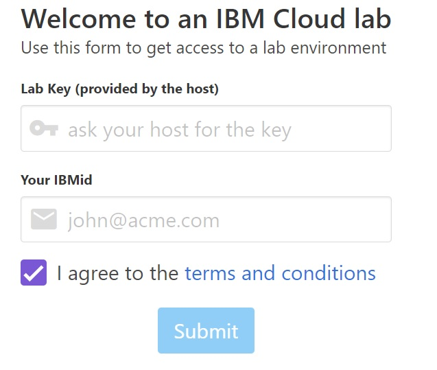
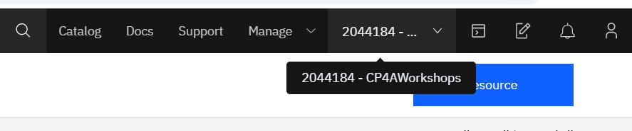
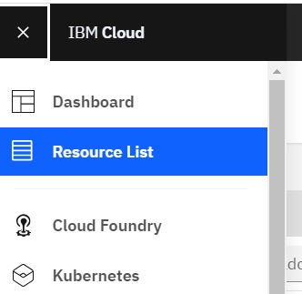
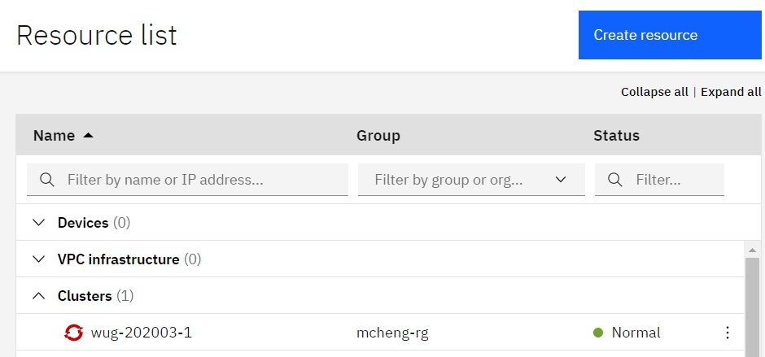
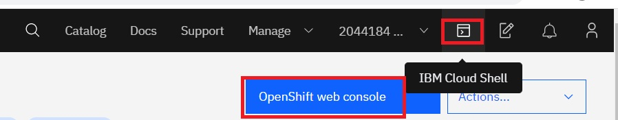

# Workshop Lab Setup

This section contains instructions to access Openshift Clusters for those workshops that use IBM public cloud

## Create a free IBM Cloud Account ID

If you don't already have an IBM Cloud Account ID, point your browser to https://cloud.ibm.com and select `Create an IBM Cloud account`. You may use any email, including personal email, to apply. No credit card needed.

## Cluster assignment

- You will be given a URL specific to your workshpop, and a key. Point your browser 
to the URL. 
Enter the key for your workshop and your IBM ID to get assigned a cluster.

- Login to IBM cloud
- Ensure that the account selected is `2044184 - CP4AWorkshops`

- Navigate to IBM CLoud > Resource list

- Expand `clusters` and click on your cluster

- For Openshift console, click `Openshift Web Console`
- For the cloud shell, click the `cloud shell` button.

