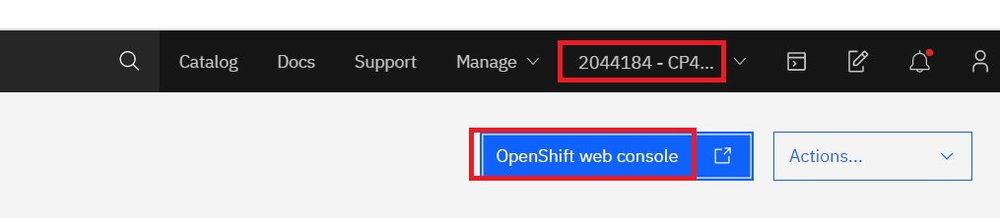

# Workshop Lab Setup

This section contains instructions to access Openshift Clusters for those workshops that use IBM public cloud

## Prequisite

You will be given a URL specific to your workshop (e.g. `https://<workshop name>.mybluemix.net/`), and a lab key for the cluster assignment through email before the workshop session and/or in the Webex/Slack chat during the workshop session.
 
## Browser Requirement

- Please use Firefox or Chrome when possible during the workshop. It's been noted IE or Edge browser may cause an unexpected behavior accessing the URLs for the lab.
- When accessing Open Shift Web Console through IBM Cloud login, you may experience the block pop-up from the browser, please ensure to unblock in order to proceed. 
  - Also note other type of blocks may be caused by your company's firewall rules, please check if any alternative can be used.

## Signing up with a new or existing IBMid

You can sign up for an IBM Cloud account by using your existing IBMid or by creating a new IBMid.
To sign up for IBM Cloud with an IBMid:
- Go to the [IBM Cloud login page](https://cloud.ibm.com), and click **Create an account**.
- Enter your IBMid email address. If you don't have an existing IBMid, an ID is created based on the email that you enter.
- Complete the remaining fields with your information, and click **Create account**.
- Confirm your account by clicking the link in the confirmation email that's sent to your provided email address.
- **Note**: If your IBMid is not with email pattern (e.g., a shortname), please inform the workshop presenter then a manual cluster assignment will be made accordinly. In the next step ##Cluser Assignment, you will start by logging in [IBM Cloud login page](https://cloud.ibm.com) and continue with the step "- Once logged in, ensure that the account selected is **2044184 - CP4AWorkshops**".

Note: You may optionally deactivate your account after the lab. 
However, we encourage you to keep your account for future labs. 
After deactivation, you will need to contact IBM Support to reactivate it. 
If you insist on deactivation, follow the instructions on the support page for "lite account": https://www.ibm.com/support/pages/how-can-you-cancel-your-ibm-cloud-account.


## Cluster assignment

- Point your browser to the workshop URL given to you. If you don't know the URL, check with the workshop presenter. 
- Enter the lab key for your workshop and your IBM ID (with email pattern) to get assigned a cluster.


- After sumitting successfully, the Congratuations page similar to the following is displayed:


- From the page, note about your assigned cluster name and ignore the bullet 5 which is not used in this workshop.
- Login to the link **IBM Cloud account** with your IBM ID.
- Once logged in, ensure that the account selected is **2044184 - CP4AWorkshops**


- Select from IBM CLoud Navigation Menu (upper left corner `hamburger menu`) > seclect Resource List


- Expand `clusters` and click on your cluster


- On the next page with your cluster summary information, click `OpenShift web console` (the blue button on the upper right corner) to access to the console for your cluster.
- **Reminder**: The OpenShift web console button here is the only access we use to connect from IBM Cloud to Red Hat OpenShift cluster.  Please do not select other drop-down or buttons from this cluster summary page.
- Once the OpenShift web console is displayed successfully, proceed to next step to access the web terminal for command line interface.
 


## Access the web terminal for command line interface

The web terminal runs in your Openshift cluster.
It gives you command line access to many tools you will use for the labs. 
To access the web terminal:

- From the OpenShift web console, navigate to **Networking -> Routes**.  
- On the right, from the top, select Project name **lab** 
- Next to the route name **tools**, click on the URL under **Location**.  


- Click on **Log in with OpenShift**


- Click on **Allow selected permissions**


- Note: The authorization permission page above may not display again in the subsequent access.  
The information will already be in the browser cookie cache.

- The web terminal is displayed:


## Clone the Workshop 

From within the web terminal, run the following **git** command to downloand the repository for labs:

```
git clone https://github.com/IBM/openshift-workshop-was.git
```

The contents for the labs are under the the directory `openshift-workshop-was/labs`. You can access files required for your labs under the lab's directory. For example: 

- Introduction to Containerization: `openshift-workshop-was/labs/Openshift/HelloContainer`
- Introduction to Container Orchestration using Openshift: `openshift-workshop-was/labs/Openshift/IntroOpenshift`

Congratulations! You've completed the lab setup.

## Next
Please follow the instructions from the workshop host to get started on one of the labs available [here](https://github.com/IBM/openshift-workshop-was/tree/master/labs/Openshift)

Most workshops use [Introduction to Containerization](https://github.com/IBM/openshift-workshop-was/tree/master/labs/Openshift/HelloContainer) as the first lab - but your workshop host may instruct you differently.


